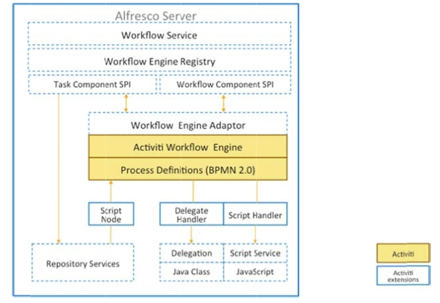

# Workflow architecture

Alfresco Content Services allows more than one workflow engine.

The following figure shows the high‐level architecture for workflow.

You can design workflow definitions using a graphical workflow designer that supports BPMN 2.0 or write the XML BPMN 2.0 process definition directly using an XML editor. Many workflow editors support BPMN 2.0 but might not understand some of the features of Alfresco Content Services workflow. We recommend the use of the Activiti eclipse designer plug‐in for Eclipse that is Alfresco Content Services-aware.

You can deploy a workflow using the Alfresco Content Services Workflow Console, or by using a Spring Bean.

Alfresco Content Services process definitions can include JavaScript, and this in turn can access content models in the repository so that you can provide your own specialized tasks for a workflow and access their properties. Process definitions have script node access which allows you to access objects in the repository, such as documents and folders. Your workflow can access and modify document objects, for example marking documents as approved, or signed off.

Alfresco Content Services allows you to access your own Java Classes through the delegate handler to support automation in your workflows. The following diagram shows these features:

-   **[Workflow instances](../concepts/wf-instances.md)**  
 A workflow instance is a running instance of a workflow definition.
-   **[Workflow artifacts](../concepts/wf-artifacts.md)**  
 A workflow consists a number of artifacts.

**Parent topic:**[Creating and managing workflows](../topics/wf-howto.md)

**Related information**  

[Activiti eclipse designer](http://www.activiti.org/userguide/index.html#activitiDesigner)

