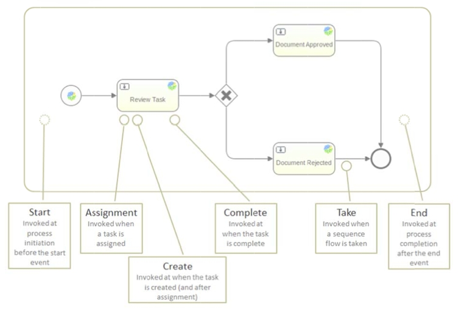

# Listeners

Listeners are an Activiti extension to BPMN 2.0 that implement hook points inside a process definition which are triggered by events during workflow execution. There are two type of listeners, task and execution.

Execution listeners can be configured on the process itself, as well as activities and transitions. Task listeners can only be configured on user tasks.

Listeners enable you to run your own code in the workflow. This can be Javascript or a call to a Java class. The following diagram shows the events in a process definition where you can configure a listener.

Listeners are described in detail in the Activiti user guide.

-   **[Task listeners](../concepts/wf-process-def-listeners-task.md)**  
 A task listener must be added to a process definition within a user task. Note that the listener is a child of the BPMN 2.0 **extensionElements** element and is in the activiti namespace since a task listener is an Activiti BPMN 2.0 extension.
-   **[Execution listeners](../concepts/wf-process-def-listeners-execution.md)**  
 Execution listeners are invoked at point in the process outside of user tasks.

**Parent topic:**[Process definitions](../concepts/wf-process-def.md)

**Related information**  

[Activiti user guide](http://www.activiti.org/userguide/)

