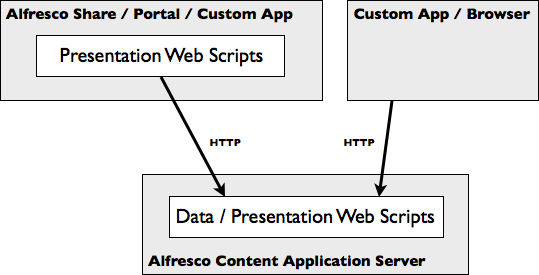

# Web script types

A web script is a service bound to a URI that responds to HTTP methods such as GET, POST, PUT, and DELETE.

There are two kinds of web scripts that use the same underlying code:

1.  Data web scripts
2.  Presentation web scripts

-   **[Repository web scripts](../concepts/ws-types-data.md)**  
Repository web scripts encapsulate access and modification of content/data held in the content repository; therefore, they are provided and exposed only by the Alfresco Content Services server.
-   **[Presentation web scripts](../concepts/ws-types-presentation.md)**  
Presentation web scripts let you customize and extend the web UI. They typically render HTML and can include browser-hosted JavaScript.

**Parent topic:**[Repository-tier web scripts](../concepts/ws-overview.md)

