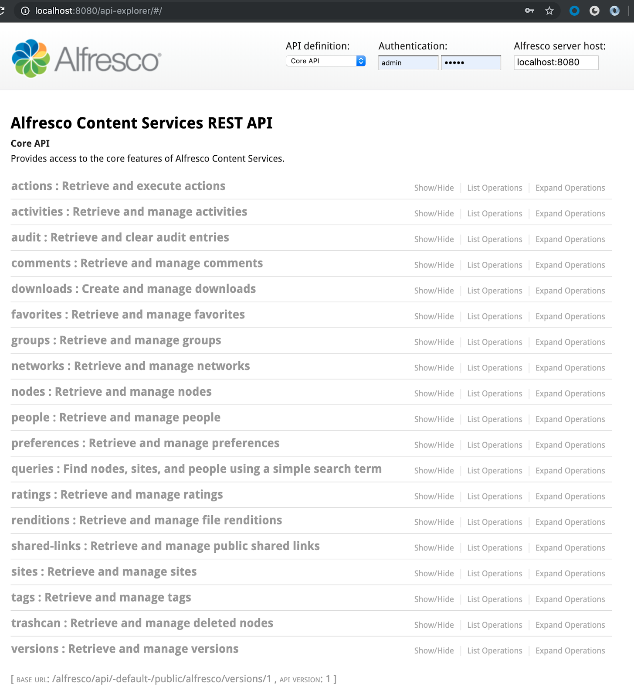

# The ReST API Explorer

The ReST API Explorer documents all the API methods available to you, and lets you try those methods out.

The Alfresco ReST API Explorer is the reference guide for the API. It's based on the [OpenAPI initiative](https://openapis.org/) and gives you interactive documentation for the Alfresco ReST API. You can access our online REST API Explorer at [https://api-explorer.alfresco.com/api-explorer](https://api-explorer.alfresco.com/api-explorer), and if you have the Alfresco SDK you can also run the Explorer on your local machine.

Follow the guidelines on [this page](../../../concepts/dev-api-by-language-alf-rest-install-api-explorer.md) for information on how to install the API Explorer in a trial or SDK environment.

This screenshot shows what the REST API Explorer looks like:

Use the userid admin and password admin if you're are using the online REST API explorer.

To explore the operations on a specific entity, for example **nodes** \(i.e. folders and files\), just click on it.

Now you can click on each of the available operations and test them on Alfresco.

You can use the API with another user than `admin` by changing the username and password in the upper right corner of the screen

The ReST API consists of a number of parts, the Core API, the Workflow API, the Search API etc. You can switch between the different APIs by clicking on the drop down box, and then selecting the API you want to work with.

**Parent topic:**[Alfresco ReST API](../../../pra/1/topics/pra-welcome-aara.md)

