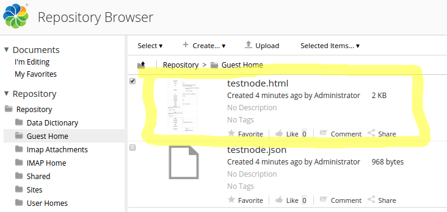

# Content Transformers \(and Renditions\)

Alfresco Content Services provides many different types of content transformations out-of-the-box. Custom transformations can also be implemented and configured.

|Information|Content Transformers|
|-----------|--------------------|
|Support Status|[Full Support](http://docs.alfresco.com/support/concepts/su-product-lifecycle.html)|
|Architecture Information|[Platform Architecture](../concepts/dev-platform-arch.md)|
|Description|Content transformers transform one type of content into another, such as a HTML file into a PDF file. They are used to enable indexing, thumbnails, and preview of content. If the target type cannot be achieved with one transformation several transformations can be chained together, such as JSON to HTML to PDF. To implement these transformations, third party tools such as PDFBox, OpenOffice, ImageMagic, and Apache Tika are used. There are a number of transformations supported out of the box that you should familiarize yourself with before implementing a custom transformer, such as:

 -   PDF **to** Text, Html or XML
-   Word, PowerPoint, Excel + other MS Office formats **-\>** Text, Html or XML
-   HTML **to** Text
-   Outlook Email .msg **to** Text
-   RFC822 Email **to** Text
-   Text **to** PDF
-   Office Open XML **to** JPEG
-   Apple iWorks files **to** PDFs or JPEGs
-   ZIP, TAR **to** Text
-   Mediawiki markup **to** HTML

 These are just a few of the supported transformations and they can also be combined to form so called transformation pipelines when it is not possible to go directly from source mimetype to target mimetype. Renditions are related to Transformations and they will be covered at the end of this article.

 To find out what transformers are currently registered and active within an Alfresco Content Services installation, you can use an admin Web Script. This is available at [http://localhost:8080/alfresco/service/mimetypes](http://localhost:8080/alfresco/service/mimetypes). This will list all the currently registered mimetypes, and provide a details link for each one. Selecting the details link will then show which transformations are currently supported both to and from that mimetype, and by what transformer. If a transformer becomes unavailable \(for example if the Open Office connection fails\), then refreshing the list will show the updated transformations.

 When working with transformations and renditions it is important to make sure that the involved mimetypes are known to Alfresco Content Services. So when accessing the "mimetypes" Web Script make sure the mimetypes that will be used in transformations and renditions are included there, if not you would have to register them with Alfresco Content Services, see the [Mimetypes extension point](dev-extension-points-mimetypes.md) for more information about that.

 The Spring bean definitions for the transformer implementations can be found in the content-services-context.xml file. This file is contained in the repository JAR and can be found as follows in an installation:

```
$ find . -name "*.jar" | xargs grep "content-services-context.xml" 
Binary file ./tomcat/webapps/alfresco/WEB-INF/lib/alfresco-repository-5.1.d-EA.jar matches
```

 Inside this XML file are the bean definitions for the transformer implementations, such as:

 ```

<bean id="transformer.PdfBox"
      class="org.alfresco.repo.content.transform.PdfBoxContentTransformer"
      parent="baseContentTransformer" >
  <property name="documentSelector" ref="pdfBoxEmbededDocumentSelector" />
</bean>


```

 The transformer bean definition does not contain the source to target mimetype transformations it supports, rather this is contained in a properties file for easier management by a System Administrator \(and these properties can be re-defined in alfresco-global.properties\). This properties file is also located in the repository JAR \(/alfresco/subsystems/Transformers/default\) and is called transformers.properties. The configuration for the `PdfBoxContentTransformer` is as follows:

 ```
content.transformer.PdfBox.priority=110 
content.transformer.PdfBox.extensions.pdf.txt.priority=50
content.transformer.PdfBox.extensions.pdf.txt.maxSourceSizeKBytes=25600
```

 The `content.transformer.PdfBox.extensions.pdf.txt.maxSourceSizeKBytes=25600` property setting ensures that PDFBox works only with PDF files up to 25MB. Note also that the `content.transformer.TikaAuto.extensions.pdf.txt.maxSourceSizeKBytes=25600` property setting ensures that TikaAuto works only with PDF text files up to 25MB.

The properties have names that follow a certain convention:

 ```
content.<transformer bean id>.<property name> (Some custom property for the transformer)
content.<transformer bean id>.priority=<number> (Default priority for this transformer)
content.<transformer bean id>.extensions.<source mimetype>.<target mimetype>.priority=<number>  (Priority for this transformation) 
content.<transformer bean id>.extensions.<source mimetype>.<target mimetype>.pipeline=transformer 1 | intermediate mimetype A)| transformer 2   
content.<transformer bean id>.extensions.<source mimetype>.<target mimetype>.failover=transformer 1 (mimetype A)| transformer 2 (mimetype A)
content.<transformer bean id>.extensions.<source mimetype>.<target mimetype>.supported=[true|false]
```

 The concept of 'explicit' transformations does not exist but instead the `priority` and `supported` properties are used to determine what transformations that are used. As the default priority is 100, setting the priority to 50 normally results in the transformer being used. Other compatible transformers will be tried in priority order if the one with highest priority fails for some reason. If multiple transformations are needed to get from source to target mimetype a `pipeline` transformation can be set up. It is also possible to control exactly which transformers are used in case of a failure by using the `failover` property.

 If you are running an Enterprise edition these properties may be changed via JMX while Alfresco Content Services is running \(note, any changes via JMX and database takes precedence over any property file settings\).

 You can create custom content transformers to transform one type of content into another, where that transformation is not already supported, such as when you have a custom input content type, or custom output content type. Take the JSON mimetype for example, if you upload a JSON file to the repository it will not have a thumbnail or a preview, and it will not be indexed and searchable.

 The following will show up in the logs when debugging is turned on \(turn it on via `log4j.logger.org.alfresco.repo.content.transform.TransformerDebug=DEBUG and log4j.logger.org.alfresco.repo.content.transform=DEBUG`\):

 ```
2016-01-05 07:50:15,111  DEBUG [content.transform.ContentTransformerRegistry] [http-bio-8443-exec-9] Searched for transformer: 
   source mimetype: application/json
   target mimetype: image/jpeg
   transformers: []
 2016-01-05 07:50:15,116  DEBUG [content.transform.ContentTransformerRegistry] [http-bio-8443-exec-9] Searched for transformer: 
   source mimetype: application/json
   target mimetype: text/plain
   transformers: []
 2016-01-05 07:50:15,117  DEBUG [content.transform.TransformerDebug] [http-bio-8443-exec-9] 10  json txt  testnode.json 968 bytes -- index -- SolrIndexer NO transformers
 2016-01-05 07:50:15,117  DEBUG [content.transform.TransformerDebug] [http-bio-8443-exec-9] 10  workspace://SpacesStore/68b0e43d-d972-406d-b211-52ce647ef41a 
 2016-01-05 07:50:15,117  DEBUG [content.transform.TransformerLog] [http-bio-8443-exec-9] 10    json txt  INFO testnode.json 968 bytes 7 ms No transformers
 2016-01-05 07:50:15,117  DEBUG [content.transform.TransformerDebug] [http-bio-8443-exec-9] 10  Finished in 7 ms Transformer NOT called
```

 You can also see that there is no transformations available for the JSON mimetype on the `http://localhost:8080/alfresco/service/mimetypes?mimetype=application/json#application/json` admin page:

 ```
**application/json - json**
   *No extractors*
   **Transformable To:** *Cannot be transformed into anything else*
   **Transformable From:** *Cannot be generated from anything else*
```

 So if you wanted to change that you could implement a JSON to HTML transformation to start with. That would give you a lot of functionality as HTML is already fully supported with thumbnail, preview, indexing and search. To do this you will need a tool that can convert from JSON to HTML. One such tool is [json2html](https://github.com/softvar/json2html), which is written in Python and can easily be invoked from the command line, and also then from a custom transformer. It produces a HTML table with the JSON data. To create this transformer you do not need to do any Java coding, just some Spring bean definitions and Python script coding.

 Starting with the Spring beans for the custom transformer you would use the `RuntimeExecutableContentTransformerWorker` class as a bean implementation. It is able to execute any command line transformation that accepts an input and an output file on the command line. Basically, if you have a command line utility or a script that takes an input file, called the source, and an output file, called the target, then you can invoke it via this class. This is a technique used for a lot of custom transformation implementations.

 Here is the Spring bean definition for what is referred to as the transformer worker:

 ```
<beans>
   <bean id="transformer.worker.json2html" class="org.alfresco.repo.content.transform.RuntimeExecutableContentTransformerWorker" >
    <property name="mimetypeService">
      <ref bean="mimetypeService" />
    </property>
    <property name="checkCommand">
      <bean class="org.alfresco.util.exec.RuntimeExec">
        <property name="commandsAndArguments">
          <map>
            <entry key=".*">
              <list>
                <value>ls</value>
                <value>/home/martin/Downloads/temp/transformation/convertJson2html.py</value>
              </list>
            </entry>
          </map>
        </property>
      </bean>
    </property>
    <property name="transformCommand">
      <bean class="org.alfresco.util.exec.RuntimeExec">
        <property name="commandsAndArguments">
          <map>
            <entry key=".*">
              <list>
                <value>/home/martin/Downloads/temp/transformation/convertJson2html.py</value>
                <value>${source}</value>
                <value>${target}</value>
              </list>
            </entry>
          </map>
        </property>
        <property name="errorCodes">
          <value>1,2</value>
        </property>
      </bean>
    </property>
  </bean>
```

 The transformer worker does the actual job of executing the transformation. It has two important properties that need to be set, the `checkCommand` property, which is used to verify that the command line tool/script that is to be used for the transformation is actually available. The other property is called `transformCommand` and should contain the script/tool path plus the source and target variables, which will resolve to temporary files that will be used during the transformation. If you want to run one script on Linux and another one on Windows you can provide multiple entries in the command line arguments map as in the following example:

 ```
<property name="transformCommand">
      <bean class="org.alfresco.util.exec.RuntimeExec">
        <property name="commandsAndArguments">
          <map>
            <entry key="Windows.*">
              <list>
                <value>cmd</value>
                <value>/C</value>
                <value>${ffmpeg.exe} ${opts} ${infile_opts} -i "${source}" ${outfile_opts} "${target}" 2&gt; NUL</value>
              </list>
            </entry>
            <entry key="Linux">
              <list>
                <value>sh</value>
                <value>-c</value>
                <value>${ffmpeg.exe} ${opts} ${infile_opts} -i '${source}' ${outfile_opts} '${target}' 2&gt; /dev/null</value>
              </list>
            </entry>
            <entry key="Mac OS X">
              <list>
                <value>sh</value>
                <value>-c</value>
                <value>${ffmpeg.exe} ${opts} ${infile_opts} -i '${source}' ${outfile_opts} '${target}' 2&gt; /dev/null</value>
              </list>
            </entry>
          </map>
        </property>
        <property name="waitForCompletion">
          <value>true</value>
        </property>
        <property name="defaultProperties">
          <props>
            <prop key="opts">-y</prop>
            <prop key="infile_opts"/>
            <prop key="outfile_opts">-f flv</prop>
          </props>
        </property>
      </bean>
    </property>
```

 When the transformation worker bean is defined you can refer to it from the transformation bean definition:

 ```
<bean id="transformer.json2html" class="org.alfresco.repo.content.transform.ProxyContentTransformer" parent="baseContentTransformer">
    <property name="worker">
       <ref bean="transformer.worker.json2html" />
    </property>
  </bean>
```

 The transformer bean needs to specify `baseContentTransformer` as the parent, as it handles registering this new transformer with the Alfresco Content Services system. The transformer implementation class that you use in this case is called `ProxyContentTransformer` and it is delegating the actual transformation to the worker. The last thing you need to do for this transformer to be active is to add some properties to alfresco-global.properties:

 ```
content.transformer.json2html.priority=30
content.transformer.json2html.extensions.json.html.supported=true
content.transformer.json2html.extensions.json.html.priority=30
```

 See above for more information about these properties.

 Currently the transformer would halt on the Python script call as that has not yet been implemented. Download the `json2html` python module as follows:

 ```
$ sudo pip install json2html
```

 Now create a script called `convertJson2html.py`:

 ```
#!/usr/bin/python

import os, sys

lib_path = os.path.abspath(os.path.join('..'))
sys.path.append(lib_path)

from json2html import *

# Get the source and target file
print 'Number of arguments:', len(sys.argv), 'arguments.'
print 'Argument List:', str(sys.argv)
sourceTempFile = sys.argv[1]
targetTempFile = sys.argv[2]

# Open and read the JSON source file
with open(sourceTempFile, 'r') as jsonF:
   jsondata = jsonF.read()
print "Read json is : ", jsondata

# Run conversion to HTML
jsonAsHTML = json2html.convert(json = jsondata)

# Write the resulting HTML representation of the JSON to target file
with open(targetTempFile, 'w+') as htmlF:
   htmlF.write(jsonAsHTML)
```

 You can test this script from command line before trying the transformation:

 ```
$ python convertJson2html.py testnode.json test.html
```

 This assumes that the testnode.json file is in the same directory as the script is run from.

 You are now ready to test this new JSON to HTML transformer. The only thing you need to do is create a rule that runs a script that does the following:

 ```
document.transformDocument("text/html");
```

 Uploading a JSON file to a folder with this rule will result in a new HTML file being generated as a result of the transformation, you will see something like this:

 

 You can see that the newly generated HTML file has a thumbnail \(refresh the page to see it\). If you navigate to the details page a preview will also be available, and you can search for the content in the JSON file and you would see the HTML version of it. You could expand the JavaScript file to move the generated HTML file somewhere else in the repository if you needed to.

 The next step is to create a pipeline transformation JSON to HTML to TEXT to make the JSON searchable and to avoid having the extra HTML file generated. This can be achieved with some extra properties in the configuration:

 ```
content.transformer.json2text.pipeline=*|html|*
content.transformer.json2text.extensions.json.txt.priority=30
content.transformer.json2text.extensions.json.txt.supported=true
```

 This defines a transformation pipeline \(also referred to as a complex transformer\). With the "\*\|html\|\*" expression means convert any supported extension \(that is only json to txt\) by using any transformer that can convert JSON to first the intermediate format HTML, which is what the transformer we just implemented above does, then use any other transformer to convert HTML to TXT, which is supported out-of-the-box. After this change you will see that any uploaded JSON file is now searchable \(remember to disable the rule\). Note that there is no Spring bean defined for the `transformer.json2text`.

 To get the thumbnail you need to define another pipeline for JSON to PNG:

```
content.transformer.json2png.pipeline=*|html|*
content.transformer.json2png.extensions.json.png.priority=30
content.transformer.json2png.extensions.json.png.supported=true
```

 Running with this pipeline configuration will first initiate a transform to HTML and then to PNG with any out-of-the-box transformer supporting HTML to PNG.

 Finally you can get the preview working with the following JSON to PDF pipeline configuration:

```
content.transformer.json2pdf.pipeline=*|html|*
content.transformer.json2pdf.extensions.json.pdf.priority=30
content.transformer.json2pdf.extensions.json.pdf.supported=true
```

 Alfresco Content Services supports PDF previewing so as long as you can transform your content into a PDF it will be available for preview in the Document Details page.

 When implementing a transformer, it is possible to associate it with an Edition, such as in the following example:

```
content.transformer.complex.JodConverter.PdfBox.edition=Enterprise
```

This sets the `transformer.complex.JodConverter` to be available only for Alfresco Content Services installations. It is also possible to associate a transformer with a specific AMP:

```
content.transformer.json2html.amp=custom-content-transformer-repo
```

This would make your custom JSON content transformer available only if an AMP with module id `custom-content-transformer-repo` has been applied.

Related to transformations are **renditions**, and the purpose of them is to provide support for rendering a specific content item into other forms, known as renditions. The rendition items are derived from their source item and as such can be updated automatically when their source item's content \(or other properties\) are changed.

 Examples of renditions \(and rendition engines\) include:

 -   `reformat` - Transforms content to new format - redirects to vanilla transformers

-   `image` - Rescales images \(including thumbnails\)

-   `freemarker` - Runs a FreeMarker template against source content

-   `xslt` - Runs XSLT on XML source content

-   `composite` - A rendition series

 Renditions can be performed synchronously or asynchronously and can be created at a specified location within the repository. By default they are created as primary children of their source item but it is possible to have them created at other places specified explicitly or as templated paths.

 The following describes an example with the `reformat` rendering engine and the custom transformation you have previously implemented \(that is json to html\). You can invoke the rendering engine and create an HTML rendition for a JSON document via JavaScript executed from a folder rule:

 ```
var renderingEngineName = 'reformat';
var renditionDefinitionName = 'cm:htmlRenditionDef';
var renditionDef = renditionService.createRenditionDefinition(renditionDefinitionName, renderingEngineName);
renditionDef.parameters['mime-type'] = 'text/html';
var htmlRendition= renditionService.render(document, renditionDef);
```

 The rendition definition name is a QName that we have to come up with, use a known namespace such as `cm`. The `mime-type` parameter tells the `reformat` rendering engine that the new rendition should be a HTML file. By default this rendition will be store as a hidden child to the uploaded JSON document. If you used the Node Browser to inspect the JSON content node you should see three hidden renditions as follows:

 ```
**Children    **
Child Name          Child Type   Child Reference                                               Primary  Association Type  Index
*cm:htmlRenditionDef  cm:content   workspace://SpacesStore/78448da2-fbab-4ef1-b451-6bbaa569b8c4  true     rn:rendition       0*
cm:doclib            cm:thumbnail workspace://SpacesStore/f7f354a7-010f-4462-82a1-7cec7f36fa1d  true     rn:rendition       1
cm:pdf               cm:thumbnail workspace://SpacesStore/8b3ec283-cd2a-4378-af2d-e72e30127210  true     rn:rendition       2
```

 If the solution being implemented is very transformation intensive a remote, then use the [Document Transformation Server](../concepts/transerv-overview.md). It would be totally dedicated to performing transformations, and can be scaled out separately from the rest of the Alfresco Content Services system, depending on transformation load.

 It is possible for an AMP \(or a properties file\) to set the initial 'average transform times' for the standard transformers, rather than having to override them in order to ensure they are not called.

If an AMP that includes a new transformer provides the following global properties, this will cause the new transformer to be given priority over the OpenOffice and JOD transformers. If a new transformer returns false from its `isTransformable` method when their transformer is not available, transformations will fall back to the OpenOffice and JOD transformers.

 ```

        transformer.OpenOffice=3600000
        transformer.complex.OpenOffice.Image.time=3600000
        transformer.complex.OpenOffice.Pdf2swf.time=3600000
        transformer.complex.OpenOffice.PdfBox.time=3600000
        
        transformer.JodConverter.time=3600000
        transformer.complex.JodConverter.Image.time=3600000
        transformer.complex.JodConverter.Pdf2swf.time=3600000
        transformer.complex.JodConverter.PdfBox.time=3600000
 
```

 If an initial 'XXX.time' global property is supplied for a transformer, the number of transformations performed may also be supplied with a '.count' value. The default being 10,000. This avoids the average time reducing too fast if transformations are requested \(because the new transformer is not available\). A higher number ensures it reduces at a slower rate. For example, 1,000,000:

 ```

        transformer.OpenOffice.count=1000000
        transformer.complex.OpenOffice.Image.count=1000000
        transformer.complex.OpenOffice.Pdf2swf.count=1000000
        transformer.complex.OpenOffice.PdfBox.count=1000000
        
        transformer.JodConverter.count=1000000
        transformer.complex.JodConverter.Image.count=1000000
        transformer.complex.JodConverter.Pdf2swf.count=1000000
        transformer.complex.JodConverter.PdfBox.count=1000000
 
```

|
|Deployment - App Server|-   tomcat/shared/classes/alfresco/extension/subsystems/Transformers/default/default - add a Spring context file with transformer bean definitions, file should have name that ends in -context.xml, such as custom-transformers-context.xml.
-   tomcat/shared/classes/alfresco-global.properties - all the properties configuration goes here

|
|[Deployment All-in-One SDK project](../concepts/sdk-getting-started.md).|-   aio/platform-jar/src/main/resources/alfresco/module/platform-jar/context/service-context.xml - Transformation bean definitions
-   aio/platform-jar/src/main/resources/alfresco/module/platform-jar/alfresco-global.properties - all the properties configuration goes here

|
|More Information|-   [Invoking transformations from Java](dev-services-content.md)
-   [Invoking transformations from JavaScript](API-JS-Transformation.md)
-   [Invoking thumbnail transformations from JavaScript](API-JS-ThumbnailService.md)
-   [Invoking renditions from Java](dev-services-rendition.md)
-   [Invoking renditions from JavaScript](API-JS-RenditionService.md)

|
|Sample Code|-   [Content Transformer Sample Code](https://github.com/Alfresco/alfresco-sdk-samples/tree/alfresco-51/all-in-one/custom-content-transformer-repo)

|
|Tutorials|-   [Extending the RuntimeExecutableContentTransformer](../tasks/serv-runtimetransformer-extend.md) \(note: this tutorial sets the `explicitTransformations` property, this is not necessary\)

|
|Developer Blogs|None|

**Parent topic:**[Platform extension points](../concepts/dev-platform-extension-points.md)

