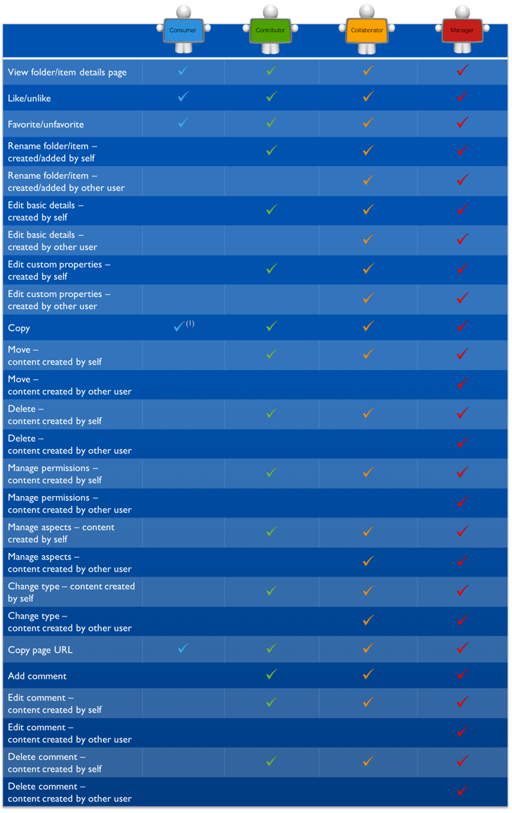

# Content permissions

The following sections detail the user permissions for content.

## Document Library

Folders and files:

**Note:** \(1\) A user with the role Consumer can copy a folder or file to another site if the user performing the action has the role of Manager, Collaborator, or Contributor in the target site.

**Tip:** Consumers who previously held a site role where they were able to add content retain their previously held permissions for any content they have added.

Folders only:

Files only:

## Calendar

## Wiki

## Discussions

## Blog

## Links

## Data Lists

**Parent topic:**[User roles and permissions](../references/permissions_share.md)

