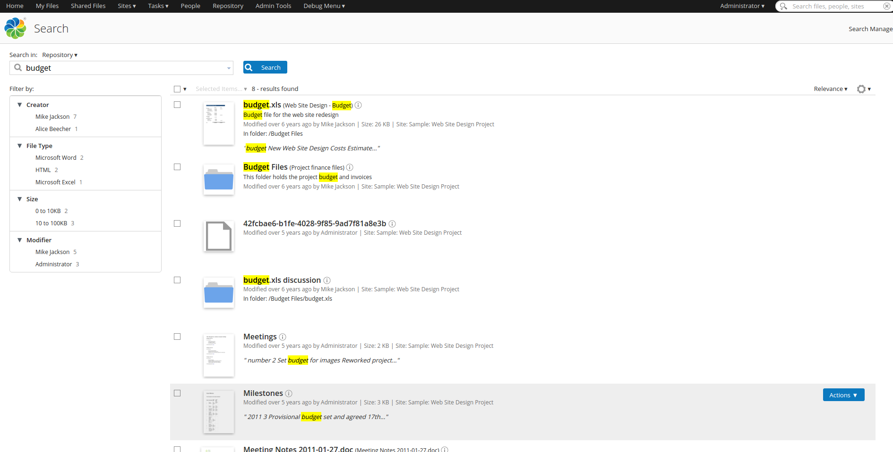

# What's new in Alfresco Content Services

See what's new in this Alfresco Content Services 5.2.7 release.

Alfresco Content Services is the new name for Alfresco One. For most people the Alfresco Share web app is still how they'll work with Alfresco Content Services. You'll see a new sign in screen and some other small changes throughout Share.

**New/Improved for Alfresco Content Services 5.2.7**

-   [Java support](whats-new.md#26)

**For everyone**

-   [Drag and drop folders](whats-new.md#1)
-   [Easier way to delete sites](whats-new.md#2)
-   [Search scope options](whats-new.md#3)
-   [Search term highlighting](whats-new.md#4)
-   [Choose site homepages and remove the dashboard](whats-new.md#5)
-   [Select and action multiple search results](whats-new.md#6)
-   [Enhanced join site requests](whats-new.md#7)
-   [Create links to content between sites](whats-new.md#8)

**New/Improved for Alfresco Content Services 5.2.1**

-   [New alfresco-pdf-renderer](whats-new.md#22)
-   [Document Fingerprints](whats-new.md#20)
-   [Improved eventual consistency](whats-new.md#23)
-   [Improved transactional metadata query](whats-new.md#24)
-   [New Search API](whats-new.md#21)
-   [Upgrading from Alfresco Search Services 1.0.0 to Alfresco Search Services 1.1.0
](whats-new.md#25)

    **Note:** From Alfresco Content Services 5.2.1 onwards, Document Transformation Server is referred to as Document Transformation Engine. See [Document Transformation Engine](../concepts/transerv-intro.md).

**For Alfresco Content Services 5.2.0**

-   [Easier access to the Admin Console](whats-new.md#9)
-   [New Support Tools](whats-new.md#10)
-   [Trashcan Cleaner](whats-new.md#11)
-   [Encrypted subsystem properties](whats-new.md#12)
-   [Alfresco Search Services with Solr 6](whats-new.md#13)
-   [New sharding methods](whats-new.md#14)
-   [New REST APIs](whats-new.md#15)
-   [Brute force attack mitigation](whats-new.md#16)
-   [New configuration properties](whats-new.md#17)
-   [Securing Alfresco Content Services components](whats-new.md#18)
-   [Improved Alfresco SDK 3.0](whats-new.md#19)

**Java support**

Alfresco Content Services 5.2.7 includes support for AWS Corretto 8.

[back to top](#top)

**Drag and drop folders**

You can now drag and drop folders from your computer straight into Alfresco Share. Any files or sub-folders in dropped folders will also be added, so you can add a complete hierarchical structure. Drag and drop isn't available in all browsers - we recommend using with Google Chrome or Firefox. See [drag and drop folders](../tasks/library-folder-dragdrop.md).

[back to top](whats-new.md#)

**Easier way to delete sites**

Site managers have a new option to quickly delete a site from anywhere in that site.

See [Deleting a site](../tasks/sites-delete.md) for more.

[back to top](whats-new.md#)

**Search scope options**

When you're in a site and start a search you have a new option to choose whether to search just the site you're currently in or across the whole repository.

See [Searching in Alfresco Share](../concepts/searches.md) for more.

[back to top](whats-new.md#)

**Search term highlighting**

When you search, the term you searched for will be highlighted in the search results.

[back to top](whats-new.md#)

**Choose site homepages and remove the dashboard**

You can now choose whether the landing page for individual sites is the dashboard, the document library, the wiki, the calendar, or another feature. You can even remove the dashboard altogether from a site.

See [Choosing a site homepage](../tasks/site-addremove-dashboard.md) for more.

[back to top](whats-new.md#)

**Select and action multiple search results**

In the Search Results screen you can now select multiple search results and choose options such as copying, moving, deleting, and downloading as a zip file.

See [Search results](../concepts/search-results.md) for more.

[back to top](whats-new.md#)

**Enhanced join site requests**

Site managers can now quickly view and approved all pending site requests to join a moderated site. Email notifications keep them informed of all new requests.

See [Approving users to join a moderated site](../tasks/members-add-moderated.md) for more.

[back to top](whats-new.md#)

**Create links to content between sites**

When you select to copy a file or folder, the new **Create Link** feature gives you the option to create a link to it from another location in Alfresco Share. This means that rather than having multiple copies of the same content, you can link to a single piece of content from multiple locations.

See [Creating links to content](../tasks/library-item-create-link.md) for more.

[back to top](whats-new.md#)

**Easier access to the Admin Console**

You can now access the Admin Console straight from the Share Admin Tools.

See [Using the Admin Console](../concepts/at-adminconsole.md) for more.

[back to top](whats-new.md#)

**New alfresco-pdf-renderer**

Alfresco Content Services uses alfresco-pdf-renderer for creating document thumbnails and previews. It replaces the previously used PDF interpreter, Ghostscript.

See [Installing alfresco-pdf-renderer](../tasks/pdf-renderer-install.md) for more.

[back to top](whats-new.md#)

**New Support Tools**

There's a new range of Support Tools to help you monitor your system and diagnose performance, communication, and memory issues. You can also export information and reports for further analysis, or to send to the Alfresco Support Team.

See [Using the Admin Console](../concepts/monitoring-intro.md) for more.

[back to top](whats-new.md#)

**Trashcan Cleaner**

You can now add a scheduled job that will empty your Alfresco trashcan according to your configuration.

See [Configuring the Trashcan Cleaner](../concepts/trashcan-cleaner.md) for more.

[back to top](whats-new.md#)

**Encrypted subsystem properties**

You can now encrypt subsystem properties like the LDAP bind password and SMTP password in the configuration files.

See [Encrypting properties](../concepts/encrypt-properties.md) for more.

[back to top](whats-new.md#)

**Alfresco Search Services with Solr 6**

Alfresco Content Services 5.2.0 now supports Solr 6, although Solr 4 remains the default search server.

See [Configuring Alfresco Search Services](../concepts/solr6-home.md) for more.

[back to top](whats-new.md#)

**Document Fingerprints**

Alfresco Content Services 5.2.1 provides support for Document Fingerprints to find related documents. It is performed by algorithms that map data, such as documents and files to shorter text strings, also known as fingerprints.

See [Document Fingerprints](../concepts/fingerprinting.md) for more.

[back to top](whats-new.md#)

**New sharding methods**

When an index grows too large to be stored on a single search server, you can distribute it across multiple search servers using new Solr 6 sharding methods.

See [Solr 6 sharding](../concepts/solr6-shard-approaches.md) for more.

[back to top](whats-new.md#)

**Improved eventual consistency**

Alfresco Content Services 5.2.1 with the Solr subsystem does not include any transactional indexing. In other words, Alfresco removes the need to have the database and indexes in perfect sync at any given time and relies on an index that gets updated at configurable intervals \(default: 15s\) by Solr itself.

The index tracker takes care of polling for new transactions and proceeds to update its index. In this way, indexes will eventually be consistent with the database.

See [Eventual consistency](../concepts/solr-event-consistency.md) for more.

[back to top](whats-new.md#)

**Improved transactional metadata query**

This section compares the query support provided by the transactional metadata query \(TMDQ\) and the Index Engine. Some queries can be executed both transactionally against the database or with eventual consistency against the Index Engine.

See [Transactional metadata query](../concepts/intrans-metadata.md) for more.

[back to top](whats-new.md#)

**New REST APIs**

This release includes an updated release of the REST API Explorer to navigate the new REST APIs. The new public v1 REST APIs introduce features for managing nodes, people, sites, shared-links, as well in-built queries and new advanced search API. This is in addition to existing collaborative features, such as favorites, comments, ratings, tags and activities.

See [ReST APIs](../pra/1/topics/pra-welcome.md) for more.

[back to top](whats-new.md#)

**New Search API**

The Search API provides access to the search features of Alfresco Content Services. The Search API accepts POST requests containing JSON structures, which follow Solr style request groupings. For example, the options required to control highlighting are grouped together.

See [Search API](../concepts/search-api.md) for more.

[back to top](whats-new.md#)

**Upgrading from Alfresco Search Services 1.0.0 to Alfresco Search Services 1.1.0
**

You can now upgrade from Alfresco Search Services 1.0.0 to Alfresco Search Services 1.1.0
 with the Solr 6 search index server.

See [upgrading Alfresco Search Services](../tasks/upgrade-ss1.0-ss1.1.md) for more.

[back to top](whats-new.md#)

**Brute force attack mitigation**

Alfresco Content Services 5.2.0 provides basic out-of-the-box protection against brute force attacks on password logins.

See [Mitigating brute force attack on user passwords](../concepts/brute-force-passwords.md) for more.

[back to top](whats-new.md#)

**New configuration properties**

You now have additional configuration properties for configuring Alfresco Content Services 5.2.0.

See [New Alfresco Content Services configuration properties](../concepts/repository-properties.md) for more.

[back to top](whats-new.md#)

**Securing Alfresco Content Services components**

After you have installed Alfresco Content Services 5.2.0, you can consider some best practices to secure the Tomcat web server, PostgreSQL database, and LibreOffice.

See [Securing Alfresco Content Services components](../tasks/securing-alfresco.md) for more.

[back to top](whats-new.md#)

**Alfresco SDK 3.0**

Alfresco SDK 3.0 is a major update to the SDK and provides several improvements on the previous SDK releases. The documentation has been rewritten and restructured in line with this update.

See [Alfresco SDK 3.0](../concepts/sdk-intro.md) for more.

[back to top](whats-new.md#)

**Parent topic:**[Alfresco Content Services](../concepts/welcome.md)

