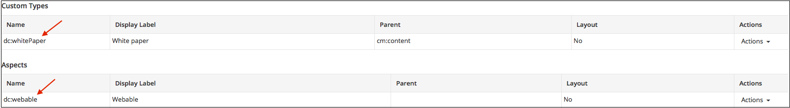
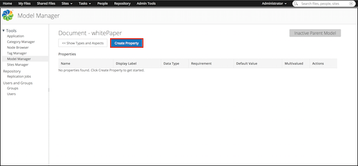
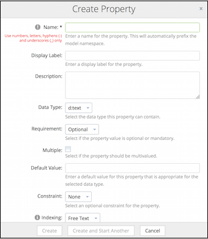
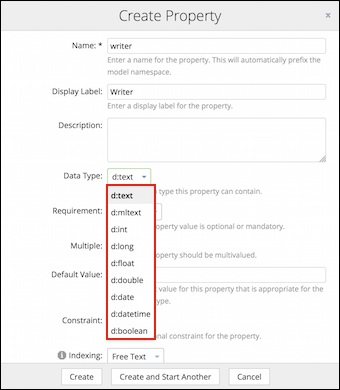
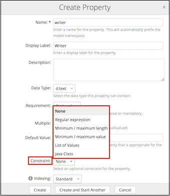

# Creating a new property for custom types and aspects

Properties are pieces of metadata associated with a particular custom type and / or aspect. Both types and aspects can have one or more properties.

1.  Click **Admin Tools**, and then click **Model Manager**.

    The **Model Manager** page is displayed.

2.  Click the relevant model from the **Custom Models** list.

    The selected model page appears. This page shows the existing custom types and aspects associated with the selected model.

3.  To create a new property, perform the following action:

    -   Under the **Custom Types** list, click the type for which you want to create the new property.

        The property page relevant to the selected type is displayed. This is of the format `model name:custom type name`.

    -   Under the **Aspects** list, click the aspect for which you want to create the new property.

        The property page relevant to the selected aspect is displayed. This is of the format `model name:aspect name`.

    

4.  Click **Create Property**.

    

    The **Create Property** window appears.

5.  Enter the details for the new property. Fields marked with an asterisk \(\*\) are required.

    

    1.  Enter a name for the property.

        Only alphanumeric characters, hyphens \(-\) and underscores \(\_\) are allowed. The property name will automatically prefix the model namespace.

    2.  Select an optional display label for the property.

        The display label is shown as the property name to the end users in Alfresco Share.

    3.  Enter an optional description of the property.

    4.  Select the data type this property can contain.

        

        Data types describe the fundamental types of data the repository will use to store properties. Alfresco Content Services supports a wide variety of data types. The available out-of-the-box data types are:

        |Option|Description|
        |------|-----------|
        |`d:text`|Specifies a text value or a character string.|
        |
        |`d:mltext`|Specifies a multilingual text value where many localized representations of the text value may be held.|
        |`d:int`|Specifies an integer value.|
        |`d:long`|Specifies a long value. This type is used when a wider range than `int` is needed.|
        |`d:float`|Specifies a float value. This data type is mainly used to save memory in large arrays of floating point numbers.|
        |`d:double`|Specifies a double value. This data type is generally used as the default data type for decimal values.|
        |`d:date`|Specifies a date value in the format `dd/mm/yyyy`.|
        |`d:datetime`|Specifies a date and time value.|
        |`d:boolean`|Specifies a boolean value which can either be `true` and `false`. This data type represents one bit of information and is used for simple flags that track true/false conditions.|

6.  Select if the property value is optional or mandatory, and if this is enforced by the system.

    The available options are:

    |Option|Description|
    |------|-----------|
    |**Optional**|Specifies that the property value is not required and the property can be left blank.|
    |
    |**Mandatory**|Specifies that the property value is required and must be filled if **Edit Properties** in Alfresco Share is to be completed. The property will be marked with an asterisk.|

7.  Select if the property should be multi-valued.

    The following table shows each data type's support for single or multiple values, with or without constraints.

    |Data type|Supports single/multi-value properties|Constraints supported|Additional information|
    |---------|--------------------------------------|---------------------|----------------------|
    |`d:text`|Multi-value properties|    -   List of Values
    -   Minimum / Maximum length
    -   Regular expression
| |
    |
    |`d:mltext`|Multi-value properties|    -   List of Values
    -   Minimum / Maximum length
    -   Regular expression
| |
    |`d:int`|Single-value properties in Model Manager

Multi-value properties in Share|    -   List of Values
    -   Minimum / Maximum value
|In Share, `d:int` does not support multiple values with constraint.|
    |`d:long`|Single-value properties in Model Manager

Multi-value properties in Share|    -   List of Values
    -   Minimum / Maximum value
|In AShare, `d:long` does not support multiple values with constraint.|
    |`d:float`|Single-value properties in Model Manager

Multi-value properties in Share|    -   List of Values
    -   Minimum / Maximum value
|In Share, `d:float` does not support multiple values with constraint.

Also, `d:float` does not support the **List of Values** constraint in Share.|
    |`d:double`|Single-value properties in Model Manager

Multi-value properties in Share|    -   List of Values
    -   Minimum / Maximum value
|In Share, `d:double` does not support multiple values with constraint.

Also, `d:double` does not support the **List of Values** constraint in Share.|
    |`d:date`|Single-value properties|Certain data types should not be used with the **List of Values** constraints.|`d:date` does not support the **List of Values** constraint.|
    |`d:datetime`|Single-value properties|Certain data types should not be used with the **List of Values** constraints.|`d:datetime` does not support the **List of Values** constraint.|
    |`d:boolean`|Single-value properties|Certain data types should not be used with the **List of Values** constraints.|`d:boolean` does not support the **List of Values** constraint.|

    If you want the end user to specify multiple values for the property in **Edit Properties** in Share, then select the **Multiple** check box. For example, if you have created a property, **Languages known** and you want the end user to be able to specify multiple answers for this property in Share, then select the **Multiple** check box in the **Create Property** window in Model Manager.

8.  Specify an optional default value for this property.

    The value specified in **Default Value** in Model Manager is displayed as the default property value in Share. Also, the default value should be appropriate for the selected data type. For example, if the data type is `d:int`, the default value must be an integer.

    The control/layout of **Default Value** depends on the selected data type. For example, if you select `d:text` as the data type, then the Default Value layout is a text box, where as if you select `d:int` as the data type, then the Default Value layout is a spin control.

9.  Select the optional constraint for the property.

    

    Depending on what constraint option you select, some additional fields are displayed.

    |Option|Additional fields|Condition/Example|
    |------|-----------------|-----------------|
    |**None**|No constraint applied.|No constraint applied.|
    |**Regular expression**|**Regular Expression**: Specify a regular expression for the constraint. This field is mandatory.|Use this constraint if you want the property value specified in Share to match the expression specified in the Model Manager.

 For example, if the constraint expression specified in the Model Manager is \[a-z\]\* , then Share will accept any value in the range of lowercase a to z.

|
    |
    |**Minimum / Maximum length**|    -   **Minimum Length**: Specify the minimum length allowed for the property.
    -   **Maximum Length**: Specify the maximum length allowed for the property.

Both the fields are mandatory.

|For example, if the minimum length and maximum length are 1 and 5, respectively, then Share will accept any text or integer value in the range of one to five characters or numbers.|
    |**Minimum / maximum value**|    -   **Minimum Value**: Specify the minimum value allowed for the property.
    -   **Maximum Value**: Specify the maximum value allowed for the property.

Both the fields are mandatory.

|For example, if the Minimum value and maximum value are 1 and 3, respectively, then Share will accept either 1, 2, or 3 as the property value.|
    |**List of Values**|    -   **List of Values**: Enter the list of allowed values, with each new item on a new line. This field is mandatory.
|For example, if you specify A, B, and C in **List of Values**, then Share will display these values in a drop-down list.|
    |**Java class**|    -   **Class name**: Enter the fully qualified name of the class to use as a constraint.
|Used for custom constraints implemented in Java.|

10. To enable the property to be used for searching, select the appropriate searching option from the **Indexing** drop-down list.

    Depending on the data type selected, the following searching options are supported:

    |Searching option|Description|Searchable|Supported data types|
    |----------------|-----------|----------|--------------------|
    |**None**|Search is not supported. Use this option if you do not want to use a property for searching.|No|Non-text data types:    -   int
    -   long
    -   float
    -   double
    -   date
    -   datetime
    -   boolean
Text date types:

    -   text
    -   mltext
    -   content
|
    |**Basic**|Property is searchable but the values will not be available in the search result filters.|Yes|Non-text data types:    -   int
    -   long
    -   float
    -   double
    -   date
    -   datetime
    -   boolean
|
    |**Enhanced search**|Use enhanced search if you want to use the property in faceting, stats, sort, and range queries. While this indexing option improves query performance and reduces memory usage, it also requires more disk space for the search index.|Yes|Non-text data types:

    -   int
    -   long
    -   float
    -   double
    -   date
    -   datetime
|
    |
    |**Free text**|Property is searchable but the values will not be available in the search result filters.|Yes|Text date types:

     -   text
    -   mltext
    -   content
|
    |**List of values - whole match**|This indexing option enables you to filter on a property in the search results while searching for the whole term.|Yes|Text date types:

     -   text
    -   mltext
    -   content
|
    |**List of values - partial match**|This indexing option enables you to filter on a property in the search results while searching the property using wildcard characters.|Yes|Text date types:

     -   text
    -   mltext
    -   content
|
    |**Pattern - unique matches**|This indexing option enables you to use unique identifiers which are searched on the basis of the full value of the property. The property itself will not be shown as a filter in the search results.|Yes|Text date types:

     -   text
    -   mltext
    -   content
|
    |**Pattern - many matches**|This indexing option enables you to use identifiers which could be searched on the basis of the full value or via the wild card characters. The property itself will not be shown as a filter in the search results.|Yes|Text date types:

     -   text
    -   mltext
    -   content
|

    **Note:** Different values can have an impact on the search performance, memory requirement, and disk storage requirement for your installation. For very large repositories, the values can have a significant impact; however, for most installations the default settings are fine. For properties that will be used for search filters, it is important to use the correct value as shown in the above table.

    **Note:** For more information on setting up search filters using the Search Manager, see [Search Manager](../concepts/super-search-manager.md).

11. To create a new property, click **Create**. To save and create another property, click **Create and Start Another** or click **Cancel** if you do not want to save the changes.

    The property created appears in the **Properties** table for the selected type or aspect. The property name is of the format, `prefix:property name`.

    Additional information displayed in the table includes the property name, display label, data type, requirement, default value, multivalued, and the actions \(Edit and Delete\) that can be performed on the property.

**Parent topic:**[Managing custom types, aspects, and properties](../concepts/admintools-using-cmm.md)

