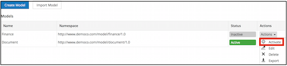

# Activating a model

Activate a model to make its custom type or aspect available to other users.

To activate a model, follow the instructions below:

1.  Click **Admin Tools**, and then click **Model Manager**.

    The **Model Manager** page is displayed. The status of the relevant model is **Inactive**.

2.  Click the **Actions** drop-down list for the model you want to activate.

3.  Click **Activate**.

    

    The status of the relevant model changes to **Active**. The types and aspects associated with this model are now available.

**Parent topic:**[Managing models](../concepts/admintools-custom-model-intro.md)

