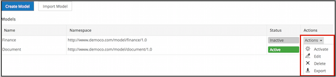
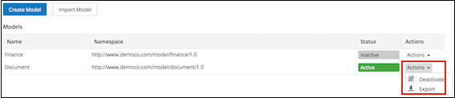

# Viewing existing models

Use the **Model Manager** page to create a new model, select an existing model to view and create the associated custom types and aspects.

1.  Click **Admin Tools**, and then click **Model Manager**.

    The **Model Manager** page displays all the models created using the Model Manager module. The list displays the model name, its namespace, status, and the available actions.

2.  Under **Custom Models**, click a model name to view the custom type\(s\) and aspect\(s\) associated with it.

3.  To perform an action on a model, click the **Actions** drop-down list against the relevant model name.

    The options available in the **Actions** drop-down list will depend on the status of the model.

    |Option|Available when content model status is..|Description|
    |------|----------------------------------------|-----------|
    |**Activate**|Inactive|Activates the model so that the custom type or aspect is available to the end users.|
    |**Edit**|Inactive|Enables you to update information of the model using the **Edit Model** window.|
    |**Delete**|Inactive|Deletes the model. You can only delete an inactive model. To delete an active model, you need to deactivate it first.|
    |**Deactivate**|Active|Deactivates the model so that the custom type or aspect is no longer available to the end users.|
    |**Export**|Active/Inactive|Saves the model on your local machine for future use or use in other repositories.|

    **Inactive model:**

    

    **Active model:**

    

**Parent topic:**[Managing models](../concepts/admintools-custom-model-intro.md)

