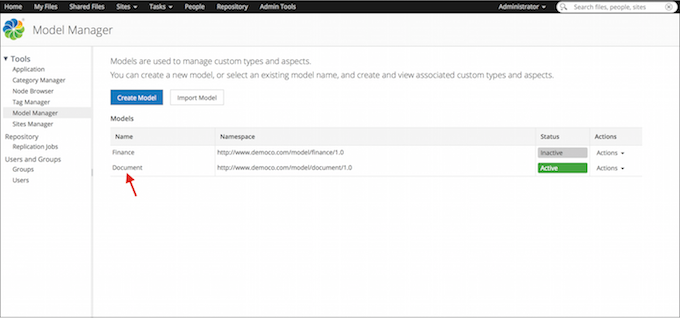
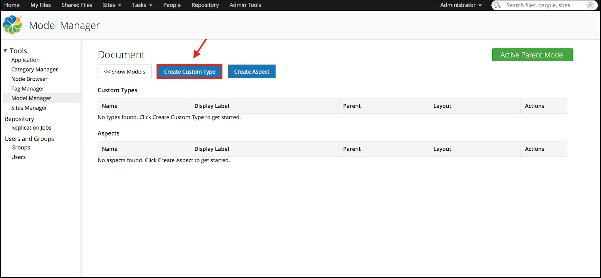
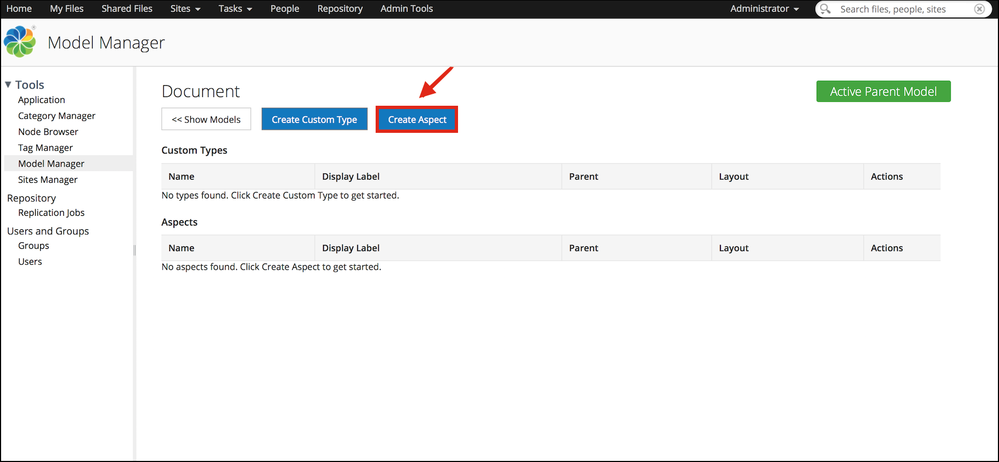
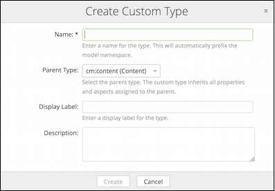
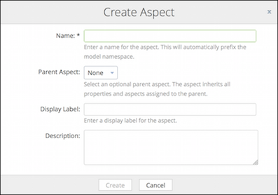
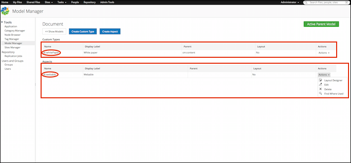

# Creating new custom types and aspects

A model can have one or more custom types and aspects. You can create new custom types and aspects using the Model Manager.

**Important:** Within a model, the custom types and aspects **must** have unique names.

1.  Click **Admin Tools**, and then click **Model Manager**.

    The **Model Manager** page is displayed.

2.  Click the model name for which you want to add the custom type and / or the aspect.

    

    The relevant model page appears. This page shows the existing custom types and aspects associated with the selected model.

3.  To create a new custom type or aspect, click on the relevant tab.

    -   To create a type, click **Create Custom Type**. The **Create Custom Type** window appears.

        

    -   To create an aspect, click **Create Aspect**. The **Create Aspect** window appears.

        

4.  Enter the details for the new custom type and / or the aspect. Fields marked with an asterisk \(\*\) are required.

    For custom type:

    

    For aspect:

    

    1.  Enter a name for the type and / or aspect.

        Only alphanumeric characters, hyphens \(-\), and underscores \(\_\) are allowed. The model name will automatically prefix the model namespace.

    2.  Select the parent type for the type and / or aspect.

        **Note:** The parent type must either be a sub-type of the `cm:content` type or `cm:folder` type. The custom type will inherit all the properties and aspects assigned to the parent.

        **Note:** The aspect will inherit all the properties and aspects assigned to the parent. The default parent type is none.

    3.  Enter an optional display label for the type and / or aspect.

        The display label is shown to the users as the model name in the **New Type** drop down in Alfresco Share.

        For example, Invoice.

    4.  Enter an optional description of the type and / or aspect.

5.  Click **Create**.

    **For custom type**: The new custom type appears in the **Custom Types** table. The name of the custom type is of the format, `Prefix:Custom type name`. Additional information displayed in the table includes the type name, display label, parent, and the actions \([Layout Designer](admintools-form-builder.md), [Edit](admintools-custom-type-edit.md), [Delete](admintools-custom-type-delete.md), and Find Where Used\*\) that can be performed on the type.

    

    **For aspects**: The new aspect appears in the **Aspects** table. The name of the custom type is of the format, `Prefix:Aspect name`. Additional information displayed in the table includes the aspect name, display label, parent, and the actions \([Layout Designer](admintools-form-builder.md), [Edit](admintools-custom-type-edit.md), [Delete](admintools-custom-type-delete.md), and Find Where Used\*\) that can be performed on the aspect.

    **Note:** \* The **Find Where Used** option searches and locates all the nodes to which the relevant type or aspect has been applied, and displays the result on the **Search** result page.

**Parent topic:**[Managing custom types, aspects, and properties](../concepts/admintools-using-cmm.md)

