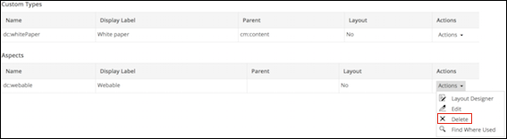

# Deleting custom types and aspects

The delete action on a custom type and aspect depends on the status of the model.

**Prerequisites for deleting custom types and aspects:**

|**For aspects**|-   If the model is inactive, you can simply delete the aspect by clicking **Delete** from the **Actions** drop-down list for the relevant aspect.
-   If the model is active and the aspect has been applied to a file, you can't delete the aspect. In this case, you need to remove the aspect by navigating to **Manage Aspects** and removing the aspect from the **Currently Selected** list. Now, you can deactivate the model.

|
|**For custom types**|-   If the model is inactive, you can simply delete the custom type by clicking **Delete** from the **Actions** drop-down list for the relevant type.
-   If the model is active, you can't delete the custom type using the Model Manager. In this case, you have to delete the file from Alfresco Share and then permanently delete the file from your Share trashcan. For more information, see [Emptying your trashcan](library-item-delete-final.md).

|

1.  Click **Admin Tools**, and then click **Model Manager**.

    The **Model Manager** page is displayed.

2.  Click the relevant model from the **Custom Models** list.

    The selected model page appears. This page shows the existing custom types and aspects associated with the selected model.

3.  For the type or aspect you want to delete, click **Delete** from the **Actions** drop-down list.

    

    If deleting a custom type, the **Confirm Custom Type Deletion** window appears.

    If deleting an aspect, the **Confirm Aspect Deletion** window appears.

4.  Click **Delete**.

For an inactive model, if a type \(or aspect\) refers to another type \(or aspect\) within the same model, then you can't delete the referenced type \(or aspect\).

For example, Model 1 comprises of Type 1 and Type 2. Within Model 1, Type 1 refers to Type 2, so you cannot delete Type 2 as it is being referenced by Type 1. But you can delete Type 1 as it is neither used nor referenced by another type within the same model.

**Parent topic:**[Managing custom types, aspects, and properties](../concepts/admintools-using-cmm.md)

