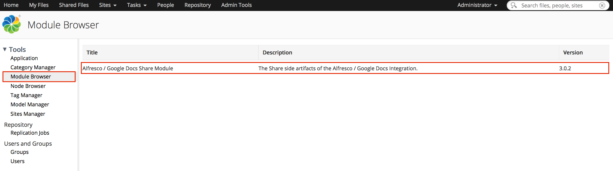

# Viewing module packages

Alfresco Module Packages are used to package customizations and extensions for deployment. Use the Module Browser page to view all the AMPs that have been applied to Alfresco Content Services.

1.  Click **Admin Tools** then **Module Browser**.

    The Module Browser page shows a list of all the module packages that are either pre-configured in an out-of-the-box installation or applied by the user, along with the description and version number.

    

**Parent topic:**[Installing an Alfresco Module Package](../tasks/amp-install.md)

