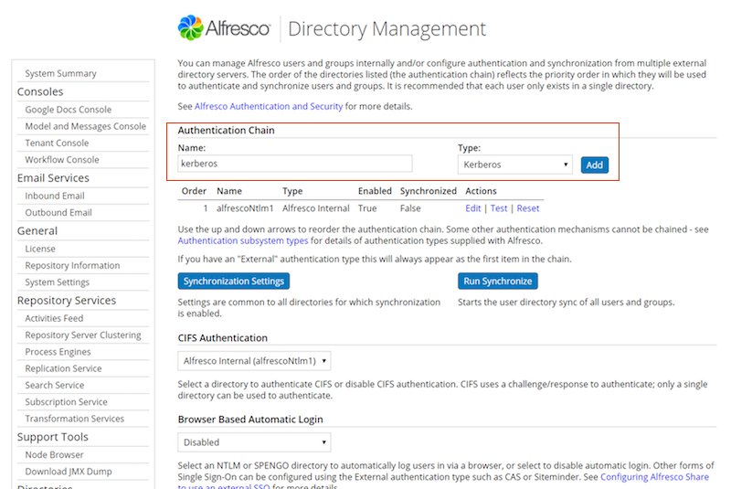

# Enabling Kerberos authentication

Use this information to enable and configure Kerberos authentication in Alfresco Content Services 5.2.7.

**Note:** These instructions assume that you want to use SSO Kerberos.

Kerberos configuration requires three main tasks.

-   Step 1: [Active Directory configuration \(by Windows administrators\)](kerberos-AD-config.md)
-   Step 2: [Configuring Alfresco on a single node using the Admin Console \(by Alfresco administrator\)](kerberos-alfresco-config.md)
-   Step 3: [Configuring Alfresco Share Kerberos SSO](auth-kerberos-shareSSO.md)
-   Step 4: [Client configuration \(by enterprise system administrator or Alfresco Administrator\)](../concepts/auth-kerberos-clientconfig.md)

*How Kerberos sits in the overall authentication chain?*

If you use Kerberos for authentication and LDAP AD for synchronizing the user accounts in to Alfresco, you must disable LDAP authentication. If you are using SSO and do not disable LDAP authentication, Kerberos authentication will fail.

In order to use all the benefits of Kerberos SSO, enable Kerberos using Directory Management in the Admin Console.

1.  In the Admin Console, click Directory Management under Directories.

    You see the Directory Management page.

2.  Under Authentication Chain, specify a name and set the type to **Kerberos**.

    **Note:** When you add the authentication types, make sure they are in the following order: Kerberos, LDAP AD, and Alfresco NTLM.

3.  Click **Add**, and then **Save** to add the new Kerberos type element in the authentication chain list.

    

4.  Select **Kerberos** from **Browser Based Automatic Login**.
5.  For configuring Kerberos configure Kerberos using the configuration properties in the Admin Console, see [Configuring Kerberos](adminconsole-directorymgt-kerberos.md).

-   **[Step 1. Configuring Kerberos with Active Directory](../tasks/kerberos-AD-config.md)**  
You can set up accounts for use by Alfresco Content Services on a Windows domain controller running Active Directory.
-   **[Step 2. Configuring Kerberos on Alfresco server](../tasks/kerberos-alfresco-config.md)**  
As an Alfresco administrator, you need to configure Kerberos on the Alfresco server that will be running either the repository tier web application \(alfresco.war\) or the Share web application \(share.war\).
-   **[Step 3. Configuring Alfresco Share Kerberos SSO](../tasks/auth-kerberos-shareSSO.md)**  
You can configure the Alfresco Share server and Active Directory server to work with Kerberos Single Sign On \(SSO\).
-   **[Step 4. Kerberos client configuration](../concepts/auth-kerberos-clientconfig.md)**  
Configure the Kerberos client authentication on Windows using Chrome, Internet Explorer, WebDav, and Firefox browsers.

**Parent topic:**[Configuring Kerberos](../concepts/auth-kerberos-intro.md)

