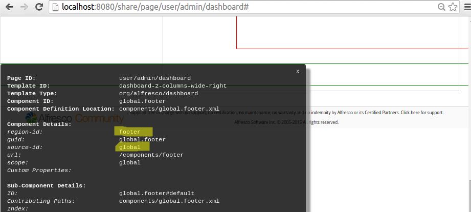
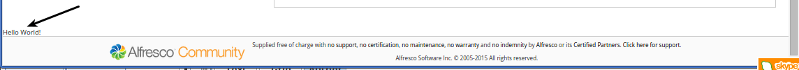

# Adding content to a Surf page

|**Name**|Add Surf Page Content|
|**Extension Point**|[Surf Extension Modules](../concepts/dev-extensions-share-surf-extension-modules.md)|
|**Description**|This tutorial demonstrates how to add some extra content to the Footer on each page. The steps you need to take to do this can be applied also when adding content to other parts of a page.|
|**Implementation Steps**|A simple and effective way to add content to a Surf page is to follow these steps:1.  Create a Web Script that returns the content to be displayed.
2.  Find a page component that is located where you want to add new content, such as the footer in our case.
3.  Add a new sub-component to the page component, referencing the new Web Script.
4.  Use a Surf Extension module to deploy the new sub-component.

|
|**Related Information**|This tutorial assumes that you are familiar with the Spring Surf development framework. If you are new to it then read up on it [here](../concepts/dev-extensions-share-architecture-extension-points.md) before starting this tutorial. If you have not already done so you should also review the [Introducing SurfBug](../concepts/dev-extensions-share-surfbug.md) topic as this tool is used in this tutorial.|
|**Source Code**|[Go to code](https://github.com/Alfresco/alfresco-sdk-samples/tree/alfresco-51/all-in-one/add-page-content-share)|

This tutorial assumes you have generated an [All-In-One SDK 3.0 Project](../concepts/sdk-getting-started.md).

Tutorial implementation steps:

1.  In the Share JAR project create a new directory as follows for the Web Script: aio/aio-share-jar/src/main/resources/alfresco/web-extension/site-webscripts/org/alfresco/tutorials.

2.  Add a Web Script descriptor file called new-content.get.desc.xml to the /tutorials directory:

    ```
    <webscript>
        <shortname>New Page Content</shortname>
        <description>Add new content to a Surf Page</description>
        <url>/tutorials/new-content</url>
        <family>Share Tutorials</family>
    </webscript>
    ```

3.  Add a web script template file called new-content.get.html.ftl to the /tutorials directory:

    ```
    <div>
        Hello World!
    </div>
    ```

4.  Identify which component to add the new sub-component to.

    For this we use the [SurfBug](../concepts/dev-extensions-share-surfbug.md) tool. Once the tool is activated \(from http://localhost:8080/share/page/surfBugStatus\) we can identify the component on the page as follows:

    

    Here we have scrolled to the bottom of the Dashboard page as we want to add our new content to the footer. Then we have clicked on the last component enclosed in red lines. This brings up the above black information box where we can see the `region-id`, `source-id`, and `scope` values that we are looking for.

5.  Add a new Surf Extension Modules file called add-page-content-extension-modules.xml to the aio/aio-share-jar/src/main/resources/alfresco/web-extension/site-data/extensions directory \(note. it is important to give this file a unique name when several Share JARs are installed, otherwise the last one wins\):

    ```
    <extension>
        <modules>
            <module>
                <id>Add new content to footer</id>
                <version>1.0</version>
                <auto-deploy>true</auto-deploy>
                <components>
                    <component>
                        <region-id>footer</region-id>
                        <source-id>global</source-id>
                        <scope>global</scope>
                        <sub-components>
                            <sub-component id="New_Content" index="25">
                                <url>/tutorials/new-content</url>
                            </sub-component>
                        </sub-components>
                    </component>
                </components>
            </module>
        </modules>
    </extension>
    ```

    What we are doing here is adding a new sub-component to the existing component identified by the region-id `footer` and the source-id `global`.

    The sub-component `url` points to the new Web Script that we just created.

    The sub-component's content can be displayed either before or after the default sub-component, which is the one with the `id` set to `default`. The position of the content is based on the `index` attribute value, which is set to 25 in our case. The `default` sub-component will have an `index` of 50 so our new sub-component will be displayed before it.

    The `id` of the new sub-component need to be unique within the main component \(i.e. the footer\) and the id `default` is reserved.

    This module will be deployed automatically when the application server is started as we have the `auto-deploy` property set to `true`.

6.  The implementation of this sample is now done, build and start the application server as follows:

    ```
    /all-in-one$ mvn clean install alfresco:run
    ```

7.  Now, log in to Alfresco Share \(http://localhost:8080/share\) and you will see the content \(Hello World!\) from the new web script displayed just above the footer:

    

    **Note:** A Surf Extension module like this can be deployed and undeployed during runtime. And this means that an Administrator can control when different customizations should be visible or hidden. This is managed via the Module deployment page that can be found at: `http://localhost:8080/share/service/modules/deploy`.


**Parent topic:**[Pages](../concepts/dev-extensions-share-tutorials-pages.md)

