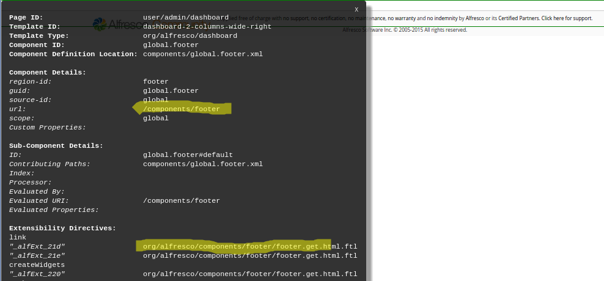
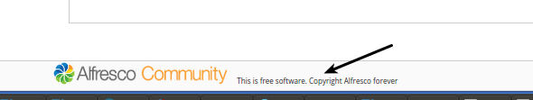

# Customizing \(web script properties\) the footer text for a Surf page

|**Name**|Customize the footer text for a Surf page via web script Properties change.|
|**Extension Point**|[Surf Extension Modules](../concepts/dev-extensions-share-surf-extension-modules.md)|
|**Description**|This tutorial demonstrates how to customize the page footer web script i18n properties to change the existing text in the footer. The tutorial walks through how to find the related component and web script.|
|**Implementation Steps**|It is often necessary to customize different parts of a Surf web script. This tutorial shows you how to customize the i18n properties files for a web script. The approach looks something like this:1.  Find the page component that corresponds to the content that should be changed.
2.  Identify the web script that is used to deliver the content.
3.  Identify what part of the web script need changing to achieve the customization, in this case the properties file, which contains the existing footer text for Alfresco Content Services and Alfresco Community Edition.
4.  Create your customized version of the \{web script id\}.get\_\{lang\}.properties file.
5.  Use a Surf Extension module to define the web script override.

|
|**Related Information**|This tutorial assumes that you are familiar with the Spring Surf development framework. If you are new to it then read up on it [here](../concepts/dev-extensions-share-architecture-extension-points.md) before starting this tutorial. If you have not already done so you should also review the [Introducing SurfBug](../concepts/dev-extensions-share-surfbug.md) topic as this tool is used in this tutorial.|
|**Source Code**|[Go to code](https://github.com/Alfresco/alfresco-sdk-samples/tree/alfresco-51/all-in-one/customize-webscript-i18n-props-share)|

This tutorial assumes you have generated an [All-In-One SDK 3.0 Project](../concepts/sdk-getting-started.md).

Tutorial implementation steps:

1.  Identify the web script that delivers the content that should be customized.

    For this we use the [SurfBug](../concepts/dev-extensions-share-surfbug.md) tool. Once the tool is activated \(from http://localhost:8080/share/page/surfBugStatus\) we can identify the web script as follows:

    

    Here we have scrolled to the bottom of the Dashboard page where the footer is located. Then we have clicked on the last component enclosed in red lines and representing the footer. This brings up the above black box that contains information about what web script that is delivering the content for the footer component \(and then also the properties\). In this case it is the footer.get.\* web script in package org.alfresco.components.footer that we need to target. You can also identify the web script via the URL \(that is, `/components/footer`\).

2.  In the Share JAR project create a new web script override package `org.alfresco.tutorials.customization.footer.i18n`.

    The directory path that needs to be created is: aio/aio-share-jar/src/main/resources/alfresco/web-extension/site-webscripts/org/alfresco/tutorials/customization/footer/i18n.

    We can choose any package path we want and then specify it in the Surf Extension Module, we will see this in a bit. However, it is important that we use a package path that will not clash with another Extension Module, deployed by some other JAR.

    For example, if we just used org.alfresco.tutorials.customization.footer and then another JAR was deployed with some other customization to the footer, using the same package path. Then if one extension module is undeployed its customizations will still be picked up if the other module is active. This is because both modules are using the same package path.

3.  Add our version of the web script properties file for English called footer.get\_en.properties to the /tutorials/customization/footer/i18n directory:

    ```
    label.copyright=This is free software. Copyright Alfresco forever
    label.copyright.enterprise=This is the software you pay for. Copyright Alfresco forever
    ```

    To know what the property names are we first lookup the original properties file, which is located in the tomcat/webapps/share/WEB-INF/classes/alfresco/site-webscripts/org/alfresco/components/footer directory.

4.  Add a new Surf Extension Modules file called customize-webscript-i18n-props-extension-modules.xml to the aio/aio-share-jar/src/main/resources/alfresco/web-extension/site-data/extensions directory \(note. it is important to give this file a unique name when several Share JARs are installed, otherwise the last one wins\):

    ```
    <extension>
        <modules>
            <module>
                <id>Customize i18n labels for Footer</id>
                <version>1.0</version>
                <auto-deploy>true</auto-deploy>
                <customizations>
                    <customization>
                        <targetPackageRoot>org.alfresco.components.footer</targetPackageRoot>
                        <sourcePackageRoot>org.alfresco.tutorials.customization.footer.i18n</sourcePackageRoot>
                    </customization>
                </customizations>
            </module>
        </modules>
    </extension>
    ```

    This extension module identifies the package with the web script that we want to override by setting the `targetPackageRoot` property. When we have set what web script to override we use the `sourcePackageRoot` property to tell Alfresco Content Services where to pick up the customized web script files.

    This module will be deployed automatically when the application server is started as we have the `auto-deploy` property set to `true`.

5.  The implementation of this sample is now done, build and start the application server as follows:

    ```
    /all-in-one$ mvn clean install alfresco:run
    ```

6.  Now, log in to Share \(http://localhost:8080/share\) and you will see the new footer text displayed as follows:

    

    **Note:** A Surf Extension module like this can be deployed and undeployed during runtime. And this means that an Administrator can control when different customizations should be visible or hidden. This is managed via the Module deployment page that can be found at: `http://localhost:8080/share/service/modules/deploy`.


**Parent topic:**[Pages](../concepts/dev-extensions-share-tutorials-pages.md)

