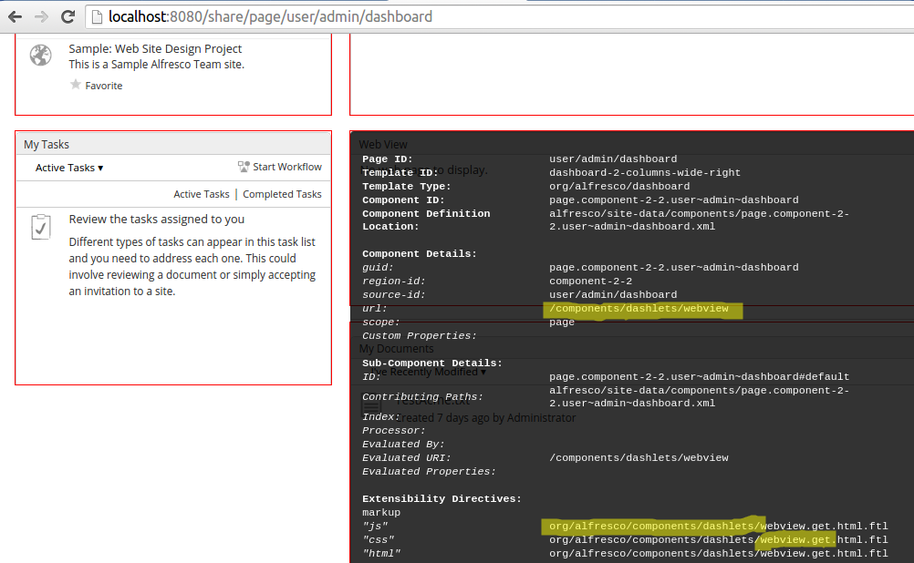
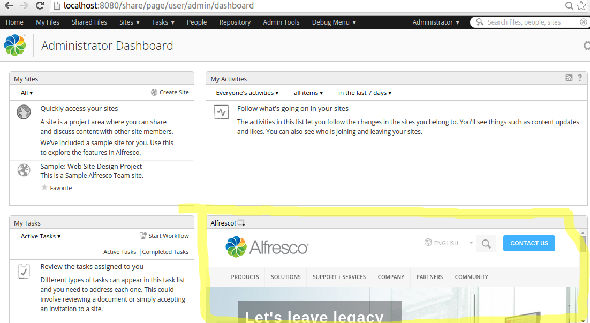

# Customizing \(web script controller\) the WebView dashlet on the Dashboard page

|**Name**|Customizing the WebView dashlet on the Dashboard page|
|**Extension Point**|[Surf Extension Modules](../concepts/dev-extensions-share-surf-extension-modules.md)|
|**Description**|This tutorial demonstrates how to customize the WebView dashlet web script controller so the Alfresco Home page is displayed by default. The tutorial walks through how to find the related component and web script.|
|**Implementation Steps**|It is often necessary to customize different parts of a Surf web script. This tutorial shows you how to customize the controller for a web script. The approach looks something like this:1.  Find the page component that corresponds to the content that should be changed.
2.  Identify the web script that is used to deliver the content.
3.  Identify what part of the web script need changing to achieve the customization, in this case the controller as we can set the page that should be loaded by default in the model.
4.  Create your version of the \{web script id\}.get.js file.
5.  Use a Surf Extension module to define the web script override.

|
|**Related Information**|This tutorial assumes that you are familiar with the Spring Surf development framework. If you are new to it then read up on it [here](../concepts/dev-extensions-share-architecture-extension-points.md) before starting this tutorial. If you have not already done so you should also review the [Introducing SurfBug](../concepts/dev-extensions-share-surfbug.md) topic as this tool is used in this tutorial.|
|**Source Code**|[Go to code](https://github.com/Alfresco/alfresco-sdk-samples/tree/alfresco-51/all-in-one/customize-webscript-controller-share)|

This tutorial assumes you have generated an [All-In-One SDK 3.0 Project](../concepts/sdk-getting-started.md).

Tutorial implementation steps:

1.  Add the WebView dashlet to the default dashboard for users.

    The WebView dashlet is not part of the default dashboard for users so we need to add it in order to be able to work with it when implementing this customization.

    The easiest way to add a dashlet permanently to the user dashboard is to define a new preset for the dashboard layout with id `user-dashboard`. Create a new presets directory under the aio/aio-share-jar/src/main/resources/alfresco/web-extension/site-data directory.

    Now, add a file called presets.xml to the new presets directory:

    ```
    <?xml version='1.0' encoding='UTF-8'?>
    <presets>
        <!-- Override wll known preset used to generate the default User dashboard.
             Add the Web View Dashlet so we can check if customization works. -->
        <preset id="user-dashboard">
            <components>
                <!-- title
                <component>
                    <scope>page</scope>
                    <region-id>title</region-id>
                    <source-id>user/${userid}/dashboard</source-id>
                    <url>/components/title/user-dashboard-title</url>
                </component>
                -->
                <!-- dashboard components -->
                <component>
                    <scope>page</scope>
                    <region-id>full-width-dashlet</region-id>
                    <source-id>user/${userid}/dashboard</source-id>
                    <url>/components/dashlets/dynamic-welcome</url>
                    <properties>
                        <dashboardType>user</dashboardType>
                    </properties>
                </component>
                <component>
                    <scope>page</scope>
                    <region-id>component-1-1</region-id>
                    <source-id>user/${userid}/dashboard</source-id>
                    <url>/components/dashlets/my-sites</url>
                </component>
                <component>
                    <scope>page</scope>
                    <region-id>component-1-2</region-id>
                    <source-id>user/${userid}/dashboard</source-id>
                    <url>/components/dashlets/my-tasks</url>
                </component>
                <component>
                    <scope>page</scope>
                    <region-id>component-2-1</region-id>
                    <source-id>user/${userid}/dashboard</source-id>
                    <url>/components/dashlets/my-activities</url>
                </component>
                <component>
                    <scope>page</scope>
                    <region-id>component-2-2</region-id>
                    <source-id>user/${userid}/dashboard</source-id>
                    <url>/components/dashlets/webview</url>
                </component>
                <component>
                    <scope>page</scope>
                    <region-id>component-2-3</region-id>
                    <source-id>user/${userid}/dashboard</source-id>
                    <url>/components/dashlets/my-documents</url>
                    <properties>
                        <height>240</height>
                    </properties>
                </component>
            </components>
            <pages>
                <page id="user/${userid}/dashboard">
                    <title>User Dashboard</title>
                    <title-id>page.userDashboard.title</title-id>
                    <description>Users dashboard page</description>
                    <description-id>page.userDashboard.description</description-id>
                    <template-instance>dashboard-2-columns-wide-right</template-instance>
                    <authentication>user</authentication>
                </page>
            </pages>
        </preset>
    </presets>
    ```

    Here we have included the WebView dashlet as `component-2-2`, so it will be displayed in column 2 and row 2 in the Dashboard layout. If you do not know the `url` for the dashlet, then just add it manually to the Dashboard and use SurfBug to identify what `url` that is used.

2.  Identify the web script that delivers the content that should be customized.

    For this we use the [SurfBug](../concepts/dev-extensions-share-surfbug.md) tool. Once the tool is activated \(from http://localhost:8080/share/page/surfBugStatus\) we can identify the web script as follows:

    

    Here we have scrolled down a bit on the Dashboard page so we have the WebView dashlet in front of us. Then we have clicked on the WebView dashlet. This brings up the above black box that contains information about what web script that is delivering the content for the dashlet. In this case it is the webview.get.\* web script in package org.alfresco.components.dashlets that we need to target. You can also identify the web script via the URL \(that is, `/components/dashlets/webview`\).

3.  In the Share JAR project create a new web script override package `org.alfresco.tutorials.customization.webview.controller`.

    The directory path that needs to be created is: aio/aio-share-jar/src/main/resources/alfresco/web-extension/site-webscripts/org/alfresco/tutorials/customization/webview/controller.

    We can choose any package path we want and then specify it in the Surf Extension Module, we will see this in a bit. However, it is important that we use a package path that will not clash with another Extension Module, deployed by some other JAR.

    For example, if we just used org.alfresco.tutorials.customization.webview and then another JAR was deployed with some other customization to the WebView dashlet, using the same package path. Then if one extension module is undeployed its customizations will still be picked up if the other module is active. This is because both modules are using the same package path.

4.  Add our version of the web script controller file called webview.get.js to the /tutorials/customization/webview/controller directory:

    ```
    if (model.isDefault == true)
    {
        model.widgets[0].options.webviewTitle = "Alfresco!";
        model.widgets[0].options.webviewURI = "http://www.alfresco.com";
        model.widgets[0].options.isDefault = false;
    }
    ```

    This controller will be processed after the out-of-the-box WebView controller. So what we are doing is just adding some stuff to the `model` widgets to tell the dashlet to load the Alfresco home page by default.

    By inspecting the source of both the out-of-the-box controller and the template, you can work out what `model` properties the template is using \(see tomcat/webapps/share/WEB-INF/classes/alfresco/site-webscripts/org/alfresco/components/dashlets\). This allows you to determine whether or not you can update the `model` after the base controller but before the template to create the required result.

5.  Add a new Surf Extension Modules file called customize-webscript-controller-extension-modules.xml to the aio/aio-share-jar/src/main/resources/alfresco/web-extension/site-data/extensions directory \(note. it is important to give this file a unique name when several Share JARs are installed, otherwise the last one wins\):

    ```
    <extension>
        <modules>
            <module>
                <id>Customize Web Script Controller for Web View Dashlet</id>
                <version>1.0</version>
                <auto-deploy>true</auto-deploy>
                <customizations>
                    <customization>
                        <targetPackageRoot>org.alfresco.components.dashlets</targetPackageRoot>
                        <sourcePackageRoot>org.alfresco.tutorials.customization.webview.controller</sourcePackageRoot>
                    </customization>
                </customizations>
            </module>
        </modules>
    </extension>
    ```

    This extension module identifies the package with the web script that we want to override by setting the `targetPackageRoot` property. When we have set what web script to override we use the `sourcePackageRoot` property to tell Alfresco where to pick up the customized web script files.

    This module will be deployed automatically when the application server is started as we have the `auto-deploy` property set to `true`.

6.  The implementation of this sample is now done, build and start the application server as follows:

    ```
    /all-in-one$ mvn clean install alfresco:run
    ```

    **Note**. when defining presets for sites and users know that they are stored in the database after first time usage. In this tutorial we defined a new user preset to display a slightly different user dashboard. If a user, such as **admin** that we most likely use with the SDK, has been logging in before this customization was applied, then that user will already have a user dashboard preset in the database. So the customization will not appear to work. But wipe out **alf\_data\_dev**, if you can, and restart and you will see that it works.

7.  Now, log in to Share \(http://localhost:8080/share\) and you will see the WebView dashlet loaded with the home page:

    

    **Note:** A Surf Extension module like this can be deployed and undeployed during runtime. And this means that an Administrator can control when different customizations should be visible or hidden. This is managed via the Module deployment page that can be found at: `http://localhost:8080/share/service/modules/deploy`.


The custom JavaScript is executed after the original. The original JavaScript sets up an initial `model` object, which the default FreeMarker template can use to render content. Controller extensions then have the opportunity to change that model and thus change the rendered output. Using this approach is dependent upon the template making use of the changed model content - just adding content to the model will have no effect unless the template is also updated to make use of the additional model data.

It is not always possible to use this approach to customize existing components, as it depends on how the JavaScript controller and template are implemented, but the approach is worth exploring.

**Parent topic:**[Pages](../concepts/dev-extensions-share-tutorials-pages.md)

