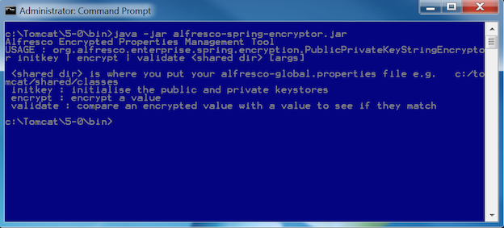
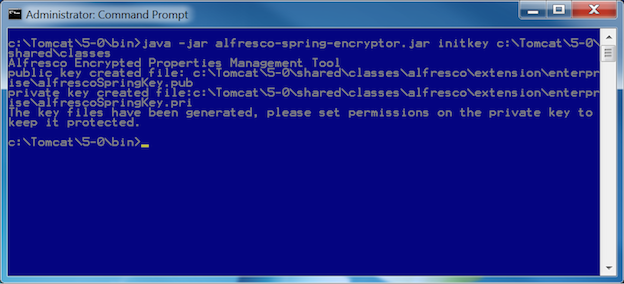
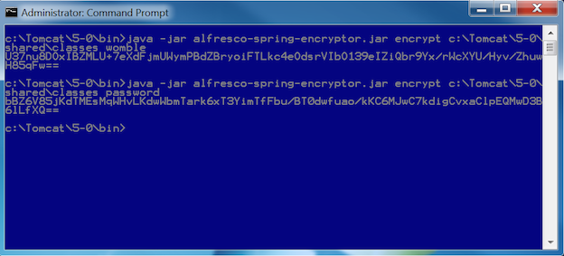
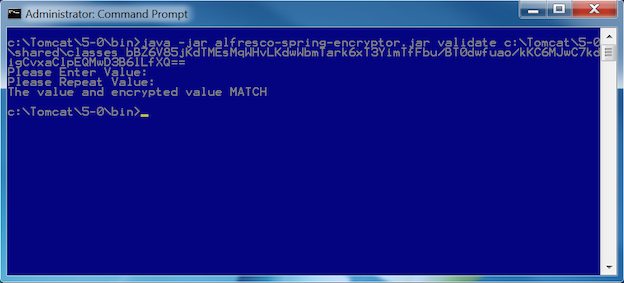

# Encrypting configuration properties

You can encrypt sensitive properties in the alfresco-global.properties configuration file.

1.  Run the Alfresco Encrypted Properties Management Tool.

    1.  Navigate to <ALFRESCO\_HOME\>/bin directory.

    2.  Locate the Alfresco Encrypted Properties Management Tool, `alfresco-spring-encryptor.jar`.

    3.  Run the executable jar file.

        ```
        java -jar alfresco-spring-encryptor.jar
        ```

    

2.  Generate the public and private keys using the `initkey` function. The public and private key pair is stored in the enterprise directory.

    ```
    java -jar alfresco-spring-encryptor.jar initkey c:/alfresco/tomcat/shared/classes
    ```

    

    You now have a public key \(`alfrescoSpringKey.pub`\) and a private key \(`alfrescoSpringKey.pri`\) in your <ALFRESCO\_HOME\>/tomcat/shared/classes/alfresco/extension/enterprise directory.

    **Note:** The private key file should be secured with the operating system permissions so that only the Alfresco Content Services process can read it.

    **Note:** Anyone can encrypt new values with the public key but only the Alfresco process can read the plain text value with the private key.

3.  Generate the encrypted string for your password/value using the `encrypt` function.

    ```
    java -jar alfresco-spring-encryptor.jar encrypt c:/alfresco/tomcat/shared/classes <password>
    ```

    **Note:** In the above command, remember to replace `<password>` with the actual password that you want to encrypt.

    

4.  Validate that the encrypted value obtained in Step 3 will decrypt the password.

    1.  Run the `validate` function.

        ```
        java -jar alfresco-spring-encryptor.jar validate c:/alfresco/tomcat/shared/classes <encrypted value>
        ```

        **Note:** In the above command, remember to replace `<encrypted value>` with encrypted string value obtained in Step 3.

    2.  You will be prompted to specify the value. Enter the password/value you want to encrypt.

    3.  You will be prompted to specify the value again. Enter the password/value you want to encrypt.

    

5.  Add the encrypted password to <ALFRESCO\_HOME\>/tomcat/shared/classes/alfresco-encrypted.properties file.

    ```
    db.password.enc=ENC(<enter encrypted password here>)
    ```

    ```
    db.password.enc=ENC(QcAf1Lr81meuP2p6Lu9ZQqFY1AsCfoWd)
    ```

    **Note:** Uncomment the `db.password.enc` property by removing the "\#" character.

6.  Set the value of the `db.password` property in thealfresco-global.properties file to point to the `db.password.enc` property in the alfresco-encrypted.properties file.

    ```
    db.password=${db.password.enc}
    ```

    **Note:** Uncomment the `db.password` property by removing the "\#" character.


**Parent topic:**[Encrypting properties](../concepts/encrypt-properties.md)

