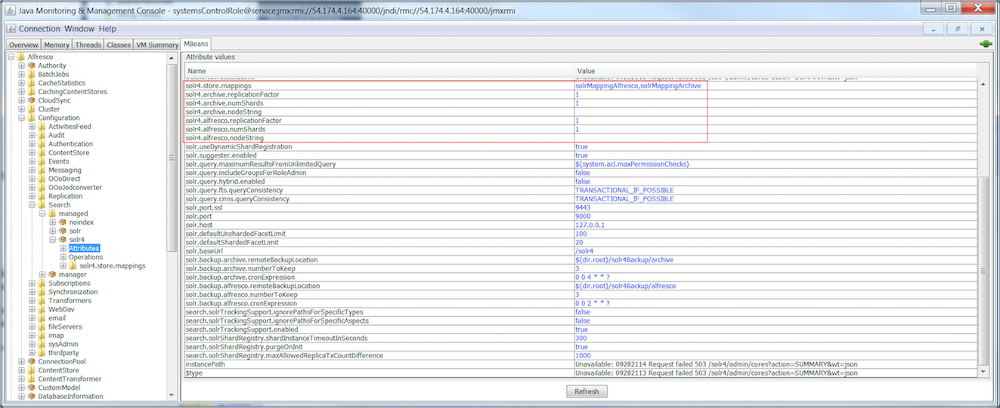

# Finding shards at query time

Use a JMX client to find shards at query time.

1.  In JConsole, go to **MBeans \> Alfresco \> Configuration \> Search \> managed \> solr4 \> Attributes**.

    All the Solr attributes are listed on this page.

    

2.  Set the following properties:

    ```
    solr4.alfresco.numShards=10
    solr4.archive.numShards=10
    ```

3.  In JConsole, go to **MBeans \> Alfresco \> Configuration \> Search \> managed \> solr4 \> solr4.store.mappings**.

4.  Set `numShards` for `solrMappingAlfresco` and `solrMappingArchive`.

    1.  Go to **solrMappingAlfresco \> Attributes \> numShards** and set the value of `numShards`.

        ```
        numShards=10
        ```

    2.  Go to **solrMappingArchive \> Attributes \> numShards** and set the value of `numShards`.

        ```
        numShards=10
        ```


**Parent topic:**[Dynamic shard registration](../concepts/dynamic-sharding.md)

