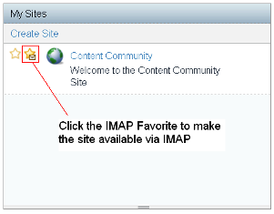

# Marking sites as IMAP favorites

To have access to Alfresco Share sites using IMAP, the site\(s\) need to be added to your list of sites using Share IMAP Favorites.

1.  Select **IMAP Favorites** in the Share **My Sites** dashlet on your **My Dashboard** page:

    

    

2.  Refresh your IMAP view to see the new sites.

    

    You can see the site added to the IMAP Sites folder.

    **Note:** If the folders do not appear in your email client, you should confirm that:

    -   The folder is in a site marked as an **IMAP favorite**.
    -   Your email client is showing all folders, and not just the folders that you have subscribed to.
    -   In your email client, look for a property like **Reload IMAP folders**.
    -   In your email client, clear your IMAP cache.

**Parent topic:**[Configuring the email client with IMAP](../concepts/imap-intro.md)

