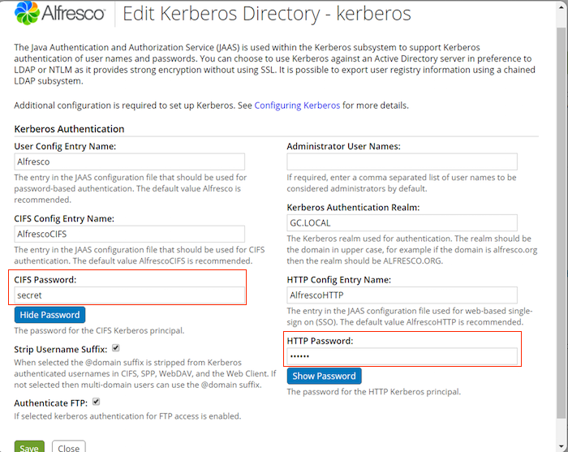

# Step 2. Configuring Kerberos on Alfresco server

As an Alfresco administrator, you need to configure Kerberos on the Alfresco server that will be running either the repository tier web application \(alfresco.war\) or the Share web application \(share.war\).

These instructions use the following naming conventions for the example server, server1.alfresco.org:

-   `<host>` is the server host name \(without domain name suffix\). For example, `server1`.
-   `<hostnetbios>` is the resolved value of the `cifs.serverName` property if the server is part of the Active Directory domain \(typically the host name with the letter 'A' appended\) or the host name otherwise \(without domain name suffix\). For example, `server1A`.
-   `<domain>` is the DNS domain. For example, `alfresco.org`.
-   `<REALM>` is t he DNS domain in upper case. For example, `ALFRESCO.ORG`.

In this example, our Windows domain controller/ Active Directory/ KDC host name is adsrv.alfresco.org. The Kerberos ini file for Linux is /etc/krb5.conf.

1.  Set up the Kerberos ini file to point to the Windows domain controller.

    The default location is %WINDIR%\\krb5.ini, where %WINDIR% is the location of your Windows directory, for example, C:\\Windows\\krb5.ini. If the file does not already exist \(for example, if the Kerberos libraries are not installed on the target server\), you must copy these over or create them from scratch. See [Kerberos Help](http://web.mit.edu/kerberos/krb5-1.12/doc/admin/conf_files/krb5_conf.html) for more information on the `krb5.conf` file.

    ```
    [libdefaults]
    default_realm = ALFRESCO.ORG
    default_tgs_enctypes = rc4-hmac
    default_tkt_enctypes = rc4-hmac
    
    [realms]
    ALFRESCO.ORG = {
       kdc = adsrv.alfresco.org
       admin_server = adsrv.alfresco.org
    }
    
    [domain_realm]
    adsrv.alfresco.org = ALFRESCO.ORG
    .adsrv.alfresco.org = ALFRESCO.ORG
    ```

    **Note:** Specify the realm in uppercase.

2.  Set up the Java login configuration file.

    For Tomcat, in the Java security folder \(for example, <installLocation\>/java/lib/security\), create a file named java.login.config with entries as shown below. Only include AlfrescoCIFS if you want to use Kerberos with CIFS. Only include ShareHTTP if the server is to run the Share web application \(share.war\). The AlfrescoHTTP is always needed.

    ```
    Alfresco {
       com.sun.security.auth.module.Krb5LoginModule sufficient;
    };
    
    AlfrescoCIFS {
       com.sun.security.auth.module.Krb5LoginModule required
       storeKey=true
       useKeyTab=true
       doNotPrompt=true
       keyTab="C:/etc/cifs<host>.keytab"
       principal="cifs/<hostnetbios>.<domain>";
    };
    
    AlfrescoHTTP
    {
       com.sun.security.auth.module.Krb5LoginModule required
       storeKey=true
       useKeyTab=true
       doNotPrompt=true
       keyTab="C:/etc/http<host>.keytab"
       principal="HTTP/<host>.<domain>";
    };
    
    ShareHTTP
    {
       com.sun.security.auth.module.Krb5LoginModule required
       storeKey=true
       useKeyTab=true
       doNotPrompt=true
       keyTab="C:/etc/http<host>.keytab"
       principal="HTTP/<host>.<domain>";
    };
    
    com.sun.net.ssl.client {
       com.sun.security.auth.module.Krb5LoginModule sufficient;
    };
    
    other {
       com.sun.security.auth.module.Krb5LoginModule sufficient;
    };
    ```

3.  To enable the login configuration file, locate and edit the following line in the main Java security configuration file, java\\lib\\security\\java.security.

    ```
    login.config.url.1=file/<installLocation>/java/lib/security/java.login.config
    ```

    **Note:** Make sure you provide the full file path instead of using variables.

4.  If the Alfresco Content Services server is not part of the Active Directory domain, ensure that its clock is kept in sync with the domain controller's, for example, by configuring the domain controller as an NTP server.

5.  To complete the Kerberos SSO tasks on the Alfresco server, see [Configuring Alfresco Share Kerberos SSO](auth-kerberos-shareSSO.md).

6.  Use Directory Management in the Admin Console to [enable Kerberos authentication](adminconsole-directorymgt-kerberos.md) and specify the CIFS and HTTP passwords.

    

    **Note:** Do not change the values of User Config Entry Name, CIFS Config Entry Name, and Kerberos Authentication Realm. If you do change, the values must match the entries in the Java login configuration file.


**Parent topic:**[Enabling Kerberos authentication](../tasks/auth-kerberos-ADconfig.md)

