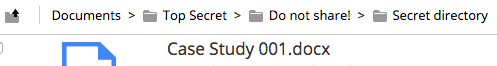

# Managing file and folder permissions

You can override the default site permissions for any content you add to the document library. This lets you control what site members can see and do with your content.

Each user has an assigned role in the site - Manager, Collaborator, Contributor, or Consumer - and each role has a default set of permissions. This controls the actions site members can [perform in the site](../references/permissions_share.md).

The Manage Permissions feature goes beyond the site permissions. It lets you override a user's site role for a particular content item or folder. This means you can give a site member either more or less access to specific content compared to what they can do with other content in the library.

This can be really useful to hide and restrict content to only a set group of site members.

**Note:** Remember to keep your content secure. If you give someone access to a file or folder then they'll see the breadcrumb path to it, even when they don't have access to it's parent folder.

CAUTION:

Don't give permissions to users who aren't a member of the site, as this can cause problems with the document library.

1.  Hover over a file/folder in the library and click **More** then **Manage Permissions**.

2.  Manage the inherited permissions:

    -    **Inherit Permissions** shows that permissions are being inherited from the parent folder. Click this button to ignore the inherited permissions.
    -    **Inherit Permissions** shows that permissions are not being inherited from the parent folder. Click this button to inherit the permissions.
3.  Manage the local permissions:

    1.  Click **Add User**.

    2.  Search for the user you want to define permissions for.

    3.  Click **Search** or press ENTER.

        The search returns a list of users.

    4.  Click **Add** to place a user in the Locally Set Permissions table. The user is given the role Consumer.

    5.  Change the role as needed.

    6.  Repeat this step to add more users and set their permissions for the same content.

        **Note:** To revoke the permissions for a user, click **Delete** in the Actions column.

4.  Click **Save**.

**Parent topic:**[Working with files and folders](../concepts/library-items-individual.md)

