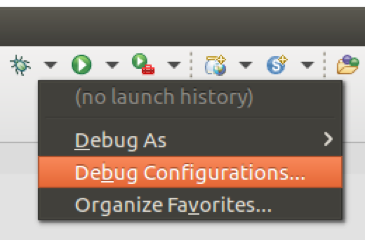
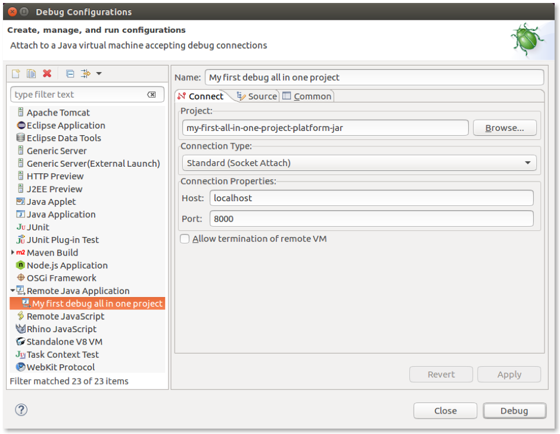
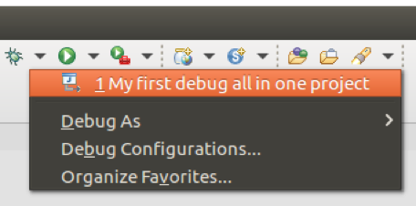
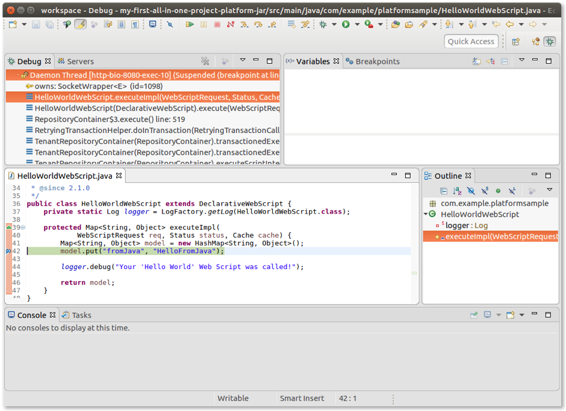

# Remote debugging using Eclipse

Here you'll see how to create and manage a configuration to remotely debug your launched Alfresco project that's waiting for a connection. This assumes you have an Eclipse IDE up and running, and have already imported the same project you are going to debug.

For more details on how import an Alfresco project into your Eclipse IDE, see [Setting up your development environment using Eclipse](sdk-develop-eclipse.md).

1.  Open the Eclipse IDE and click on **Run Configurations** \(top right\).

    

2.  Click on the green plus \(top left\) and select `Remote Java Application` to add a new configuration for a remote app.

3.  Enter a name for your configuration, for example, *My first debug all in one project*.

    

4.  Click **Browse** then locate the platform project JAR.

5.  Check that your settings match the screenshot.

6.  Click **Apply**.

    You will be taken back to the project source code.

7.  Click on the bug icon and select the new configuration to run it.

    

    The project starts running and generating all the log messages of a regular launch in the terminal window. Once it's started, you can open a browser and start using your application. In our case, we are going to test the behaviour of debugging by running the sample webscript.

8.  Open your browser and type `http://localhost:8080/alfresco/s/sample/helloworld`.

    This is a sample webscript generated in every project created using SDK 3.0 and the platform artifact.

    

    Now let's find the `HelloWorldWebScript.java` file in the `src/main/java/.../platformsample` folder of your project. If you're using an All-In-One project, the folder is located in the platform sub-project.

9.  Edit the file using Eclipse IDE and set a breakpoint \(by clicking to the left of the line number\) at line:

    `model.put(“fromJava”,”HelloFromMe”);`

10. Refresh the browser. Eclipse will intercept the execution at the breakpoint:

    

    From here the management is the same as for a regular Java application using your preferred IDE. Please note that the whole Alfresco source code is available at debug time, thanks to the local maven repository.

**Parent topic:**[Debugging](../concepts/sdk-debugging.md)

