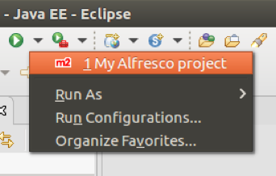

# Setting up your development environment using Eclipse

The Maven Alfresco SDK is designed to work well with Eclipse. This support includes the ability to import existing Alfresco projects created using the Alfresco SDK.

Here we assume you already have an Eclipse installation up and running, together with an available Alfresco project created using the Alfresco SDK. If you don't have a project already, follow the steps in [Getting started with Alfresco Content Services SDK 3](../concepts/sdk-getting-started.md) to learn how to quickly generate it in a few easy steps.

**Importing the Alfresco project into Eclipse**

1.  Starting from Eclipse, select **File** \> **Import** \> **Maven** \> **Existing Maven Projects** from the main menu to import the Alfresco project.

    

2.  Click **Next** then browse to the root of the Alfresco project.

    

3.  Click **Finish** to start importing the project into Eclipse.

    Before completing the import, Eclipse checks the completeness of the local Maven repository. If you already have a local repository that includes all the required dependencies, this task will finish relatively quickly. Otherwise, be patient and wait until the downloads are completed \(it can take some time\).

    Once the import is complete, a warning message is displayed.

    

4.  Click **Resolve All Later** to complete the import task.

5.  Check the Markers tab in the bottom panel, where you may see some Maven problems. Expand the list and right click on a item with an error, then select **Quick Fix** and mark as shown.

    

6.  Click **Finish** to confirm the fix.

    You may be asked to confirm your selection.

7.  Repeat the fix for all similar issues you have. Note that these issues really depend on the archetype you used to generate the project.

    Once done, you may see an error with description: `Project configuration is not up-to-date with pom.xml`.

8.  To fix this, right click one of the Alfresco projects and select **Maven** \> **Update Project**, ensure all the Alfresco projects and sub-projects are selected, and then click **OK**.

    **Running the Alfresco project from Eclipse**

    To run the Alfresco project in Eclipse you need to correctly configure the environment.

9.  Click **Run** \> Run Configuration and then select **Maven Build** from the list.

10. Right click **Maven Build** and select **New**.

11. Give the project a name \(for example, *My Alfresco project*\).

12. Select the entire project using the Workspace button.

13. Select the **Debug Output** check box and click **Apply**.

    

    Now it's time to setup the Java Runtime Environment.

14. Click on the JRE tab and type `-Xms256m -Xmx2G` in the VM arguments field.

15. Click **Apply** to confirm the settings.

    

    The configuration is done now.

16. Click the green **Run** button to launch the project.

    You will start seeing a lot of log messages in the Console tab in the bottom panel. This is the log tail where you can check for errors, debug messages and everything that's relevant for you to understand what is happening to the project execution.

    Starting from now, you can use your project as usual, for example, by opening a browser and accessing the services nad clients.

17. To stop the project, click the red **Terminate** button in the Console tab in the bottom panel.

    

18. After the first run, the configuration is added to the toolbar for a faster access to launch.

    

**Parent topic:**[Setting up your development environment](../concepts/sdk-developing.md)

