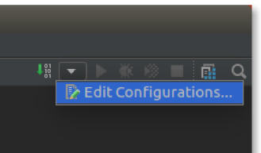

# Setting up your development environment using Intellij IDEA

The Maven Alfresco SDK is designed to work well with IntelliJ IDEA. This support includes the ability to import existing Alfresco projects created using the Alfresco SDK.

Here we assume you already have an IntelliJ IDEA installation up and running, together with an available Alfresco project created using the Alfresco SDK. If you don't have a project already, follow the steps in [Getting started with Alfresco Content Services SDK 3](../concepts/sdk-getting-started.md) to learn how to quickly generate it in a few easy steps.

**Importing the Alfresco project into Intellij IDEA**

1.  Starting from IntelliJ IDEA, select **File** \> **Open** from the main menu to open the Alfresco project.

    **Note:** Alternatively, select **Import Project** if you're running IntelliJ IDEA for the first time in your development environment.

    

2.  After the project is imported, you will see a window similar to the following:

    

    **Running the Alfresco project from IntelliJ IDEA**

    To run the Alfresco project in IntelliJ IDEA you need to correctly configure the environment.

3.  Click **Run Configurations** in the top right as shown:

    

4.  Click on the green plus \(in top left\) and select **Maven** to add a new Maven configuration.

5.  Enter your preferred name for the configuration. For example, *My first all in one project*.

6.  In the **Working directory** field, enter your project path.

7.  Enter the **Command line**, for example *clean install alfresco:run*.

    

8.  In the **Runner** tab, deselect the **Use project settings** checkbox.

9.  Enter the **VM Options** and **JRE**:

    -   VM Options: `-Xms256m -Xmx2G`
    -   JRE: select 'Use JAVA\_Home' \(for example, `/usr/lib/jvm/java-8-oracle`\)
    

10. Click **OK**.

    The project is reorganized to represent the correct Maven structure as shown in your IDE.

    

11. To run your project, click on the green arrow on the top right of the window.

    A new panel appears at the bottom of the window. In this panel you can check the log messages describing the Alfresco launch, as shown in your IDE.

    

12. To stop the execution, click on the red button on the top right of the window.

**Parent topic:**[Setting up your development environment](../concepts/sdk-developing.md)

