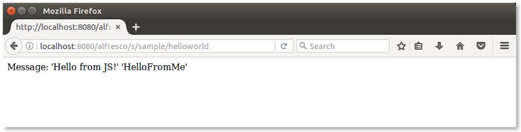

# Using HotSwapAgent

HotSwapAgent is the agent that enables you to do *hot reloading*. This allows you to modify the application code, and view the changes without having to restart Alfresco Tomcat.

A prerequisite for this tutorial is to have a project created with the Alfresco SDK 3.0, using the All-In-One archetype or the Platform JAR archetype. It's worth noting that hot reloading is only supported on the platform, and not in Alfresco Share.

**Note:** As an alternative to the HotSwapAgent you can also try out [JRebel](sdk-hot-reload-jrebel.md). It has more features but isn't free.

For more details and documentation, refer to the [HotSwapAgent website](http://hotswapagent.org/) and the [IDE setup](http://hotswapagent.org/mydoc_setup_eclipse.html) to enable it in your IDE.


**Installing HotSwapAgent**

1.  Download the [latest release of DCEVM Java patch](https://github.com/dcevm/dcevm/releases). Make sure it matches your Java SDK version, check it as follows `$ javac -version javac 1.8.0_144`

2.  Launch the installer with administrator permissions:

    ```
    $ sudo java -jar DCEVM-8u144-installer.jar
    ```

3.  From the user interface, select the correct Java installation and click the **Install DCEVM as altjvm** button \(i.e. no need to replace the JVM\). A JVM might not be automatically detected so navigate to the directory where it is installed and select it \(e.g. on a Mac: /Library/Java/JavaVirtualMachines/jdk1.8.0\_144.jdk/Contents/Home\)

    Java 1.7+ versions are supported but remember to use the right version depending on your Alfresco version.

4.  Download the [latest release of Hotswap agent jar](https://github.com/HotswapProjects/HotswapAgent/releases) and put it anywhere on your computer.

    **Important:** If you experience any issues during startup of the Alfresco project using HotswapAgent JAR v1.1.0, use v1.0 instead.

    This is all you need to get HotSwapAgent up and running in your environment.

5.  Check the installation is running correctly by executing: `java -version -XXaltjvm=dcevm`

    You should see the following log \(paying attention to the last line shown\):

    ```
    $ java -version -XXaltjvm=dcevm
    java version "1.8.0_144"
    Java(TM) SE Runtime Environment (build 1.8.0_144-b01)
    Dynamic Code Evolution 64-Bit Server VM (build 25.71-b01-dcevmlight-2, mixed mode)
    ```

6.  Run `java -version` to see the standard result when using the default JVM without the HotSwapAgent.

7.  Locate the just downloaded `hotswap-agent-1.**.jar` file and copy it to a permanent location and change the name to `hotswap-agent.jar`.

8.  Modify the `MAVEN_OPTS` variable contained in the `run.sh` or `run.bat` script that are part of your SDK project. Set it as follows \(Windows platform users may require a slightly different format\).

    ```
    MAVEN_OPTS='-Xms256m -Xmx2G -javaagent:/<path>/hotswap-agent.jar -XXaltjvm=dcevm'
    ```

    If you don't have an Alfresco SDK project, follow the steps in [Getting started with Alfresco Content Services SDK 3](../concepts/sdk-getting-started.md).

9.  Create a `hotswap-agent.properties` file in the platform-jar project

    SDK 3 projects already contains these property files. Copy the `src/test/resources/platform-hotswap-agent.properties` file into `src/main/resources/hotswap-agent.properties` \(note that file has been renamed\)

10. This is all you need to make HotSwapAgent work in your development environment. Now it's time to run the Alfresco SDK project. Launch the `run` script stored in the root of the project.

    You'll recognize HotSwap Agent is working when you see log messages such as these:

    ```
    $ sh run.sh 
    The environment variable 'MAVEN_OPTS' is not set, setting it for you
    MAVEN_OPTS is set to '-Xms256m -Xmx2G -javaagent:/Users/mbergljung/Downloads/hotswap-agent.jar -XXaltjvm=dcevm'
    HOTSWAP AGENT: 11:46:33.288 INFO (org.hotswap.agent.HotswapAgent) - Loading Hotswap agent {1.1.0-SNAPSHOT} - unlimited runtime class redefinition.
    HOTSWAP AGENT: 11:46:33.862 INFO (org.hotswap.agent.config.PluginRegistry) - Discovered plugins: [Hotswapper, WatchResources, AnonymousClassPatch, ClassInitPlugin, Hibernate, Hibernate3JPA, Hibernate3, Spring, Jersey1, Jersey2, Jetty, Tomcat, ZK, Logback, Log4j2, MyFaces, Mojarra, Seam, ELResolver, WildFlyELResolver, OsgiEquinox, Owb, Proxy, WebObjects, Weld, JBossModules, ResteasyRegistry, Deltaspike, JavaBeans, GlassFish]
    [INFO] Scanning for projects...
    ```

    Once the Alfresco SDK project is launched, it's time to start changing the content and see how hot reloading works. We will walk through a few examples. To see all the features of hot reloading, take a look to the [HotSwapAgent documentation](http://hotswapagent.org/).

11. We will start by updating an example Web Script that comes with the project template. However, before making any changes, let's run the Web Script and see what the response is, use the `http://localhost:8080/alfresco/s/sample/helloworld` URL:

    This is a sample webscript generated in every project created using SDK 3.0 and the platform artifact.

    

12. Locate `HelloWorldWebScript.java` in the src/main/java/.../platformsample folder of your project.

    If you are using an All-In-One project, the folder is located in the ...platform-jar sub-project.

13. Edit it using your preferred editor and change the code so that `HelloFromJava` becomes `HelloFromMe`\):

    model.put\(“fromJava”,”HelloFromMe”\);

14. Save your file and open a new terminal.

    If you're using an All-In-One project, remember to change directory to the `<artifadctId>-platform-jar` folder first.

15. Run `mvn compile`.

    A number of log messages appear in the Alfresco project terminal, for example:

    ```
    HOTSWAP AGENT: 13:31:15.635 RELOAD (org.hotswap.agent.config.PluginManager) - Reloading classes 
                            [org.alfresco.training.platformsample.DemoComponent, 
                            org.alfresco.training.platformsample.Demo, 
                            org.alfresco.training.platformsample.HelloWorldWebScript] (autoHotswap)
    ```

16. Refresh the browser to see the updated message:

    

    By changing the code and compiling it again, the changes have been dynamically swapped in, i.e. class `HelloWorldWebScript` reloaded.


**Parent topic:**[Hot reloading](../concepts/sdk-hot-reloading.md)

