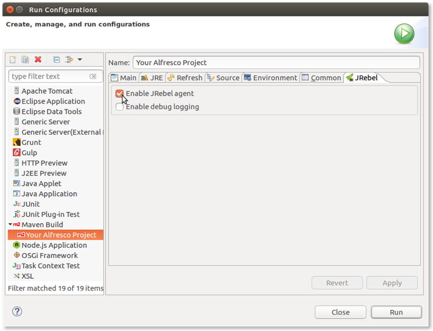
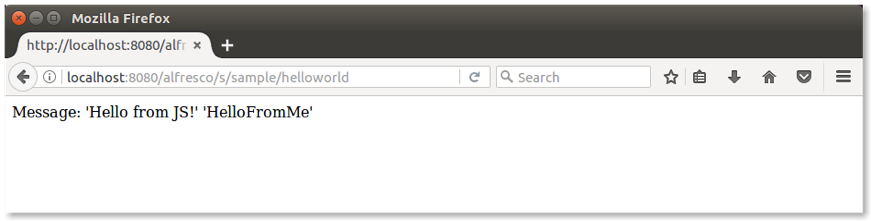

# Using JRebel with Eclipse IDE

Before using this tutorial, you should have an existing project \(All-In-One or Platform JAR\) already set up and working in your Eclipse IDE instance.

For a detailed tutorial on the Eclipse IDE set up, see [Setting up your development environment using Eclipse](sdk-develop-eclipse.md).

For further details about JRebel, refer to the [JRebel documentation](http://manuals.zeroturnaround.com/jrebel/ide/index.html) to enable it in your IDE.


To install JRebel using Eclipse IDE \(or any other supported IDE\), follow the steps below.

1.  Open Eclipse and go to Help \> Eclipse Marketplace….

2.  Search for JRebel and select `Install`.

3.  Restart Eclipse to complete the installation.

4.  Select Help \> JRebel \> Activation to activate your installation.

    Note that a license is required. In this step you will be able to request a trial license.

5.  Select Help \> JRebel \> Configuration \> Startup to configure your installation, and choose **Run via IDE**.

6.  Select Help \> JRebel \> Configuration \> Projects to configure the Alfresco project, and choose to use JRebel \(locally\) for all of your project and sub-projects.

    This is all you need to make JRebel work in your Eclipse environment. Now it's time to run the Alfresco project to use the JRebel agent. To update the project, edit the Eclipse configuration you use to launch the project, making sure that you select the JRebel agent:

    

    If you don't have an Alfresco project, follow the steps in [Getting started with Alfresco Content Services SDK 3](../concepts/sdk-getting-started.md).

7.  Select **Run** to launch the project using the updated configuration.

    You'll recognize JRebel is working when you see similar log messages:

    ```
    2017-05-16 15:28:12 JRebel:  Starting logging to file: /home/alfresco/.jrebel/jrebel.log
    2017-05-16 15:28:12 JRebel:  
    2017-05-16 15:28:12 JRebel:  #############################################################
    2017-05-16 15:28:12 JRebel:  
    2017-05-16 15:28:12 JRebel:  JRebel Agent 7.0.8 (999999999999)
    2017-05-16 15:28:12 JRebel:  (c) Copyright ZeroTurnaround AS, Estonia, Tartu.
    2017-05-16 15:28:12 JRebel:  
    2017-05-16 15:28:12 JRebel:  Over the last 2 days JRebel prevented
    2017-05-16 15:28:12 JRebel:  at least 1 redeploys/restarts saving you about 0 hours.
    2017-05-16 15:28:12 JRebel:  
    2017-05-16 15:28:12 JRebel:  Licensed to XXXX XXXX (XXXX)
    2017-05-16 15:28:12 JRebel:  
    2017-05-16 15:28:12 JRebel:  License type: evaluation
    2017-05-16 15:28:12 JRebel:  Valid from: XXX 99, 9999
    2017-05-16 15:28:12 JRebel:  Valid until: XXX 99, 9999
    2017-05-16 15:28:12 JRebel:  
    2017-05-16 15:28:12 JRebel:  You are using an EVALUATION license.
    2017-05-16 15:28:12 JRebel:  Days left until license expires: 99
    2017-05-16 15:28:12 JRebel:  
    2017-05-16 15:28:12 JRebel:  To extend your evaluation or purchase a license,
    2017-05-16 15:28:12 JRebel:  contact sales@zeroturnaround.com.
    2017-05-16 15:28:12 JRebel:  
    2017-05-16 15:28:12 JRebel:  If you think this is an error, contact support@zeroturnaround.com.
    2017-05-16 15:28:12 JRebel:  
    2017-05-16 15:28:12 JRebel:  
    2017-05-16 15:28:12 JRebel:  #############################################################
    2017-05-16 15:28:12 JRebel:  
    [INFO] Scanning for projects...
    ```

    Once the Alfresco project is launched, it's time to change the content and see how hot reloading works. Here, we will not see the details of what you might change in the project. To see all the features of hot reloading, take a look to the [JRebel documentation](https://zeroturnaround.com/software/jrebel/learn/). Instead, we would like to show the developer experience, by showing you a practical example.

8.  Before making any changes, let's run the sample webscript by opening your browser and typing `http://localhost:8080/alfresco/s/sample/helloworld`.

    This is a sample webscript generated in every project created using SDK 3.0 and the platform artifact.

    

9.  Locate `HelloWorldWebScript.java` in the src/main/java/.../platformsample folder of your project.

    If you are using an All-In-One project, the folder is located in the platform sub-project.

10. Edit it using your preferred editor and change the code so that `HelloFromJava` becomes `HelloFromMe`:

    ```
    model.put(“fromJava”,”HelloFromMe”);
    ```

11. Save your file then check your IDE Console for log messages:

    ```
    ... JRebel: Reloading class 'com.example.platformsample.HelloWorldWebScript'.
    ... JRebel: Reconfiguring bean 'webscript.alfresco.tutorials.helloworld.get'
    [com.example.platformsample.HelloWorldWebScript]
    ```

12. Refresh the browser to see the updated message:

    

    By changing the code and compiling it again, the changes have been dynamically received from Alfresco Content Services.


**Parent topic:**[Hot reloading](../concepts/sdk-hot-reloading.md)

