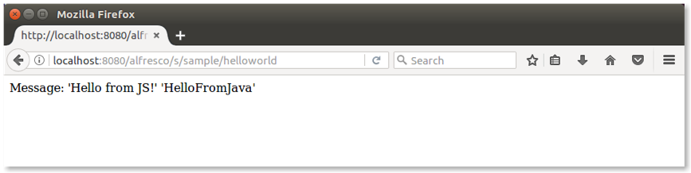

# Using JRebel

JRebel is the agent that enables you to do *hot reloading*. This allows you to modify the application code, and view the changes without having to restart Alfresco Tomcat.

A prerequisite to this tutorial is having an Alfresco project created with Alfresco SDK 3.0, using the All-In-One archetype, or the Platform JAR archetype. It's worth noting that hot reloading is only supported on the platform, and not in Alfresco Share.

**Note:** An open source and free of charge alternative to JRebel is [HotSwapAgent](sdk-hot-reload-hotswap.md). For more details, see the [HotSwapAgent website](http://hotswapagent.org/).

JRebel can be installed in several ways: for example, using an IDE or in "standalone" mode. Various IDEs are supported, including Eclipse and IntelliJ. The standalone installation is useful if you want to use hot reloading from the command line.

For more details on installing using an IDE, see [Using JRebel with Eclipse IDE](sdk-hot-reload-jrebel-eclipse.md).


**Installing JRebel standalone \(from the command line\)**

1.  Download JRebel in standalone mode and unpack it in your preferred location.

2.  Run the `activate-gui.sh` script to activate your installation.

    Note that a license is required. In this step you will be able to request a trial license.

    Now that JRebel is correctly installed, it's time to update the environment to use the agent for hot reloading.

3.  Run the following command \(modify the command slightly for Windows\):

    ```
    export MAVEN_OPTS="-Xms256m -Xmx2G 
    -agentpath:/path/to/jrebel/lib/libjrebel64.so"
    ```

    We suggest that you add the `export` command to the environment shell script \(`.bashrc` or similar depending on your operating system\).

    This is all you need to make JRebel work in your development environment. Now it's time to run the Alfresco project.

4.  Launch the `run` script stored in the root of the project.

    If you don't have an Alfresco project, follow the steps in [Getting started with Alfresco Content Services SDK 3](../concepts/sdk-getting-started.md).

    You'll recognize JRebel is working when you see similar log messages:

    ```
    2017-05-16 15:28:12 JRebel:  Starting logging to file: /home/alfresco/.jrebel/jrebel.log
    2017-05-16 15:28:12 JRebel:  
    2017-05-16 15:28:12 JRebel:  #############################################################
    2017-05-16 15:28:12 JRebel:  
    2017-05-16 15:28:12 JRebel:  JRebel Agent 7.0.8 (999999999999)
    2017-05-16 15:28:12 JRebel:  (c) Copyright ZeroTurnaround AS, Estonia, Tartu.
    2017-05-16 15:28:12 JRebel:  
    2017-05-16 15:28:12 JRebel:  Over the last 2 days JRebel prevented
    2017-05-16 15:28:12 JRebel:  at least 1 redeploys/restarts saving you about 0 hours.
    2017-05-16 15:28:12 JRebel:  
    2017-05-16 15:28:12 JRebel:  Licensed to XXXX XXXX (XXXX)
    2017-05-16 15:28:12 JRebel:  
    2017-05-16 15:28:12 JRebel:  License type: evaluation
    2017-05-16 15:28:12 JRebel:  Valid from: XXX 99, 9999
    2017-05-16 15:28:12 JRebel:  Valid until: XXX 99, 9999
    2017-05-16 15:28:12 JRebel:  
    2017-05-16 15:28:12 JRebel:  You are using an EVALUATION license.
    2017-05-16 15:28:12 JRebel:  Days left until license expires: 99
    2017-05-16 15:28:12 JRebel:  
    2017-05-16 15:28:12 JRebel:  To extend your evaluation or purchase a license,
    2017-05-16 15:28:12 JRebel:  contact sales@zeroturnaround.com.
    2017-05-16 15:28:12 JRebel:  
    2017-05-16 15:28:12 JRebel:  If you think this is an error, contact support@zeroturnaround.com.
    2017-05-16 15:28:12 JRebel:  
    2017-05-16 15:28:12 JRebel:  
    2017-05-16 15:28:12 JRebel:  #############################################################
    2017-05-16 15:28:12 JRebel:  
    [INFO] Scanning for projects...
    ```

    Once the Alfresco project is launched, it's time to change the content and see how hot reloading works. Here, we will not see the details of what you might change in the project. To see all the features of hot reloading, take a look to the [JRebel documentation](https://zeroturnaround.com/software/jrebel/learn/). Instead, we would like to show the developer experience, showing a practical example.

5.  Before making any changes, let's run the sample webscript by opening your browser and typing `http://localhost:8080/alfresco/s/sample/helloworld`.

    This is a sample webscript generated in every project created using SDK 3.0 and the platform artifact.

    

6.  Locate `HelloWorldWebScript.java` in the src/main/java/.../platformsample folder of your project.

    If you are using an All-In-One project, the folder is located in the platform sub-project.

7.  Edit it using your preferred editor and change the code so that `HelloFromJava` becomes `HelloFromMe`:

    ```
    model.put(“fromJava”,”HelloFromMe”);
    ```

8.  Save your file and open a new terminal.

    If you're using an All-In-One project, remember to change directory to the `<artifadctId>-platform-jar` folder first.

9.  Run `mvn compile`.

    A number of log messages appear in the Alfresco project terminal, for example:

    ```
    ... JRebel: Reloading class 'com.example.platformsample.HelloWorldWebScript'.
    ... JRebel: Reconfiguring bean 'webscript.alfresco.tutorials.helloworld.get' 
    [com.example.platformsample.HelloWorldWebScript]
    ```

10. Refresh the browser to see the updated message:

    

    By changing the code and compiling it again, the changes have been dynamically received from Alfresco Content Services.


**Parent topic:**[Hot reloading](../concepts/sdk-hot-reloading.md)

