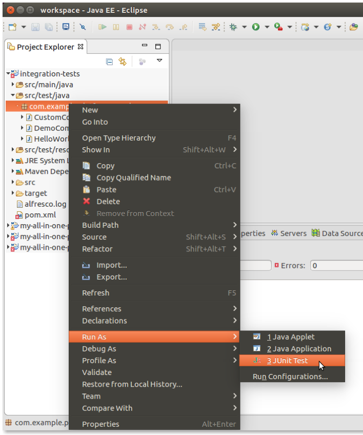
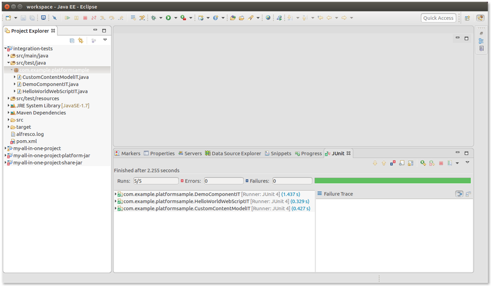

# Running integration tests from your IDE

If your project is available in Eclipse or IntelliJ, you can easily run one or more of the integration tests directly from your IDE.

To run the integration tests:

1.  Open the project using the IDE.

2.  Select the classes for the integration tests \(either one, some, or the whole package\).

3.  Right click and select **Run As ...**, then click **JUnit Test**.

    

    Once the tests have completed \(typically, after a few seconds\), the results are presented.

    

    **Important:** When using an IDE, the source code related to the integration tests is the one deployed directly on the platform side. This means that an update in the code for the Java classes will be included when you run the integration tests *if and only if* they are deployed in the platform. To avoid stopping/starting Alfresco Content Services with every change, use **hot reloading** as the only way to deploy the new version of the Java classes. For more details, see [Hot reloading](../concepts/sdk-hot-reloading.md).

**Parent topic:**[Integration testing](../concepts/sdk-integration-testing.md)

