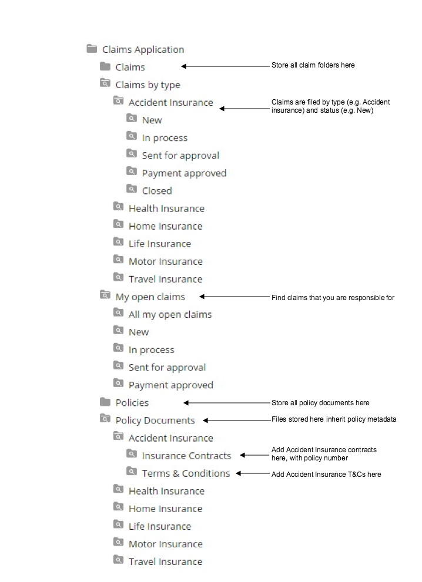

# Smart Folders tutorial

In this seven-step tutorial you will create a simple claims management solution.

You can use Smart Folders for any purpose where you want to bring together files from across an organization, and apply metadata across a set of files. A good case study is an insurance claim, where you might want to bring together information for one customer, that relates to a claim and a specific policy.

**Note:** You will need system administrator rights to perform the activities in this tutorial.

In the tutorial, you will:

1.  Import a custom content model and create a Claims Application folder where your Smart Folder structure will live
2.  Enable Smart Folders and the Type-based Smart Folder, and import the `clex_claimFolder.json` Smart Folders Template
3.  Create a rule to automatically apply the aspects for your Smart Folder structure
4.  Create a new claim
5.  Add some supporting files to your claim
6.  Apply a System Smart Folder to your Claims Application folder, to see how you can use different Smart Folder Templates together
7.  Link your claim to related policy files

For more information about the Smart Folders workflow, see [Planning and implementing Smart Folders](../concepts/sf-config-workflow.md). For information about Type-based, System, and Custom Smart Folders, see [Type-based, System, and Custom Smart Folders](../concepts/sf-folder.md).

The diagram shows the final folder structure that you will create during this tutorial: 

For background information on Smart Folder Templates, see [What is a Smart Folder?](../concepts/sf-whatis.md)

-   **[1. Setting up claims management](../tasks/sf-tutorial-cmm.md)**  
To set up the claims framework, you need to create a custom content model, then create a folder structure for your content.
-   **[2. Configuring claims management](../tasks/sf-tutorial-configure.md)**  
To configure the claims framework, add the sample template to the Data Dictionary and enable the claims aspect.
-   **[3. \(Optional\) Creating a rule to define your Smart Folder structure](../tasks/sf-tutorial-create-rule.md)**  
You can create a simple folder rule to add an aspect automatically to your folder structure.
-   **[4. Creating a new claim](../tasks/sf-tutorial-create.md)**  
You can create a new claim structure using the Smart Folder Template, and edit a new claim.
-   **[5. Adding new claim files](../tasks/sf-tutorial-add.md)**  
Add some files for the new claim.
-   **[6. Applying multiple templates](../tasks/sf-tutorial-multi.md)**  
You can use multiple Smart Folder Templates at the same time, to help you find your content more easily.
-   **[7. Adding policy files and reviewing the final claim structure](../tasks/sf-tutorial-policy.md)**  
You can add files relating to the policy and review the Smart Folder structure that you have created for managing claims.

**Parent topic:**[Configuring Smart Folders](../concepts/sf-intro.md)

