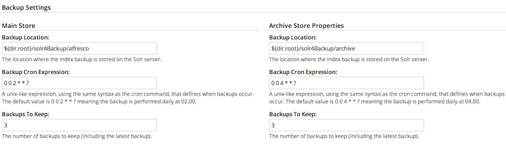

# Backing up Solr

There are a number of ways to back up the Solr indexes.

You can set the Solr indexes backup properties either by using the Admin Console in Alfresco Share or by editing the alfresco-global.properties file or by using a JMX client, such as JConsole.

**Note:** The \\alf\_data\\solr4\\content directory is not backed up automatically during the back up process. If you want a back up of this directory, you will have to do it manually.

**Parent topic:**[Solr backup and restore](../concepts/solr-backup-recovery.md)

## Set up Solr backup properties using the Share Admin Console

You can only see the Admin Console if you are an administrator user.

1.  Launch the Admin Console. For information, see [Launching the Admin Console](adminconsole-open.md).

2.  In the **Repository Services** section, click **Search Service**.

    You see the Search Service page.

3.  Scroll down to the **Backup Settings** section.

    

    Here, you can specify the backup location and edit backup properties for each core of the Solr index: **Main Store** and **Archive Store**.

    -   **Backup Cron Expression**: Specifies a Quartz cron expression that defines when backups occur. Solr creates a timestamped sub-directory for each index back up you make.
    -   **Backup Location**: Specifies the full-path location for the backup to be stored.
    -   **Backups To Keep**: Specifies the maximum number of index backups that Solr should store.
4.  Click **Edit**.

5.  Specify the full location path on the Solr server file system to store the index backup in the **Backup Location** text box.

6.  Click **Save**.


## Specifying Solr backup directory by using alfresco-global.properties file

This task shows how to specify the Solr backup directory by using alfresco-global.properties file.

-   To set the Solr backup directory using thealfresco-global.properties file, set the value of the following properties to the full path where the backups should be kept:

    ```
    solr.backup.archive.remoteBackupLocation=
    solr.backup.alfresco.remoteBackupLocation= 
    ```

    **Note:** The values set on a subsystem will mean that the property values from configuration files may be ignored. Use the Share Admin Console or JMX client to set the backup location.


## Back up Solr indexes using JMX client

If you have installed the Oracle Java SE Development Kit \(JDK\), you can use the JMX client, JConsole, to backup Solr indexes, edit Solr backup properties and setup the backup directory.

-   You can set the backup of Solr indexes using the JMX client, such as JConsole on the **JMX MBeans \> Alfresco \> Schedule \> DEFAULT \> MonitoredCronTrigger \> search.alfrescoCoreBackupTrigger \> Operations \> executeNow** tab. The default view is the Solr core summary. Alternatively, navigate to **MBeans \> Alfresco \>SolrIndexes \>coreName \>Operations \>backUpIndex** tab. Type the directory name in the **remoteLocation** text box and click **backUpIndex**.

-   Solr backup properties can be edited using the JMX client on the **JMX MBeans \> Alfresco \> Configuration \> Search \> managed \> solr \> Attributes** tab. The default view is the Solr core summary.

-   To use JMX client to setup Solr backup directory, navigate to **MBeans tab \> Alfresco \> Configuration \> Search \> managed \> solr \> Attributes** and change the values for solr.backup.alfresco.remoteBackupLocation and solr.backup.archive.remoteBackupLocation properties.


