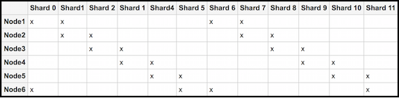

# Creating Solr shards manually

You can create, configure, and register shards explicitly using ACL based hash sharding.

**How to setup sharding?**

For archive and workspace stores, create shards and assign shards and instances to nodes. For example, if `(numShards * replicationFactor) % numNodes == 0`, the following query will create the appropriate shards on any given node from a specified node set:

```
http://<host1>:<port1>/solr4/admin/cores?action=newCore&storeRef=archive://SpacesStore&numShards=10
&numNodes=1&nodeInstance=1&replicationFactor=1
```

To put the index in a specified location set the properties as shown below:

```
http://<host1>:<port1>/solr4/admin/cores?action=newCore&storeRef=workspace://SpacesStore&numShards=10
&numNodes=1&nodeInstance=1&property.data.dir.root=<ALFRESCO_HOME>/solr4/workspace-SpacesStore
```

**Example: Creating shards**

Let's consider an example for creating 12 shards, 2 instances of each shard, and 6 nodes. As shown below, each node will get 4 different shards.



To achieve this sharding configuration, follow the steps below:

1.  Setup and configure the Solr nodes.

    1.  Set up the six Solr nodes.

        Delete the alfresco and archive cores using the following commands:

        ```
        https://localhost:8443/solr4/admin/cores?action=removeCore&storeRef=workspace://SpacesStore&coreName=alfresco
        https://localhost:8443/solr4/admin/cores?action=removeCore&storeRef=workspace://SpacesStore&coreName=archive
        ```

    2.  Configure each Solr node and start index tracking.

        -   For node 1:

            ```
            http://<host1>:<port1>/<base1>/admin/cores?action=newCore&storeRef=workspace://SpacesStore&
            numShards=12&nodeInstance=1&replicationFactor=2&numNodes=6&template=rerank
            ```

        -   For node 2:

            ```
            http://<host2>:<port2>/<base3>/admin/cores?action=newCore&storeRef=workspace://SpacesStore&
            numShards=12&nodeInstance=2&replicationFactor=2&numNodes=6&template=rerank
            ```

        -   For node 3:

            ```
            http://<host3>:<port3>/<base3>/admin/cores?action=newCore&storeRef=workspace://SpacesStore&
            numShards=12&nodeInstance=3&replicationFactor=2&numNodes=6&template=rerank
            ```

        -   For node 4:

            ```
            http://<host4>:<port4>/<base4>/admin/cores?action=newCore&storeRef=workspace://SpacesStore&
            numShards=12&nodeInstance=4&replicationFactor=2&numNodes=6&template=rerank
            ```

        -   For node 5:

            ```
            http://<host5>:<port5>/<base5>/admin/cores?action=newCore&storeRef=workspace://SpacesStore&
            numShards=12&nodeInstance=5&replicationFactor=2&numNodes=6&template=rerank
            ```

        -   For node 6:

            ```
            http://<host6>:<port6>/<base6>/admin/cores?action=newCore&storeRef=workspace://SpacesStore&
            numShards=12&nodeInstance=6&replicationFactor=2&numNodes=6&template=rerank
            ```

    3.  For each core, the properties can be set at the creation time or updated later.

        ```
        https://<host>:<port>/solr4/admin/cores?action=updateCore&storeRef=system://system&
        property.data.dir.store=<SOME VALUE>
        ```

    You should now have six nodes with four cores, each actively tracking the repository. The following URL options are available for use:

    |URL option|Description|Example|
    |----------|-----------|-------|
    |numShards|Specifies the number of logical shards.|`12`|
    |storeRef|Specifies reference to a node store.|`workspace://SpacesStore`|
    |template|Defines the base configuration for a new Solr core with some configuration properties set using the URL as shown in Step 1\(b\).http://<host6\>:<port6\>/<base6\>/admin/cores?action=newCore&storeRef=workspace://SpacesStore& numShards=12&nodeInstance=6&replicationFactor=2&numNodes=6&**template=rerank**

For more information, see [Core templates](../concepts/solr-core-templates.md).

|`template=rerank`|
    |replicationFactor|Specifies the number of copies of each document \(or, the number of physical instances to be created for each logical shard.\) A `replicationFactor` of 3 means that there will be 3 instances for each logical shard.|`2`|
    |nodeInstance|Specifies the Solr node instance being configured.|`6`|
    |numNodes|Returns the total number of nodes.|`6`|
    |coreName|Specifies the name of the Solr core.|`alfresco`|
    |property.<\>|Specifies the property and its value.|`property.data.dir.store=`|

2.  Configure Alfresco Content Services by setting the Solr subsystem properties.

    Set the three Solr subsystem properties for both the `alfresco` and `archive` cores in the alfresco-global.properties file:

    ```
    solr4.store.mappings.value.solrMappingAlfresco.nodeString=
    solr4.store.mappings.value.solrMappingAlfresco.numShards=
    solr4.store.mappings.value.solrMappingAlfresco.replicationFactor=
    
    solr4.store.mappings.value.solrMappingArchive.nodeString=
    solr4.store.mappings.value.solrMappingArchive.numShards=
    solr4.store.mappings.value.solrMappingArchive.replicationFactor= 
    ```

    For example, set the following properties as shown below:

    ```
    solr4.store.mappings.value.solrMappingAlfresco.nodeString=<host1>:<port1>/<url1>,<host2>:<port2>/<url2>
    solr4.store.mappings.value.solrMappingAlfresco.numShards=12
    solr4.store.mappings.value.solrMappingAlfresco.replicationFactor=2
    ```

    **Note:** These properties can also be configured via a JMX client or using the subsystem properties to reference the composite beans.

    Some important things to know:

    -   If the host, port, or URL is missing, the subsystem default values \(the ones set for a single index\) will be used.
    -   Make sure that the hosts are in the correct order. This is because Solr assumes that the shards are located on node 1, etc as defined in the above list when generating queries.
    -   At query time, a Solr core is selected at random to do the distribution of all shards, again selected at random.
3.  Set the configuration properties that applies to all the cores in a Solr instance in the shared.properties file.

    For shard registration, Alfresco Content Services needs to know to which Solr port the requests should be sent. This can be configured, along with an explicit host name.

    ```
    solr.host=localhost
    solr.port=8080
    ```

    These properties will be used when registering all cores found under the <SOLR\_HOME\> directory. For more information, see [About shared.properties file](../concepts/solr-shared-properties.md).


-   **[Core templates](../concepts/solr-core-templates.md)**  
Core templates are used to define the base configuration for a new Solr core with some configuration properties.
-   **[About shared.properties file](../concepts/solr-shared-properties.md)**  
The <ALFRESCO\_HOME\>/solr4/conf/shared.properties file is used to set configuration that applies to all the cores in a Solr instance.

**Parent topic:**[Setting up Solr sharding](../concepts/solr-shard-config.md)

