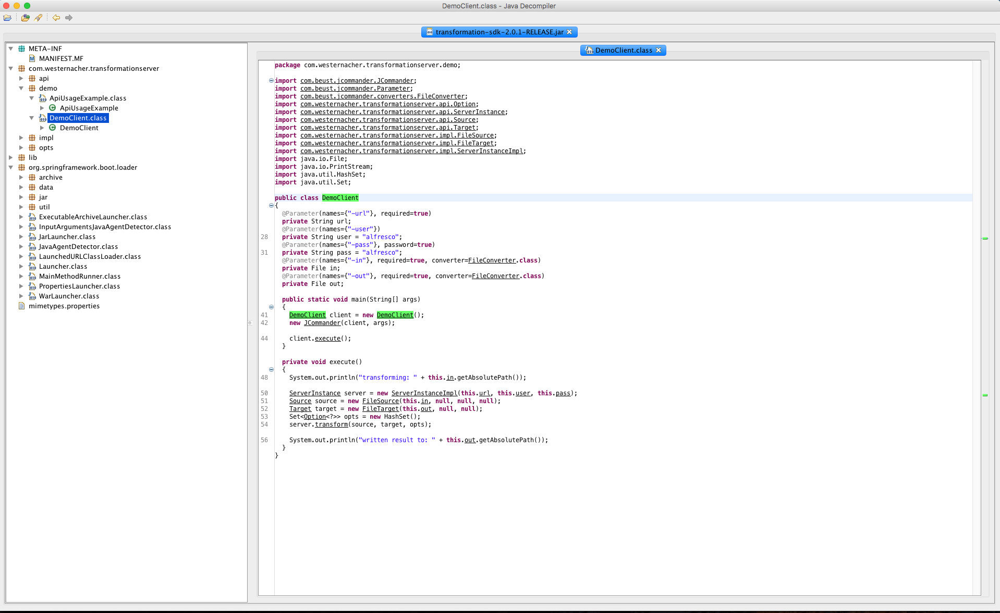
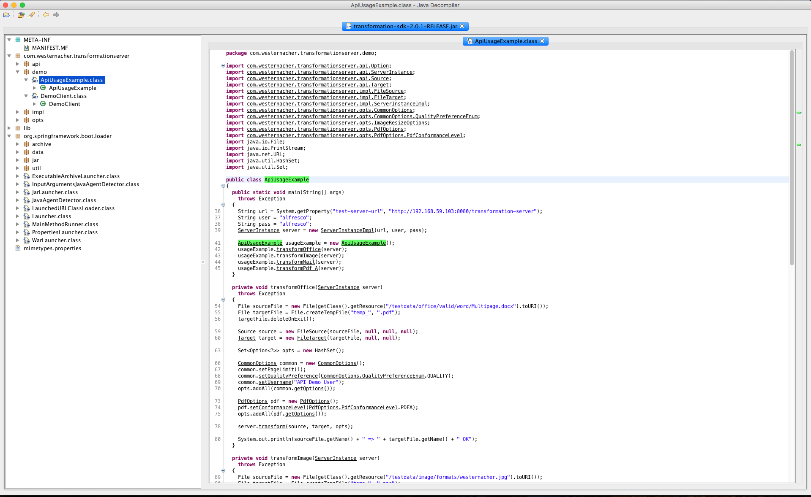

# Installing the Document Transformation Engine SDK

Use this information to install the Document Transformation Engine SDK.

1.  Download the Document Transformation Engine SDK from the [Alfresco Support Portal](http://support.alfresco.com).

    This is an executable jar file with all dependencies that works as a command line client. The executable class is `com.westernacher.transformationserver.demo.DemoClient`.

    

    To invoke the Document Transformation Engine SDK jar file, use the following syntax:

    ```
    java -jar transformation-sdk-2.0.1-RELEASE.jar -in input.doc -out output.pdf -url http://trafo-url:8080/transformation-server
    ```

    An API usage example is available at com.westernacher.transformationserver.demo.ApiUsageExample. You can copy, modify, and use this code in your own product.

    

    A list of the most important file formats is available at mimetypes.properties. These file formats have their mime type auto-detected by the file extension. Note that this is not the full list of supported formats.

    

    The most important source and target formats are:

    -   Source formats:
        -   Most image formats
        -   Nearly all Microsoft Word, Excel, and PowerPoint formats
        -   .eml and .msg Emails
    -   Target formats
        -   PDF and PDF/A
        -   SWF
        -   Most image formats
    -   Functions that do not work with the SDK
        -   OCR
        -   Resizing an image, which is necessary to produce thumbnails
        -   PDF/A as a target format
    **Note:** The Document Transformation Engine SDK source code is available on request. Contact [Customer Support](https://support.alfresco.com) for the SDK source code.


**Parent topic:**[Installing the Document Transformation Engine](../concepts/transerv-installing.md)

