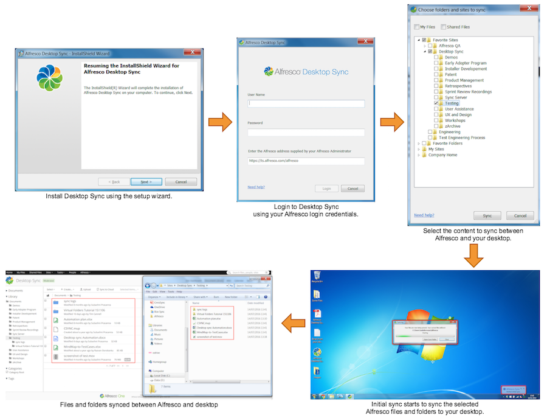

# Using Desktop Sync

Desktop Sync is easy to set up and use. Just follow the instructions and in no time you'll have Alfresco content synced with your desktop.

With Desktop Sync, you have the latest information instantly. You can view, share, and edit any kind of file, wherever you are, online or off.

**Get up and running with Desktop Sync**

If you want to use Desktop Sync on your desktop, you'll need:

-   Windows 10: 64-bit or 32-bit version
-   Windows 8: 64-bit version
-   Windows 7: 64-bit or 32-bit version

Click each step of the sync process flow to learn more about it.

-   **[Installing Desktop Sync](../tasks/ds-install-app.md)**  
Desktop Sync is quick and easy to install.
-   **[Setting up Desktop Sync](../tasks/ds-setup.md)**  
The first time you open Desktop Sync you need to enter your login details to connect to Alfresco.
-   **[Selecting content to sync](../tasks/ds-select-sync.md)**  
Once you've set up Desktop Sync, all your favourite Alfresco content, your My Files, and Shared Files are displayed.
-   **[Working with Desktop Sync](../concepts/ds-working.md)**  
The C:\\Users\\<username\>\\Alfresco folder works like any other folder on your desktop. To save your work in Alfresco, just work on your files in the C:\\Users\\<username\>\\Alfresco folder, and everything in the folder will be automatically synced to Alfresco.
-   **[Desktop Sync options](../references/ds-taskbar.md)**  
You can quickly access Desktop Sync from the Windows system tray.
-   **[Desktop Sync FAQs](../references/ds-faqs42.md)**  
Here's a list of common questions about Desktop Sync.
-   **[Configuring Desktop Sync](../concepts/ds-config.md)**  
If you're an IT administrator, you can configure Desktop Sync for central installation purposes.

**Parent topic:**[Desktop Sync for Windows](../concepts/ds-overview-win.md)

