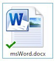
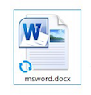

# Working with Desktop Sync

The C:\\Users\\<username\>\\Alfresco folder works like any other folder on your desktop. To save your work in Alfresco, just work on your files in the C:\\Users\\<username\>\\Alfresco folder, and everything in the folder will be automatically synced to Alfresco.

**Understanding Desktop Sync icons**

Desktop Sync always ensures that the files in your C:\\Users\\<username\>\\Alfresco folder are synced with Alfresco. It adds status icons to your files and folders so you know the application is working.

You'll see icons in a few different places:

-   Icons that appear over the Desktop Sync icon in your system tray represent the overall status of your Alfresco folder.
-   Icons that appear over individual files and folders represent the status of that file or folder.

Here's what each of these icons means:

**System tray icons**

|Icon name|System tray icon|Description|
|---------|----------------|-----------|
|Green tick||A green tick shows all your files are synced and accessible from your desktop.|
|Red cross||A red cross indicates there are conflicts that need to be resolved by the user. Something isn't working properly and your file\(s\) are not being synced.|
|Pause||A pause icon indicates that Desktop Sync is paused due to invalid server credentials or there's nothing configured to sync.|

**Context menu icons**

|Icon name|Context menu icon|Description|
|---------|-----------------|-----------|
|Green tick||It's synced - A green tick on a file indicates that the file or folder is in sync with the server copy.|
|Blue arrows||It's in use - Blue arrows indicate that Desktop Sync is waiting for the application to release the file or for free space to become available, or a server file to be checked in.|
|Red cross||It's in conflict - A red cross on a file or folder indicates that update/rename/delete has conflicted with a server-side change and we were not able to automatically resolve it. You need to decide which version to keep.|

**Conflict matrix**

A sync conflict occurs when Desktop Sync can't resolve differences between a file stored on your desktop and a version of the same file in Alfresco, thereby stopping sync from being completed. This usually happens when a file has changed in both the locations since its last sync, making it difficult to determine which changes to save.

Selecting one version to sync will resolve the conflict. For example, a conflict results when a file is updated from both the desktop and in Alfresco since its last sync. Desktop Sync will give you a choice of resolving the sync conflict by selecting one version and copying it to the other location. For more information, see [Sync conflict resolution matrix](ds-conflicts.md).

-   **[Sync conflict resolution matrix](../concepts/ds-conflicts.md)**  
Use this information to resolve and manage Desktop Sync conflicts.

**Parent topic:**[Using Desktop Sync](../concepts/desktopsync-using.md)

