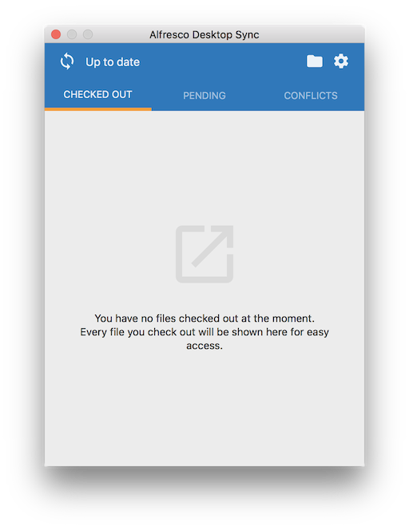

# Desktop Sync options

You can access Desktop Sync from the Mac OS X menu bar.

**System menu options**

The Desktop Sync icon appears in the Mac menu bar and looks like this:

-   **Application icon**

    Click the Desktop Sync  icon to see more options.

-   **Sync folder**

    Click the folder  icon to open the `Alfresco` sync folder on your computer.

-   **Settings**

    Click the  icon to open the Desktop Sync settings menu. See [Settings](ds-settings-mac.md) for more details.

**Check Outs, Conflicts and Pending Syncs**

Displays information about checked out files, any pending syncs, and conflicts.

-   Select **Checked Out** to view information about any files you've checked out from Desktop Sync, for example, file name, file location, and details when the file was downloaded.
-   Select **Pending** to view information about any pending syncs, for example, file name, status of the pending sync, modifier, file location, and details when the file was last accessed.
-   Select **Conflicts** to view conflict-related information and resolve the conflict. The information displayed includes file name, the conflict or issue, modifier, location of the conflict, and details when the file was last modified.

    To resolve a conflict, select the conflict and either click:

    -   **Discard my Changes**: Replaces the local file with the Alfresco copy.
    -   **Keep my Changes**: Copies updates made to content locally over to Alfresco.

**Note:** There may be times when you can't resolve a conflict for a file because the parent folder also has a conflict. In this case, your only choice is to resolve the conflict on the folder by either selecting **Keep my Changes** or **Discard my Changes**. Your choice is then applied to all files within that folder.

**Update password**

Desktop Sync doesn't allow you to change your password directly. However, if your [password changes](http://docs.alfresco.com/5.2/tasks/profile-password.html) in Alfresco Share, you will see a notification in Desktop Sync asking you to update your password. Click **Update Password** to continue.

**Finder menu actions**

To view the Finder menu actions, follow the steps below:

1.  Navigate to your synced content in Finder.
2.  Right-click on a file or folder to access the Finder menu actions.
3.  Click **Sync Now** to sync your content immediately.
4.  Click **Check Out** to download the file to your computer and lock it in Alfresco, so that other users can't overwrite it while you make changes offline.

Once you check out a file, you'll see two more options:

-   **Check In**: Uploads a new version of your content to Alfresco.
-   **Cancel Check Out**: Cancels editing to unlock the file without saving any changes.

In the event of a conflict, you'll see two more options:

-   **Discard my Changes**: Replaces the local file with the Alfresco copy.
-   **Keep my Changes**: Copies updates made to content locally over to Alfresco.

**Parent topic:**[Using Desktop Sync](../concepts/desktopsync-using-mac.md)

