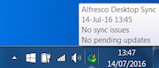
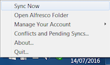
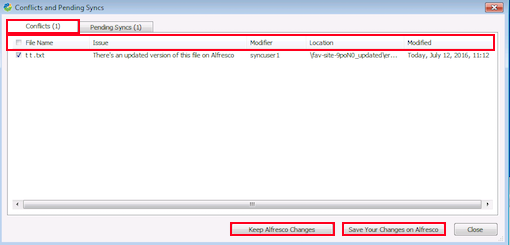

# Desktop Sync options

You can quickly access Desktop Sync from the Windows system tray.

**System menu options**

The Desktop Sync icon appears in the Windows taskbar's system tray and looks like this:

Hover your cursor over the Desktop Sync icon to display sync status information, such as date and time of last sync, sync issues \(conflicts\), and any pending updates.

Right-click on the Desktop Sync icon  to see the following options:

Click  and you have the following options:

**Sync Now**

By default local content is synced to Alfresco immediately and Alfresco content is synced locally every five minutes. Click this if you want content synced immediately.

**Open Alfresco Folder**

Opens Desktop Sync folder in explorer C:\\<username\>\\Alfresco.

**Manage Your Account**

You can manage which folders and sites get synced on your desktop and other account details using **Manage Your Account**. The available options are:

-   **Manage Folders...**: Opens Choose folders and sites to sync screen. See [Selecting content to sync](../tasks/ds-select-sync.md).

    If you deselect a previously synced folder and click **Sync**, then the synced content from your desktop is removed. In case you have any unsynced or conflicted files, they will be orphaned in C:\\Users\\<username\>\\Alfresco\\orphaned.

-   **Remove Account...**: Removes the synced user from Desktop Sync and deletes all the synced content from the desktop. You can still access your files in Alfresco. On removing your account you are taken back to the Desktop Sync login screen. See [Setting up Desktop Sync](../tasks/ds-setup.md).
-   **Enter Your New Password...**: If you have recently changed your Alfresco password, use this option to update the same password in Desktop Sync.

    The **Have you recently changed your password in Alfresco One?** window appears. Specify the updated password to resume syncing and click **Update**.

**Conflicts and Pending Syncs...**

Displays information about the conflicts and any pending syncs.

-   Use the **Conflicts** tab to view conflict-related information and resolve the conflict. The information displayed includes file name, the conflict or issue, modifier, location of the conflict, and details when the file was last modified.

    To resolve a conflict, select the conflict and either click:

    -   **Keep Alfresco Changes** to replace the local file with the Alfresco copy; or
    -   **Save Your Changes on Alfresco** to copy updates made to content locally over to Alfresco.
-   Use the **Pending** tab to view information about any pending syncs, for example, file name, status of the pending sync, modifier, file location, and details when the file was last accessed.

**About...**

Tells you which version of Desktop Sync you're using.

**Quit...**

Closes Desktop Sync.

You will no longer be able to sync during this time. Syncing will resume when you restart Desktop Sync. Any content updated while Desktop Sync was closed will be synced when the application is restarted.

It's recommended that you always have Desktop Sync up and running so that your local content and Alfresco are in sync.

**Context menu options**

To view the Desktop Sync context menu, follow the steps below:

1.  Navigate to your synced content \(folder or file\) in the File Explorer.
2.  Right-click the file to see the **Alfresco Sync** option.
3.  Click **Sync Now** to sync your content immediately.

In the event of a conflict, you'll see two more options:

-   **Keep Alfresco Changes**: Replaces the local file with the Alfresco copy.
-   **Save Your Changes on Alfresco**: Copies updates made to content locally over to Alfresco.

**Parent topic:**[Using Desktop Sync](../concepts/desktopsync-using.md)

