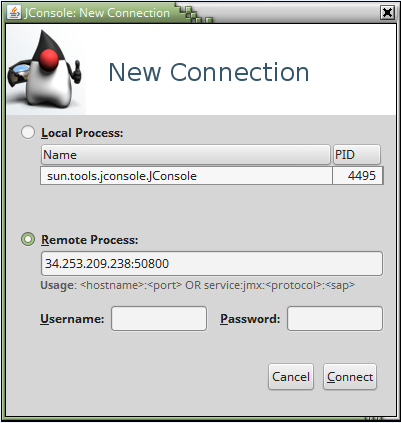
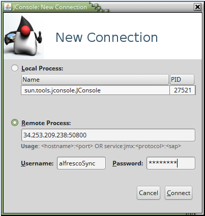

# Connecting to sync service through JMX

To connect to sync service remotely via a JMX client \(for example, using JConsole\), you need to start the sync service by enabling the JMX remote option and choose whether to disable authentication and/or SSL. This is because password authentication over the Secure Sockets Layer \(SSL\) and Transport Layer Security \(TLS\) is enabled by default.

**Insecure JMX connection**

You can start the sync service with JMX remote enabled and all security disabled, but this isn't recommended for production systems.

1.  Start the service with the following Java options by substituting the required host name and ports:

    ```
    -Dcom.sun.management.jmxremote=true 
    -Djava.rmi.server.hostname=<sync-service-IP> 
    -Dcom.sun.management.jmxremote.port=<jmx-remote-port> 
    -Dcom.sun.management.jmxremote.rmi.port=<jmx-rmi-port>
    -Dcom.sun.management.jmxremote.authenticate=false 
    -Dcom.sun.management.jmxremote.ssl=false
    ```

    For example:

    ```
    cd <installLocation>/service-sync
    java -Xmx2G -Dcom.sun.management.jmxremote=true -Djava.rmi.server.hostname=34.253.209.238 
    -Dcom.sun.management.jmxremote.port=50800 -Dcom.sun.management.jmxremote.rmi.port=50801 
    -Dcom.sun.management.jmxremote.authenticate=false -Dcom.sun.management.jmxremote.ssl=false 
    -Djava.io.tmpdir=/var/tmp/dsync -cp postgresql.jar:service-sync-2.2.jar 
    org.alfresco.service.sync.dropwizard.SyncService server config.yml
    ```

    **Note:** Make sure the ports for `com.sun.management.jmxremote.port` and `com.sun.management.jmxremote.rmi.port` are open.

    **Note:** For production systems, use both SSL client certificates to authenticate the client host, and password authentication for user management, by enabling `com.sun.management.jmxremote.authenticate` and `com.sun.management.jmxremote.ssl`.

2.  Start JConsole by typing the following command:

    ```
    jconsole
    ```

3.  Select **Remote Process**, and enter the sync service IP, and `com.sun.management.jmxremote.port` value, as shown in the example below.
4.  Click **Connect**.

    


1.  **JMX connection with authentication**

    Before enabling the authentication, first you need to create two files. The file names are not important. Use the following example for guidance.

2.  Create files `jmx.access` and `jmx.password`.

    1.  `jmx.access` is the access control file for remote JMX API access. This file defines the allowed access for the specified roles.
    2.  `jmx.password` is the password file which defines the roles and their passwords.
    To be functional, a role must have an entry in both the password and the access files.

3.  In the `jmx.access` file, add the desired role and access level.

    For example:

    ```
    alfrescoSync=readwrite
    ```

    This entry means that the **alfrescoSync** role/user has read and write access.

    **Note:** For more details and other access levels, see `<JavaInstallationDir>/jre/lib/management/jmxremote.access`.

4.  In the `jmx.password` file, add the role created in the previous step and the desired password.

    For example:

    ```
    alfrescoSync=password
    ```

5.  Change the `jmx.password` permission to read-only for the owner:

    For example:

    ```
    chmod 600 jmx.password
    ```

6.  Start the sync service by enabling authentication, and pass on the path to the created files:

    ```
    -Dcom.sun.management.jmxremote.authenticate=true 
    -Dcom.sun.management.jmxremote.access.file=/path/to/jmx.access 
    -Dcom.sun.management.jmxremote.password.file=/path/to/jmx.password
    ```

    For example:

    ```
    cd <installLocation>/service-sync
    java -Xmx2G -Dcom.sun.management.jmxremote=true -Djava.rmi.server.hostname=34.253.209.238 
    -Dcom.sun.management.jmxremote.port=50800 -Dcom.sun.management.jmxremote.rmi.port=50801 
    -Dcom.sun.management.jmxremote.authenticate=true 
    -Dcom.sun.management.jmxremote.access.file=/path/to/jmx.access 
    -Dcom.sun.management.jmxremote.password.file=/path/to/jmx.password 
    -Dcom.sun.management.jmxremote.ssl=false -Djava.io.tmpdir=/var/tmp/dsync 
    -cp postgresql.jar:service-sync-2.2.jar org.alfresco.service.sync.dropwizard.SyncService 
    server config.yml
    ```

7.  Start JConsole and select **Remote Process**.

8.  Enter the sync service IP, `com.sun.management.jmxremote.port` value, user name, and password, as shown in the example below.

9.  Click **Connect**.

    


**JMX connection with authentication and SSL**

The out-of-the-box sync service provides keystore \(`sync.jks`\) and truststore \(`sync.truststore`\). The password for the keystore and truststore for the default installation is specified in the `applicationConnectors` section of the `config.yml` file:

```
server:
    applicationConnectors:
         keyStorePassword:
```

**Note:** For Sync Service 2.1.1 only: The truststore file isn't provided with the out-of-the-box installation of sync service. You can follow the example steps in [How to export and import SSL certificate](ds-jmx-access.md#export_import_cert) to create your own truststore.

The keystore contains a private key and a self-signed certificate for the sync service. The truststore contains the self-signed certificate exported from the keystore to create a trust relationship between the sync service and itself. In production systems, the truststore usually contains only certificates that are trusted and signed by certificate authorities \(CA\).

**Note:** For production systems, it's strongly advised that you use your own SSL key and a certificate that's signed by a certificate authority.

1.  Start the sync service by enabling SSL and pass on the path, password, and the store type to the keystore and truststore:

    ```
    -Dcom.sun.management.jmxremote.ssl=true -Djavax.net.ssl.keyStore=/path/to/keystore 
    -Djavax.net.ssl.keyStorePassword=<password> -Djavax.net.ssl.keyStoreType=<type> 
    -Djavax.net.ssl.trustStore=/path/to/truststore -Djavax.net.ssl.trustStoreType=<type> 
    -Djavax.net.ssl.trustStorePassword=<password>
    ```

    For example:

    ```
    cd <installLocation>/service-sync
    java -Xmx2G -Dcom.sun.management.jmxremote=true -Djava.rmi.server.hostname=34.253.209.238 
    -Dcom.sun.management.jmxremote.port=50800 -Dcom.sun.management.jmxremote.rmi.port=50801 
    -Dcom.sun.management.jmxremote.authenticate=true -Dcom.sun.management.jmxremote.access.file=/path/to/jmx.access 
    -Dcom.sun.management.jmxremote.password.file=/path/to/jmx.password -Dcom.sun.management.jmxremote.ssl=true 
    -Djavax.net.ssl.keyStore=/path/to/sync.jks -Djavax.net.ssl.keyStorePassword=<password> 
    -Djavax.net.ssl.keyStoreType=JCEKS -Djavax.net.ssl.trustStore=/path/to/sync.truststore 
    -Djavax.net.ssl.trustStoreType=JCEKS -Djavax.net.ssl.trustStorePassword=<password>  
    -Djava.io.tmpdir=/var/tmp/dsync -cp postgresql.jar:service-sync-2.2.jar org.alfresco.service.sync.dropwizard.SyncService 
    server config.yml
    ```

2.  Copy the sync service truststore into your local machine or export the sync service certificate into a new truststore. See the example steps in [How to export and import SSL certificate](ds-jmx-access.md#export_import_cert).
3.  Start JConsole:

    ```
    jconsole -J-Djavax.net.ssl.trustStore=sync.truststore 
    -J-Djavax.net.ssl.trustStoreType=JCEKS 
    -J-Djavax.net.ssl.trustStorePassword=<password> 
    ```

4.  Select **Remote Process** and enter the sync service IP and `com.sun.management.jmxremote.port` valuevalue, user name, and password, as in the earlier example.

**How to export and import SSL certificate**

1.  Export the certificate from the `sync.jks` keystore.

    For example, you can use the Java keytool \(`<JavaInstallationDir>/bin/keytool`\):

    ```
    keytool -exportcert -alias sync -keystore sync.jks -file synccer.cer -storetype jceks -storepass <password> 
    ```

    This creates a `synccer.cer` file. This certificate can then be imported into the truststore so you can use it to start the JConsole.

2.  Import the certificate into a truststore.

    For example, using the Java keytool:

    ```
    keytool -importcert -alias sync -file synccer.cer -keystore sync.truststore -storetype JCEKS -storepass <yourPassword>
    ```

    This creates a truststore file of type JCEKS with the name `sync.truststore` \(if it doesn't already exist\).


