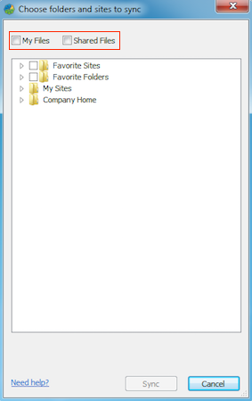
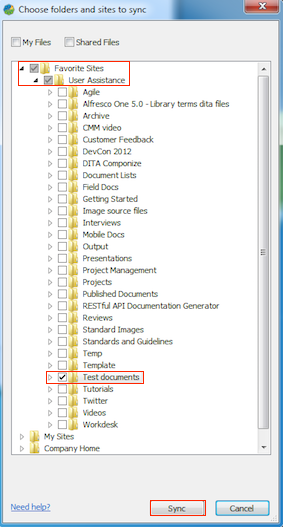
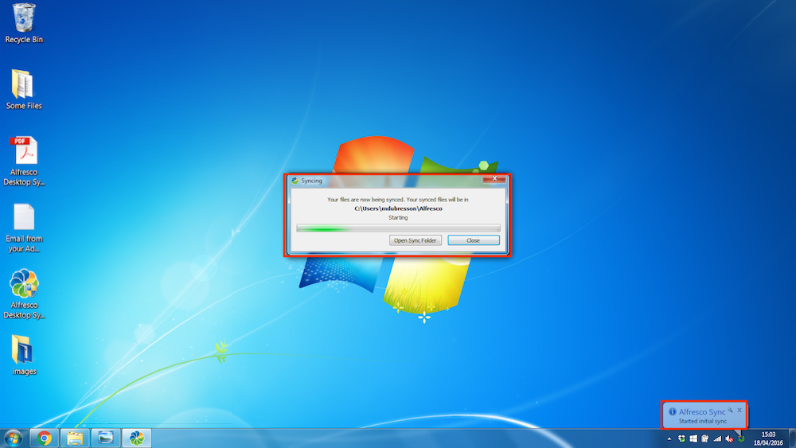
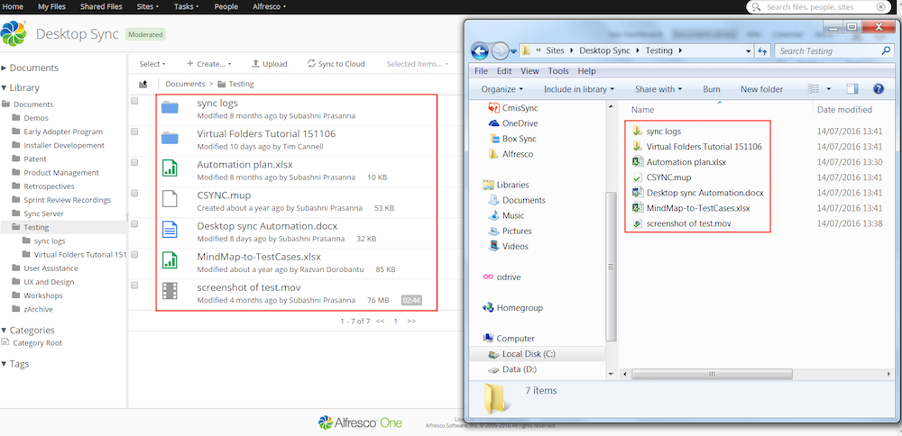

# Selecting content to sync

Once you've set up Desktop Sync, all your favourite Alfresco content, your My Files, and Shared Files are displayed.

Use the Choose folders and sites to sync screen to select the content to sync between Alfresco and your desktop. The content is synced at C:\\Users\\<username\>\\Alfresco.

**Note:** Only select the content you need. The more content you select, the more space will be taken on your local machine and the more time it will take to perform the initial sync.

1.  Select  next to My Files and Shared Files.

    

    1.  Click **My Files** to sync all the files and folders under **My Files** in Alfresco. See [My Files](http://docs.alfresco.com/5.0/concepts/library-external-myfiles.html).

    2.  Click **Shared Files** to sync all the files and folders under **Shared Files** in Alfresco. See [Shared Files](http://docs.alfresco.com/5.0/concepts/library-external-shared.html).

2.  Select  next to **Favourite Sites** to sync all your favourite sites.

    

    To select specific sites, click  to expand the list and select the relevant site.

    To sync a specific folder within a site, double-click the site name and select the folder.

3.  Select  next to **Favourite Folders** to sync all your favourite folders.

    To sync specific folders, click  to expand the list, double-click the site name and select the relevant folder.

    When you expand **Favourite Folders**, all the favourite folders for a site are grouped under that site.

4.  Under **My Sites**, you'll see all the sites you are a member of.

    To sync specific folders, click  to expand the list, double-click the site name and select the relevant folder.

    **Note:** Sites display their full name and folders display the hierarchy of the folder, for example, My Site \| My Folder.

5.  Under **Company Home**, you'll see all the folders created by the Administrator under Company Home of Alfresco repository.

6.  Click **Sync** to start initial syncing of the selected Alfresco files and folders to your desktop.

    **Tip:** You can click **Cancel** to cancel the sync and close the Choose folders and sites to sync screen.

    **Note:** During the initial sync, don't disconnect your computer from the network or put your computer to sleep. Although the sync will resume if interrupted, it will likely need to check the content again and very large initial syncs may take a long time to complete.

**About initial sync**

The **Syncing** progress screen shows the status of initial sync. The Alfresco icon in the system tray will spin during the sync process. On completion, a notification appears on the system tray.

In C:\\Users\\<username\>\\Alfresco, copies of all the content you've selected to sync are created. Desktop Sync automatically keeps both the local copy and the Alfresco versions in sync with each other whenever any changes are made.

During initial sync:

-   if you create a new file or update a file on your desktop, it will be synced only after the initial sync is over.
-   it is recommended that you don't move the parent folders being synced.

**Parent topic:**[Using Desktop Sync](../concepts/desktopsync-using.md)

