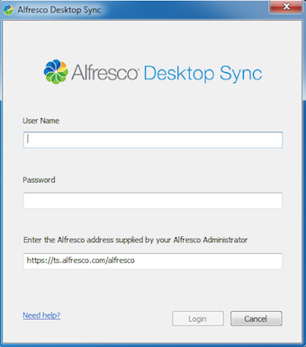
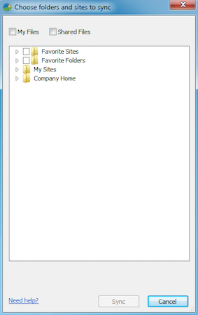

# Setting up Desktop Sync

The first time you open Desktop Sync you need to enter your login details to connect to Alfresco.

1.  Open Desktop Sync just as you would any other program by double-clicking the icon on your desktop or opening it through Explorer.

    Speak to your Alfresco Administrator if you need any help.

2.  When prompted, log in using your Alfresco user name and password.

    

3.  Enter the Alfresco address supplied by your Alfresco administrator.

    This is the address of the Alfresco server available from your system administrator. Make sure the URL provided is the repository URL.

    This could be, for example, *https://alfresco.mycompany.com/alfresco*. You can copy it from your browser when logged into Alfresco.

4.  Click **Login**.

    That's it. Your Desktop Sync account is now set.

The Choose folders and sites to sync screen appears.

All your favourite Alfresco content, My Files, Shared Files, and your Alfresco sites are displayed.

**Parent topic:**[Using Desktop Sync](../concepts/desktopsync-using.md)

