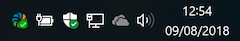
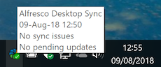
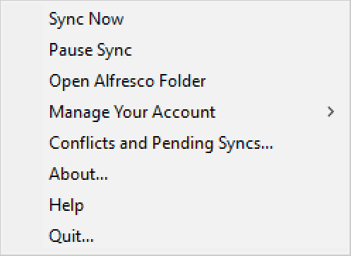
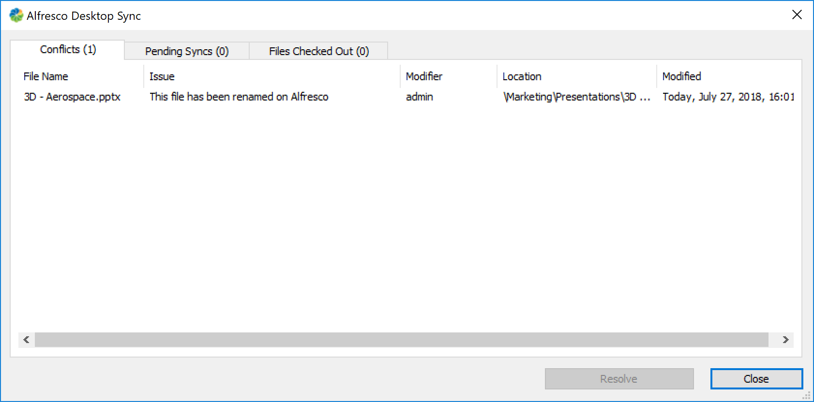
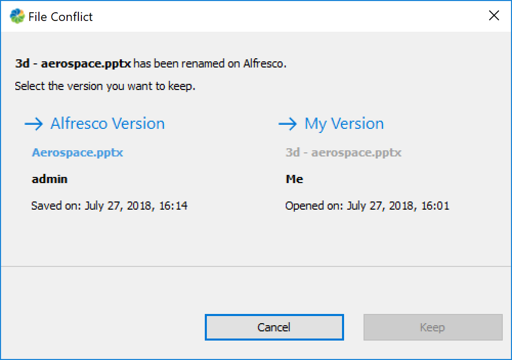

# Desktop Sync options

You can access Desktop Sync from the Windows system tray.

**System menu options**

The Desktop Sync icon appears in the Windows taskbar's system tray and looks like this:

Hover your cursor over the Desktop Sync icon to display sync status information, such as date and time of last sync, sync issues \(conflicts\), and any pending updates.

Right-click on the Desktop Sync icon  to see the following options:

**Sync Now**

By default local content is synced to Alfresco immediately and Alfresco content is synced locally every five minutes. Click this if you want content synced immediately.

[back to top](ds-taskbar.md#)

**Pause Sync**

Pauses Sync if you don't wish to synchronize files from the server, for example when you have a low bandwidth connection.

[back to top](ds-taskbar.md#)

**Open Alfresco Folder**

Opens Desktop Sync folder in Explorer `C:\<username>\Alfresco`.

[back to top](ds-taskbar.md#)

**Manage Your Account**

You can manage which folders and sites get synced on your desktop and other account details using **Manage Your Account**. The available options are:

-   **Manage Folders...**: Opens Choose folders and sites to sync screen. See [Selecting content to sync](../tasks/ds-select-sync.md).

    If you deselect a previously synced folder and click **Sync**, then the synced content from your desktop is removed. In case you have any unsynced or conflicted files, they will be orphaned in C:\\Users\\<username\>\\Alfresco\\orphaned.

-   **Remove Account...**: Removes the synced user from Desktop Sync and deletes all the synced content from the desktop. You can still access your files in Alfresco. On removing your account you are taken back to the Desktop Sync login screen. See [Setting up Desktop Sync](../tasks/ds-setup.md).
-   **Enter Your New Password...**: If you have recently changed your Alfresco password, use this option to update the same password in Desktop Sync.

    The **Have you recently changed your password in Alfresco?** window appears. Specify the updated password to resume syncing and click **Update**.

-   **Consistency Check**: Performs a consistency check on Desktop Sync. This is typically used in collaboration with your IT team when you need support.

[back to top](ds-taskbar.md#)

**Conflicts and Pending Syncs...**

Displays information about checked out files, any pending syncs, and conflicts.

-   Select **Files Checked Out** to view information about any files you've checked out from Desktop Sync, for example, file name, file location, and details when the file was downloaded.
-   Select **Pending Syncs** to view information about any pending syncs, for example, file name, status of the pending sync, modifier, file location, and details when the file was last accessed.
-   Select **Conflicts** to view conflict-related information and resolve the conflict. The information displayed includes file name, the conflict or issue, modifier, location of the conflict, and details when the file was last modified.
-   Select the file in conflict and click **Resolve**.

To resolve a conflict, choose which version to keep, Alfresco or your changes and click **Keep**:

-   **Alfresco Version**: Replaces the local file with the Alfresco copy.
-   **My Version**: Copies updates made to content locally to Alfresco.

**Working with multiple Checked Out files**

If several files are **Checked Out**, you have the following options:

-   Select files individually using the check boxes to the left hand side, or use the select all files check box at the top.
-   When you select more than one check box, you can pick bulk actions at the top of the tab, **Check In** and **Cancel Check Out**. If you choose **Check In**, you can select if the new version is a major or minor change, and optionally input a comment. Select **Check In** again to save your changes. This applies the same version change and comment \(if added\) to all the selected files.

[back to top](ds-taskbar.md#)

**About...**

Tells you which version of Desktop Sync you're using.

[back to top](ds-taskbar.md#)

**Help**

View online help.

[back to top](ds-taskbar.md#)

**Quit...**

Closes Desktop Sync.

You will no longer be able to sync during this time. Syncing will resume when you restart Desktop Sync. Any content updated while Desktop Sync was closed will be synced when the application is restarted.

It's recommended that you always have Desktop Sync up and running so that your local content and Alfresco are in sync.

[back to top](ds-taskbar.md#)

**Explorer menu actions**

To view the Desktop Sync context menu, follow the steps below:

1.  Navigate to your synced content \(folder or file\) in the File Explorer.
2.  Right-click the content to access the Explorer menu actions.
3.  Click **Sync Now** to sync your content immediately.
4.  Click **Check Out** to lock it in Alfresco, so that other users can't overwrite it while you make changes. Once you check out a file, you'll see two more options:
    -   **Check In**: Uploads a new version of your content to Alfresco.
    -   **Cancel Check Out**: Cancels editing to unlock the file without saving any changes.
5.  In the event of a conflict, you'll see one more option:
    -   **Resolve**: Selecting this option opens a screen where you can decide to keep your changes or the changes from the server.

**Working with multiple files in Explorer**

You can also work with multiple files by using the Explorer right click menu actions:

-   **Sync Now** and **Check Out**.
-   **Check In** and **Cancel Check Out** are displayed if any file is already checked out.
-   When you click **Check In**, select if the new version is a major or minor change, and optionally input a comment. Click **Check In** again to save your changes. This applies the same version change and comment \(if added\) to all the selected files.
-   If you have selected a mixture of items, for example where you have files checked out and not checked out, then all the relevant options are shown. When an action is selected, it's only applied to the files that are in a relevant state.
-   If any of the files you selected are in conflict, you'll have to resolve these individually, as the conflict resolution options are not displayed.

[back to top](ds-taskbar.md#)

**Parent topic:**[Using Desktop Sync for Windows](../concepts/desktopsync-using.md)

