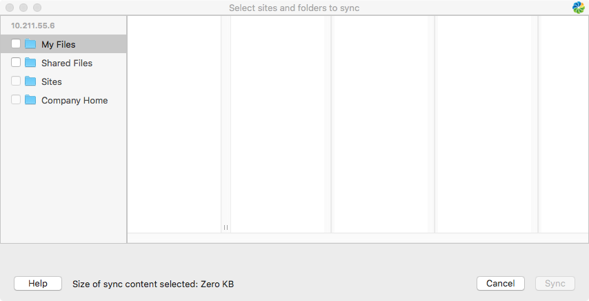
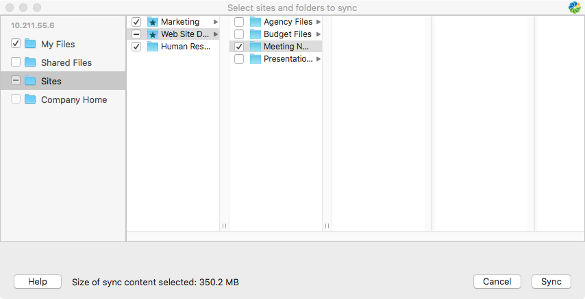
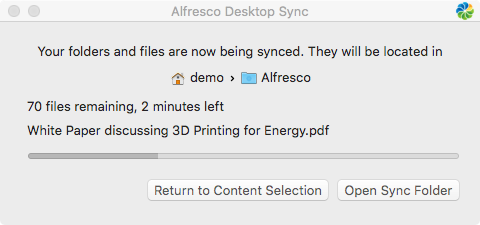
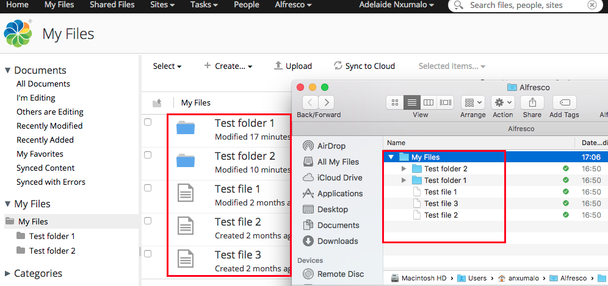

# Selecting content to sync

Once you've set up Desktop Sync, all your Alfresco folders will be displayed from My Files, Shared Files, and your Sites.

Use the Select sites and folders to sync dialog to select the content to sync between Alfresco Share and your desktop. The content is synced to your /<userHome\>/Alfresco folder, located in Finder under **Go \> Home**.

**Note:** The screen provides an estimate of how much disk space will be occupied, so only select the content you need. The more content you select, the more space will be taken on your computer and the more time it'll take to perform the initial sync.

1.  Synchronize your content from **My Files** and **Shared Files**.

    

    1.  Select **My Files** to expand the folder list in your **My Files** area of Alfresco Content Services.

        You can navigate through the folder hierarchy and click the check box to select individual folders, or select **My Files** to sync everything. See [My Files](http://docs.alfresco.com/5.2/concepts/library-external-myfiles.html) for more.

    2.  Select **Shared Files** to expand the folder list in your **Shared Files** area of Alfresco Content Services.

        You can navigate through the folder hierarchy and click the check box to select individual folders, or select **Shared Files** to sync everything. See [Shared Files](http://docs.alfresco.com/5.2/concepts/library-external-shared.html) for more.

2.  Select **Sites** to expand the list of sites you are a member of in Alfresco Content Services, sites you have favorited, and sites with content that you have favorited.

    

    -    indicates a favorite site or folder
    -    indicates a site or folder that contains favorited content
    These are listed in alphabetical order, grouped by favorites, then sites with favorited content, and then other sites you're a member of.

    1.  Select **Sites** to expand the folder list in your **Sites** area of Alfresco Content Services.

        You can navigate through the folder hierarchy and click the check box to select individual folders.

    2.  Select **Company Home** to expand the folder list in your **Company Home** area of Alfresco Content Services \(if set up by your IT team\).

        You can navigate through the folder hierarchy and click the check box to select individual folders.

        **Note:** It's not possible to select all your **Sites** or all of **Company Home** as it's likely to involve a large sync and may take a long time.

3.  Click **Sync** to start initial syncing of the selected files and folders to your desktop.

    **Tip:** You can click **Cancel** to cancel selecting content and close the Select sites and folders to sync dialog.

    **Note:** During the initial sync, don't disconnect your computer from the network or put your computer to sleep. Although the sync will resume if interrupted, it's likely to need to check the content again, and very large initial syncs may take a long time to complete.

**About initial sync**

The **Sync** progress dialog shows the status of the initial sync. The Alfresco icon in the menu bar changes to indicate that the sync is in progress . Once the sync has completed successfully, the icon changes to .

In /<userHome\>/Alfresco, copies of all the content you've selected to sync are created. Desktop Sync automatically keeps both the local copy and the Alfresco Content Services versions in sync with each other whenever any changes are made.

During initial sync:

-   You can close the sync progress dialog using the red cross, and the initial sync will continue in the background which allows you to continue working elsewhere.
-   You can **Return to Content Selection** to change the content selected for synchronization. Note that after making changes, your sync will restart from the beginning.
-   If you create a new file or update a file on your desktop, it'll be synced after the initial sync is over.
-   It's recommended that you don't move folders until the initial sync has completed.

**Parent topic:**[Using Desktop Sync for Mac](../concepts/desktopsync-using-mac.md)

