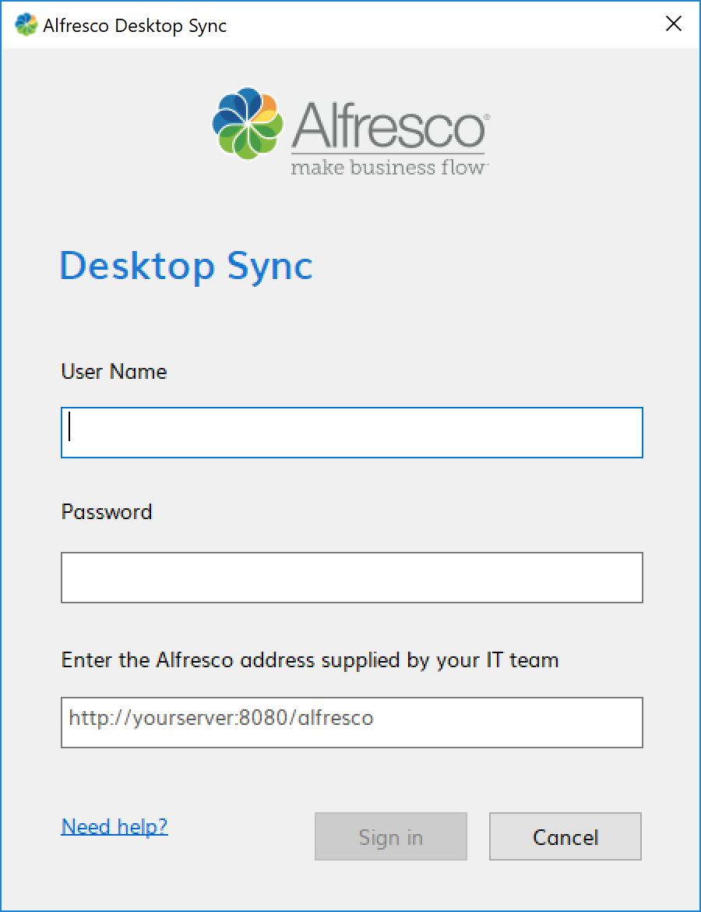
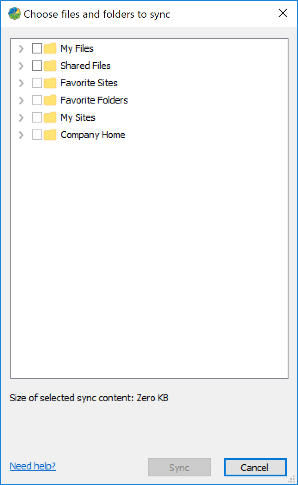

# Setting up Desktop Sync

The first time you open Desktop Sync you need to enter your login details to connect to Alfresco.

1.  Open Desktop Sync just as you would any other program by double-clicking the icon on your desktop or opening it through Explorer.

    Speak to your IT team if you need any help.

2.  When prompted, log in using your user name and password.

    

3.  Enter the Alfresco address supplied by your IT team.

    This is the address of the server - make sure the URL provided is the repository URL.

    This could be, for example, *https://alfresco.mycompany.com/alfresco*.

4.  Click **Sign In**.

    That's it. Your Desktop Sync account is now set.

The Choose files and folders to sync screen appears.

All your favourite Alfresco content, My Files, Shared Files, and your Alfresco sites are displayed.

**Parent topic:**[Using Desktop Sync for Windows](../concepts/desktopsync-using.md)

