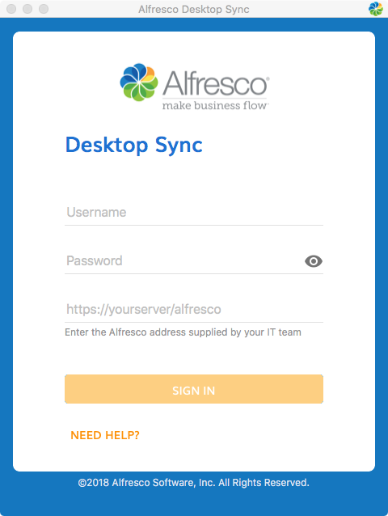
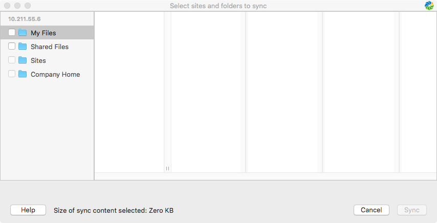

# Setting up Desktop Sync

The first time you open Desktop Sync you need to enter your login details to connect to Alfresco Content Services.

1.  Open Desktop Sync from your **Applications**.

    The Alfresco Desktop Sync login dialog appears. Speak to your IT team if you need any help.

2.  When prompted, log in using your user name and password.

    

3.  Enter the address supplied by your IT team.

    This is the address of the server - make sure the URL provided is the repository URL.

    This could be, for example, *https://alfresco.mycompany.com/alfresco*.

4.  Click **Sign In**.

    That's it. Your Desktop Sync account is now set.

The Select sites and folders to sync dialog appears.

All your Alfresco Content Services folders will be displayed from My Files, Shared Files, and your Sites.

**Parent topic:**[Using Desktop Sync for Mac](../concepts/desktopsync-using-mac.md)

