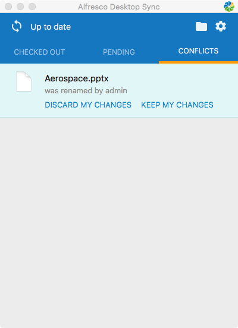

# Working with Desktop Sync

To save your work in Alfresco, just work on your files in the /<userHome\>/Alfresco folder, and everything in the folder will be automatically synced to Alfresco.

**Understanding Desktop Sync icons**

Desktop Sync always ensures that the files in your /<userHome\>/Alfresco folder are synced with Alfresco. It adds status icons to your files and folders so you know the application is working.

You'll see icons in two different places: in the menu bar and next to individual files and folders.

**Menu bar icons**

Icons that appear over the Desktop Sync icon in your menu bar represent the overall status of your Alfresco folder.

Here's what each of these icons means.

|Icon name|Icon|Description|
|---------|----|-----------|
|Green tick||A green tick shows all your files are synced and accessible from your desktop.|
|Red flag||A red flag indicates there are conflicts that need to be resolved by the user. Something isn't working properly and your file\(s\) are not being synced.|
|Blue arrows||A syncing icon indicates that file\(s\) are being synced or waiting to be synced.|
|Pause||A pause icon indicates that Desktop Sync is paused due to invalid server credentials or there's nothing configured to sync.|
|Warning||A warning icon indicates that either: -   Desktop Sync failed to get a successful server health check. Contact your IT team if you see this warning when you're having problems working with your files.
-   An update is available for Desktop Sync \(i.e. the installed version is older than the one provided by your IT team\).

|
|Offline||An offline icon indicates that Desktop Sync isn't connected to Alfresco and you are working offline. Check your Internet connection to resume syncing your files.|

**Content icons**

Icons that appear next to individual files and folders represent the status of that file or folder.

Here's what each of these icons means.

|Icon name|File / Folder icon|Description|
|---------|------------------|-----------|
|Green tick||It's synced - A green tick on a file indicates that the file or folder is in sync with the server copy.|
|Refresh arrows||It's in use. The blue arrows indicate that Desktop Sync is waiting for the application to release the file or for free space to become available.|
|Red flag||It's in conflict. A red flag on a file or folder indicates that update/rename/delete has conflicted with a server-side change and we aren't able to automatically resolve it. You need to decide which version to keep.|
|Grey arrow||It's checked out by another user. A grey arrow indicates that the file is checked out by another user in Alfresco. The file is locked, so you can't make changes until the file is checked in, or the check out is cancelled.|
|Blue arrow||It's checked out by you. A blue arrow indicates that the file is checked out by you. The file is locked on the server, so others can't make changes until the file is checked in, or the check out is cancelled.|
|Grey pencil||It's read-only. A grey pencil indicates that you don't have permission to edit this file. This could be due to insufficient privileges on the server, or the file has been declared as a record.|

**Note:** You can hide the icons displayed in Finder by changing a setting on your Mac. To hide the Finder extension, open System Preferences \> Extensions. Locate the **Alfresco Desktop Sync** extension, then remove the tick in the check box next to **Finder**.

**Desktop Sync User Interface**

Click  to open the Desktop Sync User Interface \(UI\). By default, this is docked \(or locked\) to the menu bar. Click and drag it away from the menu bar to move it. Here is a brief description of each tab in the UI.

|Tab name|Description|
|--------|-----------|
|Checked Out|Displays files that you have checked out from your synced folder in Desktop Sync. You can click the icon or file name to open it, or double-click to reveal the file in Finder. See [working with multiple Checked Out files](../references/ds-taskbar-mac.md#multipleFilesCo) for more.|
|Pending|Displays any changes that are waiting to be synced to Alfresco.**Note:** Files that are currently in use by another application are listed here.

|
|Conflicts|Displays a list of files or folders that are in conflict. **Note:** If a folder is in conflict as well as any of its contents \(such as a file or sub-folder\), special rules apply for how this content is resolved. See [conflict matrix](ds-working-mac.md#conflict) for more details.

|

**Finder menu actions**

You can access Desktop Sync actions through the Finder context menu by right clicking on a file or folder.

|Action|Description|
|------|-----------|
|Sync Now|Use this option when you want to sync content immediately.|
|Check Out|When you check out a file, it's locked in Alfresco, so that other users can't overwrite it while you make changes offline. This also applies when [working with multiple files in Finder](../references/ds-taskbar-mac.md#multipleFilesFinder).|
|Check In|Shown only when you have one or more files checked out. Select this option when you're ready to upload a new version to Alfresco. See [working with multiple files in Finder](../references/ds-taskbar-mac.md#multipleFilesFinder) for more.|
|Cancel Check Out|Shown only when you have one or more files checked out. You can cancel editing to unlock the file\(s\) without saving changes. See [working with multiple files in Finder](../references/ds-taskbar-mac.md#multipleFilesFinder) for more.|
|Keep my Changes|Shown only when you need to resolve a conflict. Select this option to keep the changes made on your computer. This will sync your changes to Alfresco as a new version.|
|Discard my Changes|Shown only when you need to resolve a conflict. Select this option to discard the changes made on your computer. This will sync the latest version from Alfresco, overwriting your changes in your `Alfresco` sync folder.|
|Declare as Record|Shown only when Alfresco Governance Services is running. Select this option to declare the file as a record. See [Declaring records](https://docs.alfresco.com/ags/tasks/rm-create-record.html) for more. **Note:** Files previously rejected as a record can't be automatically declared again. See [Managing unfiled records](https://docs.alfresco.com/ags/concepts/rm-records-manage-unfiled.html) for information on resetting the status.

|
|Share|Shown only when you right-click a file \(i.e. not a folder\). Select this option to share a link to a file. See [Sharing files](../tasks/ds-share-file-mac.md) for more.|
|Update Desktop Sync|Shown only when a newer version of Desktop Sync is provided by your IT team. Select this option to update Desktop Sync. See [Updating Desktop Sync](../tasks/ds-update.md) for more.|

**Note:** From time to time Finder extensions are disabled by another application. To enable them, go to System Preferences \> Extensions and select Alfresco Desktop Sync.

**What are conflicts?**

Whilst Desktop Sync ensures that content is kept up to date silently, under normal operation there may be circumstances where Desktop Sync can't resolve differences between a file stored on your desktop and the corresponding file in Alfresco. When the sync changes can't be updated automatically you are asked to resolve the conflict manually. This happens when a file has changed in both locations since its last sync, making it difficult to determine which changes to save.

For example, a conflict occurs when you update a file in your Alfresco sync folder and an update to the same file has happened on the server since the last sync. Desktop Sync will give you a choice of resolving the sync conflict by either choosing to keep your changes, or discarding your changes in favor of the latest copy from Alfresco.

For more information, see [Sync conflict resolution matrix](ds-conflicts-mac.md).

-   **[Sync conflict resolution matrix](../concepts/ds-conflicts-mac.md)**  
Use this information to resolve and manage Desktop Sync conflicts.
-   **[Sharing files](../tasks/ds-share-file-mac.md)**  
You can easily share a file from the Finder menu actions. Clicking the **Share** action generates a URL that you can send by email. People with access to the URL can view the file.
-   **[Permissions](../concepts/ds-permissions.md)**  
Alfresco Content Services permissions are replicated on the desktop for files and folders that have been synchronized, ensuring that users are not able to edit files offline as well as on the server.
-   **[Governance Services](../concepts/ds-governance.md)**  
Desktop Sync is fully compatible with Alfresco Governance Services. This topic explains how Desktop Sync handles records and classified files.
-   **[Updating Desktop Sync](../tasks/ds-update.md)**  
You'll be notified when a newer version of Desktop Sync is provided by your IT team. This is shown as a notification in the system tray \(Windows\) or in the menu bar \(Mac\).

**Parent topic:**[Using Desktop Sync for Mac](../concepts/desktopsync-using-mac.md)

