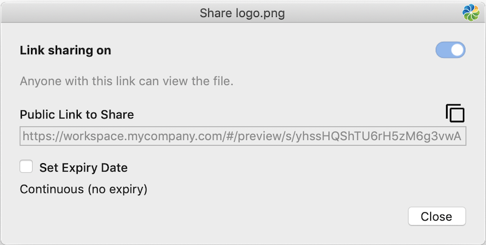
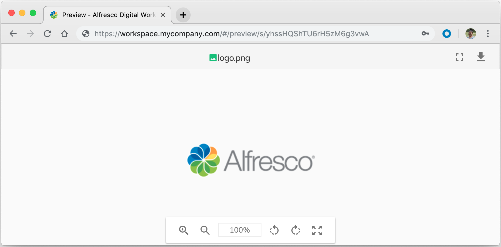

# Sharing files

You can easily share a file from the Finder menu actions. Clicking the **Share** action generates a URL that you can send by email. People with access to the URL can view the file.

Make sure that you've [configured file sharing](../concepts/ds-config.md#12) before continuing.

1.  In your **Alfresco** synced folder find the file you want to share.

    You can only share files, not folders.

2.  Right-click the file and select **Share**.

    A window appears displaying that link sharing is enabled \(**Link sharing on**\), the URL for this file, and no expiry date is set.

    

    **Note:** If a file is record, link sharing is not allowed. If a file is read-only, the file can be shared but you can't set an expiry date. However, if a read-only file was previously shared and had an expiry date, the date is displayed but can't be changed \(i.e. the field is read-only\).

3.  Click the copy  icon to copy the link.

    You can paste it wherever you like, such as an email or document. Here's a preview of the shared file in Alfresco Digital Workspace:

    

4.  \(Optional\): To set an expiry date for the shared link, first tick the **Set Expiry Date** check box, and then adjust the date using the up and down arrows.

    To remove an expiry date, remove the tick from the **Set Expiry Date** check box.

5.  Click **Close**.

    When you don't want the shared file to be available anymore, you can break the link. Once you make the link invalid, anyone who tries to access it will be unable to reach the page.

6.  Right-click the shared file and select **Share**.

7.  Click the link sharing switch \(i.e. set **Link sharing off**\) to break the link.

    A notification appears stating that the shared link will be deleted.

8.  Click **Remove** to complete the action.

    **Note:** When the file is shared again, a new link is generated.

**Parent topic:**[Working with Desktop Sync](../concepts/ds-working-mac.md)

