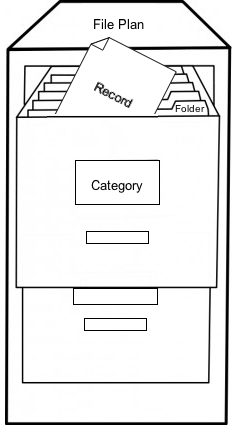

# The File Plan

The File Plan is a container for records, folders, categories and disposition schedules. It's effectively a virtual filing cabinet for storing records, and is the basic structure of Records Management. This structure lets you classify and group records with similar characteristics.

The top level of the File Plan is created when you create a Records Management site. This is like an empty virtual filing cabinet - you then add drawers \(categories\), folders, and records to it.

Remember that it's far more versatile than a physical filing cabinet, but the following rules are enforced when working with the File Plan structure:

-   The top level of the File Plan can only contain record categories.
-   A category can contain other categories and folders.
-   A folder can contain only records.

The structure of the File Plan will generally reflect different parts of your organization and can be made up of the following elements:

-   **Record category**

    The record category contains the retention and disposition schedules for its folders and records. In other words it controls how records are managed, and how they're disposed of when they're not needed any more.

-   **Record folder**

    A record folder is created in a record category, and inherits the attributes of the record category. The record folder is considered to be under the control of the record category. Once the record folder is created, security restrictions apply. A record folder can be open or closed, and a closed record folder cannot accept records for filing.

-   **Record**

    A record is a document in the File Plan. It's filed in a record folder, and is under the control of a record category.

-   **Vital record**

    A vital record is a record that is considered to be essential to the operation of an organization. A vital record must be reviewed periodically, according to its review period. The review period is attached to the record category or folder.

You can create a File Plan structure from scratch or [load the Records Management test data](../tasks/rm-load-testdata.md) to use as a starting point. This gives you a sample File Plan that you can rework to meet your needs.

You can also automate the File Plan by [applying rules to categories and folders](rm-rules.md). This means that records can be moved automatically through the record lifecyle, without you having to do any of the work.

-   **[../tasks/rm-fileplan-access.md](../tasks/rm-fileplan-access.md)**  

-   **[Browsing the File Plan](../concepts/rm-fileplan-browse.md)**  
The File Plan consists of an explorer panel and a content list.

**Parent topic:**[Using Records Management](../concepts/rm-intro.md)

