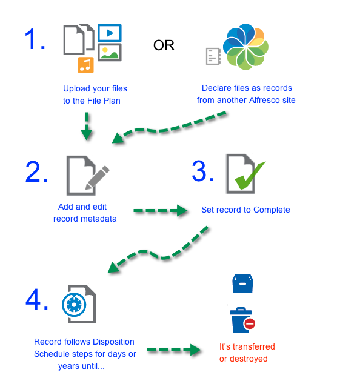

# Life cycle of a record

You can create a record either by uploading it to the Records Management File Plan, or by declaring an item in another Alfresco site as a record.

When you have added all required metadata to a record you can mark the record as complete. This makes it an active part of the File Plan, and subject to the rules of the disposition schedule it is associated with.

It then goes through various time and event based steps such as cut off and retention, until it is eventually transferred elsewhere, or destroyed, according to its disposition schedule.

**Parent topic:**[Records Management QuickStart](../concepts/rm-gs-overview.md)

**Parent topic:**[Using Records Management](../concepts/rm-intro.md)

