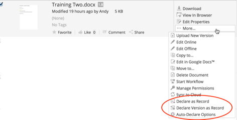
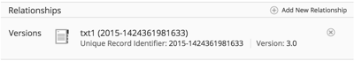
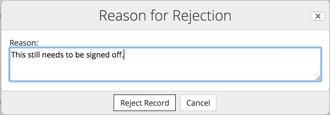

# What's new in Alfresco Records Management

Alfresco Records Management just got a whole lot simpler and smarter.

We've focused our efforts on extending the ways that non-Records Management users can create and work with records. Effectively this means that most users never need to worry about records, file plans, or disposition schedules.

See [Records based on existing files \(in-place records\)](../concepts/rm-in-place.md) for more.

-   [Declare file versions as records](whats-new-rm.md#1)
-   [Move in-place records](whats-new-rm.md#2)
-   [Improved add relationship process](whats-new-rm.md#3)
-   [Improved record rejection process](whats-new-rm.md#4)
-   [Unlink records](whats-new-rm.md#5)
-   [RM Admin Tools](whats-new-rm.md#6)
-   [Renamed capabilities](whats-new-rm.md#7)

**Declare file versions as records**

In recent releases of Records Management we introduced the concept of in-place records, where you could take an existing file in a non-Records Management site and declare it as a record, automatically creating a corresponding record.

This has now been extended so that you can create records based on specific version of files, so for example, you can keep a record of a file before customer sign-off, and a record of the same file updated with customer changes.

You can [manually declare versions as a record](../tasks/rm-create-version-record.md) and you can [set up auto-declare options](../tasks/rm-autodeclare-options.md).

[back to top](whats-new-rm.md#)

**Move in-place records**

You can now move files that have been declared as records to a different location in the document library, for example to a separate folder structure where you archive all files that have been declared as records. The record in the File Plan is entirely unaffected by movements to the originating file.

See [Moving in-place records](../tasks/rm-in-place-move.md) for more.

[back to top](whats-new-rm.md#)

**Improved add relationship process**

It's now a quick process to add relationships to records using the new **Add Relationship** action. You can see and manage any relationships a record has in the file preview screen, and relationships between different versions of an in-place record are created automatically.

See [Creating relationships between records](../tasks/rm-records-manage-reference.md) for more.

[back to top](whats-new-rm.md#)

**Improved record rejection process**

When an in-place record is rejected from the Records Management site, a warning that the record has been rejected is now displayed against the originating file, and the user can read the reason for rejection.

Once understood, the rejection warning can be removed from the file, allowing users to later resubmit the file as a record.

See [Managing records](../tasks/rm-records-manage.md) for more.

[back to top](whats-new-rm.md#)

**Unlink records**

Previously in Records Management you could link records so as to file them in multiple locations in the File Plan. Now, you can unlink them as well.

See [Linking records](../tasks/rm-records-manage-link.md) for more.

[back to top](whats-new-rm.md#)

**RM Admin Tools**

The Records Management Console has been renamed to RM Admin Tools, for consistency with the Alfresco Admin Tools.

[back to top](whats-new-rm.md#)

**Renamed capabilities**

In the RM Admin Tools, we've renamed a couple of the capabilities to make them clearer.

-   Manage Access Rights is now Manage Permissions
-   Manage Access Controls is now Group and User Role Assignment

 

[back to top](whats-new-rm.md#)

You can follow our latest updates at [Alfrescodocs](https://twitter.com/Alfrescodocs).

**Parent topic:**[Alfresco Records Management](../concepts/welcome-rm.md)

