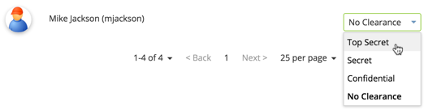
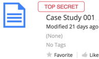

# Classification life cycle

Users with the required security clearance and file permissions can classify and reclassify both files and records.

1. Alfresco Administrator assigns security clearance level to a user in the Alfresco Admin Tools.

2. User is given \(or already has\) the site and file permissions needed to edit files / records.

3. User selects to classify a file or record.

4. The classified file / record is only seen by those with the required security clearance.

5. Users reclassify the file / record as required, following the Downgrade Schedule or Declassification Schedule where appropriate.

**Parent topic:**[Classification](../concepts/rm-classification.md)

